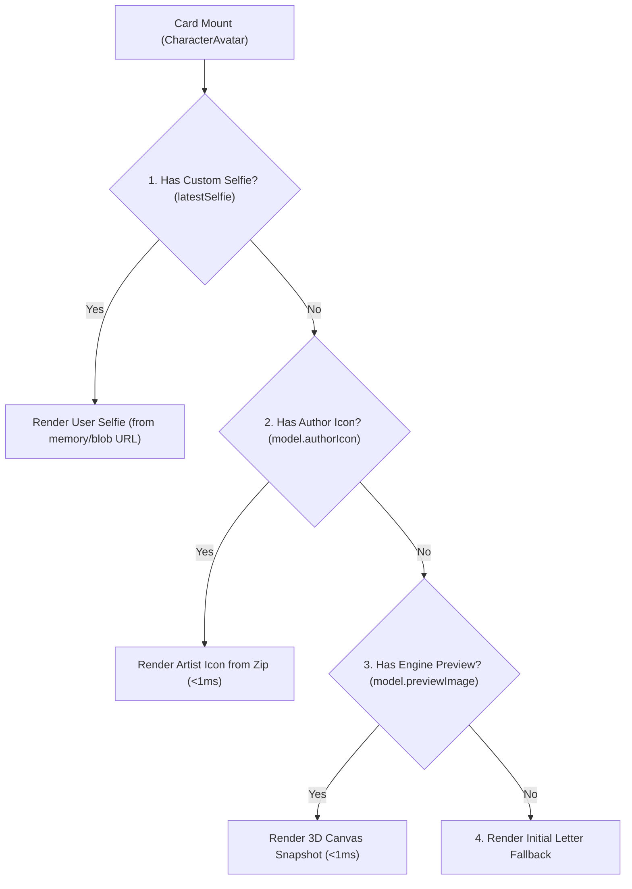

# AIRI Character Card Gallery & Management Hub

Covers the primary character card management surface in settings (`packages/stage-pages/src/pages/settings/airi-card/index.vue`), the responsive card grid (`CardListItem.vue`), the avatar and thumbnail resolution engine (`CharacterAvatar.vue`, `character-media-resolver.ts`), dialog lifecycle and performance optimizations.

## 1. Surface Architecture & Map

- **Gallery Root Hub**: `packages/stage-pages/src/pages/settings/airi-card/index.vue`
  - Route: `#/settings/airi-card`
  - Responsibilities: Displays responsive 2-column (mobile/portrait) / 4-column (desktop/landscape) card grid, search filter, sorting options, import drag-and-drop zone, and action triggers.
- **Card Card Item**: `packages/stage-pages/src/pages/settings/airi-card/components/CardListItem.vue`
  - Responsibilities: Flip card animation (Front: 1:1 portrait + name overlay + active badge; Back: description, version, consciousness/voice modules; Bottom: toolbar with edit, export JSON/PNG, selfie, activate, delete).
- **Avatar & Thumbnail Component**: `packages/stage-ui/src/components/misc/CharacterAvatar.vue`
  - Used in `CardListItem.vue` and `ControlStrip.vue`.
  - Resolves avatar image according to strict priority chain without blocking the UI thread.
- **Media Resolver Library**: `packages/stage-ui/src/libs/character-media-resolver.ts`
  - Provides `getLatestSelfie(cardId)`, `extractModelIcon(displayModelId)`, and `extractComplementaryColors(imageUrl)`.
  - Maintains in-memory `iconCache` and `colorCache` + `localStorage` persistence.
- **Card Inspector Dialog**: `packages/stage-pages/src/pages/settings/airi-card/components/CardDetailDialog.vue`
  - Modal displaying card stats, personality, prompts, modules, and concept stack.
- **Full Card Editor Dialog**: `packages/stage-pages/src/pages/settings/airi-card/components/CardCreationDialog.vue`
  - Tabbed editor (8 tabs: Identity, Cognition, Generation, Acting, Modules, Artistry, Proactivity, Tools).

---

## 2. Store & Data Persistence Layer

Per [`docs/data-catalog.md`](../../../docs/data-catalog.md):

| Data Slice | Storage Layer | Key | Shape |
| :--- | :--- | :--- | :--- |
| **All Character Cards** | IndexedDB (`unstorage` base: `airi-local`) | `local:airi-cards` | `[string, AiriCard][]` (tuples of `[cardId, card]`) |
| **Active Card ID** | Browser `localStorage` | `airi-card-active-id` | `string` (e.g. `'default'`) |
| **Display Model Metadata** | IndexedDB (`unstorage` base: `airi-local`) | `local:display-models/metadata-cache` | `DisplayModelFile[]` (lightweight metadata without heavy binaries) |
| **Display Model Binary** | IndexedDB (`localforage`) | `display-model-{id}` | Full binary file/blob (VRM GLB or Live2D ZIP) |
| **Selfies / Journal BG** | IndexedDB (`localforage`) | `bg-{nanoid}` | `BackgroundEntry` (type: `'selfie'`, tagged with `characterId`) |

---

## 3. Media & Thumbnail Resolution Priority Chain

To prevent UI hitching and respect author intent, thumbnail resolution follows a 4-tier synchronous in-memory priority:



### Critical Performance & Hierarchy Rules
1. **4-Tier Priority Hierarchy**:
   * **Tier 1 (User Intent)**: Custom Stage Selfie (`latestSelfie`)
   * **Tier 2 (Author Intent)**: Artist-crafted icon (`authorIcon` from `icon.png`/`icon.jpg` inside the model zip)
   * **Tier 3 (Engine Fallback)**: Automated 3D canvas snapshot (`previewImage`)
   * **Tier 4 (Identity Fallback)**: Colored initial letter badge
2. **Pay the Extraction Tax Exactly Once**: `authorIcon` is extracted once at import time (or once during lazy background migration) and persisted into `local:display-models/metadata-cache`. It is **never** extracted on the live UI render path.
3. **Never attempt JSZip on VRM binaries**: VRMs are GLB files, not ZIPs. Skip zip extraction immediately if `model.format === 'vrm'`.
4. **Non-blocking color extraction**: `extractComplementaryColors` runs asynchronously and caches to memory/localStorage so canvas operations never block route transitions.

---

## 4. Lazy-Loading & Skeleton Loading Contracts

1. **Lazy Dialogs**:
   - Heavy dialogs (`CardCreationDialog`, `CardDetailDialog`, `CardImportWizard`, `CreateModeSelectorDialog`, `DeleteCardDialog`) must be wrapped with `v-if` and imported via `defineAsyncComponent`.
   - This ensures the initial page bundle evaluates only the card grid, keeping navigation instant.
2. **Skeleton Shimmer Cards**:
   - While `cardsLoading` is `true`, render a 2x4 responsive shimmer placeholder grid (`animate-pulse`).
   - Transition smoothly into the real card list once `local:airi-cards` loads from IndexedDB.

---

## 5. Verification Commands

```bash
pnpm -F @proj-airi/stage-pages typecheck
pnpm -F @proj-airi/stage-tamagotchi typecheck
pnpm -F @proj-airi/stage-ui typecheck
```
