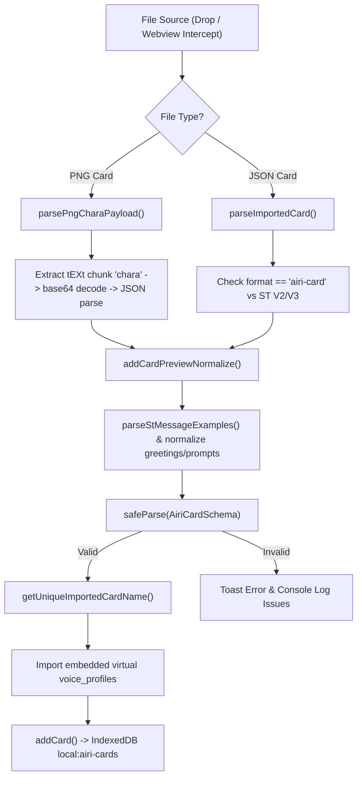

# AIRI Character Card Architecture & Import/Export Specification

A comprehensive design catalog documenting character card specifications, schema definitions (`AiriCard` and `AiriExtension`), import/export pipelines, PNG chunk manipulation, Electron webview download interception, upstream (`moeru-ai/airi:main`) ZIP packaging, and the proposed **AIRI Card Package Spec v2** multi-model specification.

---

## 1. Overview & Core Architecture

In AIRI, a **Character Card** (`AiriCard`) serves as the primary portable definition for an AI persona. It encapsulates:

1. **Identity & Core Prompting**: Character name, nickname, version, greetings, creator notes, personality, scenario, system prompt, and example message dialogues.
2. **Module Configurations**: Active LLM provider & model (Consciousness), TTS provider, model, voice ID & effects (Speech), and active background.
3. **Display & Manifestation**: 2D/3D display model links (VRM, Live2D, Spine, MMD), expressions, parameter mappings, and active outfits.
4. **Behavioral Systems**: Acting prompts, proactivity/heartbeats, dream state/journaling, short-term memory budgets, and concept-based visual assets.

AIRI cards extend the community standard **Character Card Spec V2 / V3** (from `@proj-airi/ccc`), storing custom AIRI-specific features inside `extensions.airi` (`AiriExtension`).

### Key File Locations

| Component | Path | Description |
| :--- | :--- | :--- |
| **Card UI Page** | [`packages/stage-pages/src/pages/settings/airi-card/index.vue`](file:///Users/richardpinedo/Projects.nosync/airi/airi_dasilva333/packages/stage-pages/src/pages/settings/airi-card/index.vue) | Main card management, drag-and-drop import, JSON/PNG export handlers |
| **Import Wizard** | [`packages/stage-pages/src/pages/settings/airi-card/components/CardImportWizard.vue`](file:///Users/richardpinedo/Projects.nosync/airi/airi_dasilva333/packages/stage-pages/src/pages/settings/airi-card/components/CardImportWizard.vue) | Webview download import wizard modal |
| **Card Store** | [`packages/stage-ui/src/stores/modules/airi-card.ts`](file:///Users/richardpinedo/Projects.nosync/airi/airi_dasilva333/packages/stage-ui/src/stores/modules/airi-card.ts) | Pinia store managing local IndexedDB persistence (`local:airi-cards`) |
| **Card Schema & Types** | [`packages/stage-ui/src/types/card.schema.ts`](file:///Users/richardpinedo/Projects.nosync/airi/airi_dasilva333/packages/stage-ui/src/types/card.schema.ts) | Valibot runtime schema (`AiriCardSchema`) |
| **Data Catalog Doc** | [`docs/data-catalog.md`](file:///Users/richardpinedo/Projects.nosync/airi/airi_dasilva333/docs/data-catalog.md) | Storage layer reference detailing `AiriCard` and `AiriExtension` |
| **Download Interceptor** | [`apps/stage-tamagotchi/src/main/index.ts`](file:///Users/richardpinedo/Projects.nosync/airi/airi_dasilva333/apps/stage-tamagotchi/src/main/index.ts) | Electron main process interceptor for webview card downloads |
| **Upstream Import/Export Service** | `packages/stage-ui/src/services/airi-card-import-export.ts` | Upstream `moeru-ai/airi:main` ZIP package service |

---

## 2. Card Schema & `AiriExtension` Definitions

AIRI Character Cards extend the base `Card` structure:

```typescript
interface AiriCard extends Card {
  extensions: {
    airi: AiriExtension
  } & Card['extensions']
  updatedAt?: number
  createdAt?: number
}
```

### Base `Card` Fields (SillyTavern / CCC V2/V3 Spec)

- `name`: Character display name.
- `nickname`: Optional custom user-defined display name.
- `version`: Character version string (e.g. `"1.0.0"`).
- `greetings`: Array of greeting strings (`greetings[0]` is initial greeting; `greetings.slice(1)` are alternate greetings).
- `notes`: Creator notes.
- `description`: Short character summary.
- `personality`: Personality traits and descriptions.
- `scenario`: Current setting and scenario context.
- `systemPrompt`: Core system instructions injected into LLM context.
- `tags`: Array of string tags for filtering.
- `messageExample`: Array of dialogue arrays (`Message[][]`) formatted as `{{user}}: ...` and `{{char}}: ...`.

### `AiriExtension` Structure

The `AiriExtension` interface in [`packages/stage-ui/src/stores/modules/airi-card.ts`](file:///Users/richardpinedo/Projects.nosync/airi/airi_dasilva333/packages/stage-ui/src/stores/modules/airi-card.ts#L121) defines AIRI's rich capability set:

```typescript
interface AiriExtension {
  modules: {
    consciousness: { provider: string, model: string, moduleConfigs?: Record<string, any> }
    speech: { provider: string, model: string, voice_id: string, pitch?: number, rate?: number, ssml?: boolean, language?: string }
    vrm?: { source?: 'file' | 'url', file?: string, url?: string }
    live2d?: { source?: 'file' | 'url', file?: string, url?: string, activeExpressions?: Record<string, number>, modelParameters?: Record<string, number> }
    displayModelId?: string
    activeBackgroundId?: string | null
    active_expressions?: Record<string, number>
  }
  acting?: {
    modelExpressionPrompt: string
    speechExpressionPrompt: string
    speechMannerismPrompt: string
    idleAnimations?: string[]
  }
  artistry?: {
    provider?: string
    model?: string
    promptPrefix?: string
    widgetInstruction?: string
    spawnMode?: 'bg' | 'widget' | 'inline' | 'bg_widget'
    options?: Record<string, any>
    autonomousEnabled?: boolean
  }
  generation?: CharacterGenerationConfig
  outfits?: AiriOutfit[]
  agents: { [key: string]: { prompt: string, enabled?: boolean } }
  heartbeats?: HeartbeatConfig
  dreamState?: DreamStateConfig
  shortTermMemory?: ShortTermMemoryConfig
  groundingEnabled?: boolean
  visual_assets?: Record<string, {
    description: string
    prompt?: string
    isBase?: boolean
    artistry?: { provider?: string, model?: string, options?: Record<string, any> }
    manifestation?: { modelId?: string, mood?: string, backgroundId?: string, active_expressions?: Record<string, number> }
    speech?: { provider?: string, model?: string, voice_id?: string }
  }>
  voice_profiles?: VoiceProfile[]
}
```

---

## 3. Fork Implementation Architecture (`dasilva333/airi`)

The fork architecture prioritizes **ecosystem interoperability** (SillyTavern, Chubb, JannyAI), **untruncated feature preservation**, and **live stage visual rendering**.



### 3.1 PNG tEXt Chunking & SillyTavern Spec V2

- **Export (`exportCardPng`)**: Converts card metadata to SillyTavern V2 format (`buildCharaCardV2`), embeds compatibility probes (`sillytavernCompatibilityProbe`), encodes payload as UTF-8 base64, computes an IEEE 802.3 CRC32 checksum, and injects a `tEXt` chunk with keyword `'chara'` prior to the PNG `IEND` chunk (`injectPngTextChunk`).
- **Import (`parsePngCharaPayload`)**: Scans PNG binary chunks starting at offset 8, locates `tEXt` chunks with keyword `'chara'`, base64-decodes the string payload, and parses JSON.

### 3.2 AIRI JSON Format (v1)

- **Export (`exportCard`)**: Encapsulates the card in `{ format: 'airi-card', version: 1, card }`.
- **Import (`parseImportedCard`)**: Detects `format === 'airi-card'` wrapper or unwraps raw ST V2/V3 JSON structures.

### 3.3 Live Canvas Snapshot & Frame Rendering

When exporting a PNG card, `composeCardExportPng()` captures a live rendered preview of the active VRM or Live2D model (`loadVrmModelPreview` / `loadLive2DModelPreview`) with current active expressions and outfits. The snapshot is composited into a fixed 925×1436 framed canvas using `card-export-frame.png`.

### 3.4 Electron Webview Download Interceptor

In [`apps/stage-tamagotchi/src/main/index.ts`](file:///Users/richardpinedo/Projects.nosync/airi/airi_dasilva333/apps/stage-tamagotchi/src/main/index.ts#L235):
- Listens to `session.defaultSession.on('will-download')` for `webview` triggers.
- Intercepts `.png` or `.json` card files downloaded from discovery sites (JannyAI, JanitorAI, Chub AI, Risu Realm, DataCat), saves to temp directory, and sends IPC event `'chara-card-downloaded'`.
- In `index.vue`, `handleCharaCardDownloaded()` converts the payload and launches `CardImportWizard.vue`.

### 3.5 Voice Profile & Asset Embedding

During export (`getCardWithExportedBackground`), referenced virtual voice profiles are embedded into `card.extensions.airi.voice_profiles`, and the active scene background is converted to a base64 Data URL (`preferredBackgroundDataUrl`). Upon import, missing voice profiles are auto-registered in `speechStore`.

---

## 4. Upstream Main Architecture (`moeru-ai/airi:main`)

Upstream main (`moeru-ai/airi:main` PR #1998, commit `5aa44aedd`) introduced a **ZIP archive package format** (`.zip`) implemented in `packages/stage-ui/src/services/airi-card-import-export.ts`.

### 4.1 ZIP Archive Format & `manifest.json` v1

Upstream packages character cards as a compressed `.zip` archive containing:

```
card-package.zip/
├── manifest.json            # Package manifest (format version & path index)
├── card.json                # CCv3 Character Card specification
└── models/
    └── body-model.vrm       # (Optional) Single bundled display model binary
```

#### Upstream `manifest.json` (Version 1):
```json
{
  "format": "airi-card-package",
  "version": 1,
  "createdAt": "2026-07-27T00:00:00.000Z",
  "card": {
    "path": "card.json",
    "spec": "chara_card_v3"
  },
  "resources": {
    "displayModel": {
      "format": "vrm",
      "name": "character_model.vrm",
      "path": "models/body-model.vrm"
    }
  }
}
```

### 4.2 CCv3 `card.json` Structure

Upstream exports `card.json` adhering strictly to **Character Card Spec V3 (CCv3)** via `@proj-airi/ccc`:

```json
{
  "spec": "chara_card_v3",
  "spec_version": "3.0",
  "data": {
    "name": "Kokoa",
    "description": "...",
    "personality": "...",
    "scenario": "...",
    "first_mes": "Hello!",
    "alternate_greetings": [],
    "mes_example": "",
    "creator_notes": "",
    "system_prompt": "...",
    "post_history_instructions": "...",
    "tags": [],
    "creator": "",
    "character_version": "1.0.0",
    "extensions": {
      "airi": {
        "modules": {
          "consciousness": { "provider": "openai", "model": "gpt-4o" },
          "speech": { "provider": "elevenlabs", "model": "eleven_multilingual_v2", "voice_id": "alloy" },
          "displayModelId": "display-model-xyz"
        }
      }
    }
  }
}
```

### 4.3 Single Display Model Packaging

When exporting, upstream queries `displayModelsStore`, fetches the local file or URL blob for `displayModelId`, and writes it into `models/body-model.<ext>`. On import, it reads the binary array buffer and registers it in `displayModelsStore.addDisplayModel()`.

### 4.4 Security & Whitelist Sanitization (`sanitizeAiri`)

Upstream enforces a strict security whitelist (`sanitizeAiri()`). When importing a card package, it **intentionally strips**:
- Custom extensions outside the hardcoded whitelist.
- Agent prompts (`agents`).
- Acting prompts (`acting`).
- Dream state & heartbeat parameters.
- Machine-local file paths and references.

### 4.5 Upstream UI/UX Constraints

- **No Export Options / Modal**: Exporting in `CardDetailDialog.vue` triggers `exportAiriCardPackage()` instantly with no user choices.
- **No Opt-Out Mechanism**: Users cannot opt out of including the display model if it exists locally.
- **No Copyright Warning**: Offers no licensing or redistribution prompts for restricted 3D/2D models.

---

## 5. Comparative Analysis & Tradeoff Matrix

| Feature / Dimension | Upstream (`moeru-ai/airi:main`) | Current Fork (`dasilva333/airi`) |
| :--- | :--- | :--- |
| **Package Extension** | `.zip` | `.png` (SillyTavern V2) / `.json` (AIRI v1) |
| **Display Model Support** | Bundles 1 local display model binary | Live stage canvas snapshot frame rendering |
| **Multi-Model Support** | Single model (`displayModelId`) only | Multi-model capable (visual assets, outfits, manifestations) |
| **Extension Data** | Whitelist sanitized (strips custom fields) | Full schema preservation via Valibot |
| **Voice Profiles** | Basic provider/model strings | Embeds virtual voice profiles into package |
| **Webview Interception** | File picker only (`.zip`) | Electron main process `will-download` interceptor |
| **Export UI UX** | Single instant action button | Popover actions (PNG / JSON) |

---

## 6. Future Architecture: AIRI Package Spec v2 & Export UI Design

To achieve full upstream interoperability while supporting your fork's multi-model architecture, clean asset storage, and copyright controls, we propose **AIRI Card Package Spec v2**.

### 6.1 ZIP Package Spec v2 Directory Layout

```
my-character-card.zip
├── manifest.json            # Version 2 package manifest with multi-model array
├── card.json                # CCv3 card metadata (clean references, no inline base64 blobs)
├── cover.png                # Framed card cover image
├── background.png           # (Optional) Scene background image
├── README.md                # (Optional) Character info, model credits, & fork compatibility
├── models/
│   ├── base_model.vrm       # Primary display model
│   └── casual_outfit.zip    # Secondary Live2D outfit / manifestation
└── voices/
    └── custom_voice.json    # Embedded virtual-audio-studio profile
```

### 6.2 Spec v2 `manifest.json` Definition

```json
{
  "format": "airi-card-package",
  "version": 2,
  "generator": "AIRI Fork (dasilva333)",
  "createdAt": "2026-07-27T00:00:00.000Z",
  "card": {
    "path": "card.json",
    "spec": "chara_card_v3"
  },
  "resources": {
    "cardImage": { "path": "cover.png" },
    "backgroundImage": { "path": "background.png", "title": "Cozy Room" },
    "displayModels": [
      { "id": "primary", "format": "vrm", "name": "base_model.vrm", "path": "models/base_model.vrm", "role": "base" },
      { "id": "casual_outfit", "format": "live2d-zip", "name": "casual_outfit.zip", "path": "models/casual_outfit.zip", "role": "manifestation" }
    ],
    "voiceProfiles": [
      { "id": "voice-1", "path": "voices/custom_voice.json" }
    ]
  }
}
```

### 6.3 Multi-Model & Clean Asset Bundling

- **No Base64 Bloat**: Cover images and background photos are written as clean binary files (`cover.png`, `background.png`) rather than bloated inline base64 strings inside JSON metadata.
- **Multi-Model Manifest Array**: Supports mapping multiple models per card (e.g., base VRM model + alternative Live2D outfits + manifestation models).

### 6.4 Export Configuration Modal UX (Option B)

Instead of instant unconfigurable export, opening Export launches a **Card Package Export Modal** offering full control:

```
+-------------------------------------------------------------+
| Export Character Card Package                               |
+-------------------------------------------------------------+
| Package Format:                                             |
| (•) AIRI Extended Package (ZIP v2) - Multi-model & Assets   |
| ( ) Upstream Main Compatible (ZIP v1)                       |
| ( ) SillyTavern Portable PNG (.png)                         |
| ( ) Standalone AIRI JSON (.json)                            |
|                                                             |
| Include Assets & Options:                                   |
| [x] Include Display Model(s) (2 models selected)            |
|     ⚠️ Ensure you have redistribution rights for model files |
| [x] Include Scene Background Image (Cozy Room)              |
| [x] Include Virtual Voice Profiles                          |
| [x] Include Rendered Card Frame Cover                       |
| [x] Generate README.md with model credits & compatibility   |
|                                                             |
| [ Cancel ]                                 [ Export Package ]|
+-------------------------------------------------------------+
```

### 6.5 Legal, Copyright & Opt-Out Controls

The modal includes opt-out checkboxes and clear notices:
- **Model Copyright Protection**: Allows users to opt out of bundling 3D/2D models if licensing forbids redistribution.
- **Privacy & Size Control**: Allows opting out of large background images or sensitive voice configurations.

### 6.6 Auto-Generated `README.md` & Compatibility Matrix

When `[x] Generate README.md` is enabled, the exporter auto-generates a human-readable `README.md` inside the ZIP archive:

```markdown
# Character: Kokoa

This character card package was created using AIRI.

## Compatibility
- **AIRI Fork (dasilva333)**: Full support for multi-model loading, custom acting prompts, voice profiles, and visual manifestations.
- **AIRI Upstream (moeru-ai/airi)**: Compatible (primary display model and core CCv3 persona fields imported).
- **SillyTavern / CCv3 Readers**: Import `card.json` directly.

## Assets & Credits
- **Primary Model**: `models/base_model.vrm`
- **Background**: `background.png` (Cozy Room)
```

---

## 7. Import Pipeline Backwards & Forwards Compatibility

To maintain complete compatibility across all versions:

1. **File Picker Input**: `<InputFile accept=".zip,.json,.png">`.
2. **ZIP Inspector**:
   - Reads `manifest.json`.
   - If `version: 1` (Upstream Main): Processes single display model + CCv3 fields.
   - If `version: 2` (AIRI Extended): Processes multi-model array + separate cover/background assets + full `AiriExtension` schema.
   - If no `manifest.json`: Falls back to searching for `card.json` or character PNGs inside the ZIP.
3. **PNG Inspector**: Processes SillyTavern `tEXt` chunk `'chara'`.
4. **JSON Inspector**: Processes AIRI v1 JSON or CCv2/v3 JSON.
