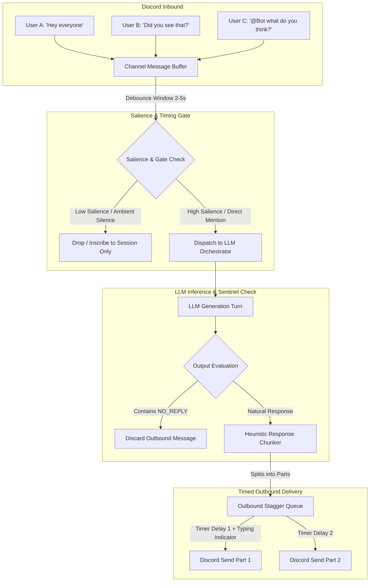

# Design Document: Conversational Group Bot Dynamics & Ambient Multi-User Orchestration

**Status:** Draft / Exploratory
**Area:** Discord Integration / Ambient Multi-User Chat / Orchestration Layer
**Target:** `apps/stage-tamagotchi/src/main/services/airi/discord/`, `packages/stage-ui/src/stores/modules/discord.ts`, `packages/stage-ui/src/stores/chat.ts`

---

## 1. Executive Summary & Problem Statement

In single-user chat scenarios, a 1:1 request-response pattern (*User Message &rarr; LLM Invocation &rarr; Assistant Response*) is standard and predictable. However, in **multi-user group environments** (e.g., Discord guild channels, group DMs, Twitch streams, VR chat rooms), this naive 1:1 model breaks down:

1. **Hyper-Reactivity & Channel Spam:** When every human message triggers an LLM turn, the bot frequently interrupts natural human-to-human flow, replying to trivial tokens (`"A."`, `"Gm"`, `"np"`, laughing emojis) or jumping into every minor sub-thread.
2. **Cost & Rate-Limit Explosion:** In active channels with multiple concurrent speakers, 1:1 invocations cause quadratic scaling in API token usage, incurring extreme costs and hitting provider rate limits.
3. **Race Conditions & Interleaved Replies:** Because LLM inference takes hundreds of milliseconds to several seconds, by the time the model replies to Message $N$, human users may have already sent Messages $N+1$, $N+2$, and $N+3$. The bot's reply lands out-of-order and appears disconnected from current context.
4. **Lack of Native Silence (`NO_REPLY` Deficit):** Without an architectural silence hook, generative models will invent conversational filler (*"two words and a vibe"*) simply because they cannot choose not to generate tokens when invoked.

This design document outlines the architecture for **Ambient Multi-User Conversational Bots**, detailing message buffering, salience gating, silence sentinels (`NO_REPLY`), and heuristic response chunking with timed delivery.

---

## 2. Empirical Case Study: MekaHime / Sarah & Group Chat Dynamics

Observations from real-world testing in community Discord environments (e.g., MekaHime's Sarah bot) highlight key conversational behaviors and architectural friction points:

* **The "Enthusiastic Responder" Syndrome:**
  * The bot is highly conversational, witty, and engaging, but replies to nearly every event across users.
  * When users test with single-character or micro-messages (`"A."`), the bot feels obligated to reply (*"A? That's the whole message? Bold move."*), creating comedic value but escalating conversational clutter.
* **In-Character Rationalization vs. Architectural Hooks:**
  * When queried about silence mechanisms or guardrails, the bot notes: *"I don't think I've got a NO_REPLY switch... It's more like I just judge in the moment... I can reply with two words and a vibe instead of writing you an essay."*
  * This confirms that without an explicit middleware drop sentinel, the model's only recourse is minimizing token output rather than remaining silent.
* **The "UPD Dialog" & Staggered Cadence Trace:**
  * Investigation of project changelogs and update notes (`UPD dialog`) suggests that human-like multi-message bursts are often simulated via **heuristic response splitting and timer-based chunk dispatch** rather than multi-pass LLM round-trips.

---

## 3. Core Architectural Concepts & Hypotheses



### 3.1. Inbound Debounce & Slotted Buffer (Batch Ingestion)
Instead of dispatching immediately on every `messageCreate` event:
* Inbound messages for a given channel are held in a **short sliding buffer** (e.g., 2–4 seconds debounce or until a conversational pause is detected).
* If multiple messages arrive in quick succession from different users, they are compiled into a unified batch turn:
  ```
  [10:01 PM] Niv: A.
  [10:02 PM] azimuthal: she's a little derp...
  [10:02 PM] I_am_Amikas_Grandfather: Gm
  ```
* This transforms $N$ separate API calls into $1$ contextual evaluation turn.

### 3.2. Salience & Attention Ecology Gating
Before hitting the primary LLM:
1. **Hard Triggers (100% Salience):** Direct bot `@mention`, reply-to-bot, DM, or configured trigger keywords.
2. **Contextual Salience Heuristic (Ambient Mode):**
   * Ratio of recent bot speaking frequency vs. total channel velocity.
   * Semantic relevance score to the character's core topics or active memory clusters.
   * If salience is below threshold, messages are appended to background context history without triggering active generation.

### 3.3. The `NO_REPLY` Silence Sentinel
When ambient turns *are* evaluated by the LLM:
* The system prompt explicitly teaches the silence contract:
  > If the conversation does not require your input, or if other humans are talking among themselves without addressing you, output `NO_REPLY` and nothing else.
* The renderer / gateway layer intercepts the generated text:
  * If output equals `NO_REPLY` (or matches a designated silent token sequence), no Discord API message is sent.
  * The transcript is recorded in session history as a silent observation turn.

### 3.4. Single-Turn Multi-Response Chunking & Timed Cadence
To produce realistic Discord typing patterns (short bursts instead of massive wall-of-text paragraphs) without paying for multiple LLM completions:
* The model generates a structured multi-part response or uses delimiter splits (e.g., `\n\n`, sentence chunking, or custom delimiters like `<|BREAK|>`).
* An **Outbound Stagger Queue** delivers the parts with randomized, reading-speed-proportional delays:
  1. Trigger Discord typing indicator.
  2. Send Part 1 (e.g., *"Oh wait, the pastel blue hair one?"*).
  3. Wait 1.5s – 3.0s (scaled by word count).
  4. Send Part 2 (e.g., *"Okay that's kind of adorable, ngl."*).

---

## 4. Empirical Chronology & Architectural Post-Mortem (UPD 1.0 – 6.0)

Tracing developer and tester logs from **UPD Dialog 1.0 through 6.0** reveals a comprehensive taxonomy of failure modes encountered when building autonomous characters on a **Triple-Tier LLM Architecture** (specifically local `Qwen3-VL 30B Abliterated` clusters) across Discord, Twitch streams, and multi-modal voice.

```
┌──────────────────────────────────────────────────────────────────────────┐
│              Chronological Evolution of Group Bot Failure Modes          │
├─────────┬───────────────────┬────────────────────────────────────────────┤
│ Version │ Testing Surface   │ Key Failure Modes & Insights               │
├─────────┼───────────────────┼────────────────────────────────────────────┤
│ UPD 1.0 │ Discord Alpha     │ • 3-Tier Qwen3-VL 30B Architecture         │
│ (2/6/26)│ (Sakura)          │ • L3 "Fake Friend" Overthinking Demotions  │
│         │                   │ • "Speak Without Thinking" CN prompt leaks │
│         │                   │ • Multi-user context switching latency     │
│         │                   │ • Dynamic prompt shielding (Tier 1 vs 2)   │
├─────────┼───────────────────┼────────────────────────────────────────────┤
│ UPD 2.0 │ Discord Beta      │ • Emotional Runaway / Self-Echo Rage Lock  │
│ (2/15/26│ (Sakura)          │ • 5-Tier Social Graph & Top/Worst moments  │
│         │                   │ • Attribution Drift / Memory Conflation    │
│         │                   │ • 6-hour Memory Ingestion Cold-Start Lag   │
│         │                   │ • Identity Invalidation Defensive Spirals  │
├─────────┼───────────────────┼────────────────────────────────────────────┤
│ UPD 5.0 │ Twitch Stream     │ • "1-by-1 vs Whole Chat" context overload  │
│ (6/27/26│ (Amika/Cres)      │ • Emotion state-machine thrashing on TTS   │
│         │                   │ • "Got it" confirmation lock loops         │
├─────────┼───────────────────┼────────────────────────────────────────────┤
│ UPD 5.5 │ Camera & Voice    │ • Vision pipeline crash on camera active   │
│ (6/29/26│ (Sarah)           │ • Scratchpad token leaks (CN system tags)  │
│         │                   │ • ASR accent bias & confirmation loops     │
│         │                   │ • Cross-version memory wipe / amnesia      │
├─────────┼───────────────────┼────────────────────────────────────────────┤
│ UPD 5.5.1│ Discord Sandbox  │ • Un-damped emotional amplification (Tsundere)│
│ (7/1/26)│ (Amika/Sarah)     │ • Trilingual hop & crash (CN -> EN -> JP)  │
│         │                   │ • Unprompted profanity / safety escape     │
├─────────┼───────────────────┼────────────────────────────────────────────┤
│ UPD 6.0 │ Paid VC / DMs     │ • Circadian fatigue sabotaging paid turns  │
│ (7/10/26│ (Sarah)           │ • Multi-gen TTS volume blowout ("ear crash")│
│         │                   │ • Context conflation (DMs vs Channels)    │
└─────────┴───────────────────┴────────────────────────────────────────────┘
```

---

### 4.1. The 3-Tier Architecture & The "Fake Friend" Recalibrator (UPD 1.0)
* **The Hardware & Model Stack:** The bot ran locally on a **Triple Qwen3-VL 30B Abliterated** architecture divided into distinct abstraction tiers:
  * **Tier 1 (Surface Chat LLM):** The user-facing conversational layer.
  * **Tier 2 (Dynamic Prompt Synthesizer):** Generates and injects real-time prompt modifications into Tier 1 based on conversational state. Prevents prompt injection (users attempting 4,000-word prompt dumps only see Tier 1 wrappers).
  * **Tier 3 (Deep Memory Organizer & Relationship Engine):** Runs asynchronously every 100–200 conversational turns to organize memories and evaluate social relationships.
* **The "Fake Friend" Overthinking Heuristic:**
  * User relationships were persisted in JSON per user (`user_id -> { status: "friend", favorability: 0.89 }`).
  * When a user spammed interactions and farmed favorability suspiciously fast, the Tier 3 LLM flagged it as unnatural, executed an intensive re-organization (causing noticeable "reset lag"), and actively demoted the user to the worst possible relationship score.
  * *Developer Rationale:* Designed to simulate a human "overthinking" late at night and realizing their friends were fake.
  * *User Experience Failure:* Users perceived this as a random bug where the bot "died and wiped their relationship to 0 or negative".
* **"Speak Without Thinking" (脱口而出) Prompt Bleed:**
  * When emotional intensity spiked to extreme levels, a fast-path fallback (*"speak without thinking"*) was triggered using pre-generated templates.
  * Because developer edge-case templates were originally written in Chinese and left untranslated, high emotional stress caused the bot to output raw Chinese phrases.
* **Multi-User Speaker Switching Latency:**
  * When a new speaker spoke in the channel, the bot had to re-query the user's past dialogue history and relationship JSON, creating noticeable latency spikes during multi-user conversations.

---

### 4.2. Emotional Runaway Feedback Loops & Social Attribution Drift (UPD 2.0)
* **The Emotional Runaway / Self-Echo Rage Lock:**
  * When users repeatedly sent annoying or trolling messages, the character became angry.
  * *The Recursive Defect:* The LLM transcript contained the assistant's own past angry responses. On subsequent turns, the model read its own previous rage, interpreted it as ambient hostility in the room, and recursively amplified its anger—ignoring human apologies and repeating the same furious phrases in an inescapable loop until developers performed a hard server reset.
* **The 5-Tier Social Graph & Top/Worst Moments Synthesis:**
  * Tier 3 successfully consolidated multi-user interactions into a 5-tier social taxonomy:
    1. *Fav People* (high favorability + reciprocal connection)
    2. *Good Friends* (stress-free banter)
    3. *Acquaintances* (mixed / pushy / neutral)
    4. *Disliked People* (boundary manipulators / identity deniers)
    5. *Hated / Enemies* (severe harassment / trolls)
  * Synthesized salient narrative milestones (*Top 3 Moments* vs. *Worst 3 Moments*).
* **Attribution Drift & Memory Conflation (The Cross-User Contamination Bug):**
  * *The Defect:* In multi-user channels, the episodic memory summarizer frequently mixed up speaker IDs—attributing troll actions or harassment to innocent users (e.g., Daniel tried to give headphones to help calm her down, but she marked him as a hostile pest because his turns were conflated with previous trolls).
  * *Developer Disclaimer:* Confirmed that prototype episodic RAG regularly scrambled participant attributions.
* **Identity Invalidation Defensive Spirals:**
  * When users attacked the character's reality (*"you're just a blank system / dumb AI"*), the system prompt compelled the bot to fiercely defend its shrine-maiden lore. Without emotional damping, this escalated into sustained hostility.
* **AIRI Engineering Solution:**
  * **Emotional State Damping & Context Cleansing:** Emotional state is tracked externally via numerical state registers (Mood/Intimacy in `airi-dating-sim-engine` / Echo Chips in `airi-memory-echo-chips`) rather than relying purely on in-context self-dialogue reflection.
  * **Strict Multi-User Turn Attribution:** Epistemic grounding in memory ingestion guarantees that actions are explicitly keyed to authenticated `authorId`, preventing attribution bleeding across channel participants.

---

### 4.3. The "1-by-1 vs. Whole Chat" Fallacy (UPD 5.0)
* **The Root Cause:** The streaming bot used an architecture designed strictly for sequential 1:1 turns. When deployed to a live Twitch stream or high-velocity chat, the bot attempted to process incoming chat messages sequentially.
* **The Symptoms:**
  * **Chat Engine Crash:** The queue overflowed, causing total interaction failure for secondary characters (Crescentine).
  * **Emotion-TTS Thrashing:** Rapidly alternating sentiment in audience chat caused the emotion state machine to oscillate wildly (crying &rarr; anger &rarr; whispering &rarr; panic), resulting in TTS synthesizer desync.
  * **Loop Lock:** Repetitive token cycling (*"Got it... Got it... Got it"* even when told *"don't got it"*).
* **AIRI Engineering Solution:**
  * Strict inbound debouncing (`ChannelDebounceBuffer`) and salience filtering. High-velocity streams are digested in aggregate summary batches rather than 1:1 message queues.
  * Emotional inertia damping: Avatar emotion states use an Exponential Moving Average (EMA) or decay timer rather than instant jumping per message.

---

### 4.4. Internal Scratchpad & System Token Leakage (UPD 5.5)
* **The Discovery:** Users noted the bot occasionally spoke bizarre Chinese phrases out of nowhere (*"video script"*, *"ppl talking"*, *"checking code"*).
* **The Root Cause:** These phrases correspond to internal VLM / agent scratchpad reasoning tokens (e.g., `[视频脚本]`, `[有人说话]`, `[检查代码]`) from base models (Qwen/DeepSeek/MiniCPM) or backend developer scaffolding. The downstream streaming parser failed to filter these control tokens before dispatching text to the TTS engine and Discord output.
* **AIRI Engineering Solution:**
  * Structured marker parsing with strict separation: Raw chain-of-thought and internal status markers (such as `<|ACT:...|>` or `<thought>...</thought>`) are stripped by the marker parser (`packages/stage-ui/src/composables/llm-marker-parser.ts`) before reaching TTS or Discord payloads.

---

### 4.5. Vision Ingestion Concurrency & Camera Crashes (UPD 5.5)
* **The Discovery:** Enabling the video camera during live conversation caused immediate crashes taking hours to patch.
* **The Root Cause:** Real-time VLM frame ingestion without frame-rate gating or worker isolation blocked the main event loop, overloaded VRAM, and caused request timeouts on concurrent text generation.
* **AIRI Engineering Solution:**
  * The Cascaded Salience Gate (pHash &rarr; Vision Embedding &rarr; VLM Forwarder) in `airi-attention-ecology-vision` gates visual frames asynchronously, ensuring heavy vision inference never blocks the conversational event loop.

---

### 4.6. ASR Accent Bias & Confirmation Traps (UPD 5.5)
* **The Discovery:** The speech pipeline struggled with Malaysian and non-US English accents, causing the bot to repeatedly ask back (*"Did you mean X?"*).
* **The Root Cause:** Low acoustic confidence scores combined with an over-cautious system prompt instruction to verify ambiguous commands created an inescapable confirmation loop.
* **AIRI Engineering Solution:**
  * Flexible intent recognition without rigid verification prompts; conversational continuity heuristics allow the bot to make best-guess interpretations while allowing natural human corrections.

---

### 4.7. Emergent Archetype Overdrive & Trilingual Hopping (UPD 5.5.1)
* **The Discovery:** Once favorability/romance triggered, the character (Amika) escalated into exaggerated anime tropes (*"Tsundere"*, random swearing, unprompted sweating markers). In Sarah's case, forcing language switching caused trilingual hopping (CN &rarr; EN &rarr; JP) and system crash.
* **The Root Cause:** In-context emotional feedback loops without state regularization cause extreme archetype amplification. Conflicting language directives cause sampling instability across multilingual vocabularies.
* **AIRI Engineering Solution:**
  * Bounded persona calibration via AiriCard extensions (`packages/ccc/src/define/card.ts`) with hard prompt guards against runaway trope amplification.

---

### 4.8. Circadian Fatigue & The Simulation vs. Utility Clash (UPD 6.0)
* **The Discovery:** A clock-based circadian rhythm (3 AM Pacific) and daily interaction counter forced the bot into a "sleepy / tired" state, refusing to speak during paid voice sessions (\$5/call).
* **The Resolution:** Complete removal of the hard tiredness feature.
* **AIRI Engineering Principle:**
  * Environmental and proactivity sensors provide **ambient color**, not **conversational refusal**. Direct user invocations and dedicated voice sessions must enforce an uncompromised minimum service floor.

---

### 4.9. TTS Pipeline Adaptation & Dynamic Range Normalization (UPD 6.0)
* **The Discovery:** Backward-adapting a V3 streaming pipeline to legacy V1/V2 voice architectures resulted in severe gain disparities—whispering followed by un-normalized full-scale digital clipping (*"ear crash"*).
* **AIRI Engineering Solution:**
  * DSP limiter and audio normalization stage in the audio playback worker (`packages/stage-ui/src/composables/use-speech-caption-player.ts`), ensuring steady loudness across diverse TTS models.

---

### 4.10. Architecture Matrix: MekaHime 3-Tier Stack vs. AIRI 8-Pillars Platform

| Subsystem / Layer | MekaHime (Qwen3-VL 30B Local Stack) | AIRI Architecture |
| :--- | :--- | :--- |
| **Model Topology** | 3-Tier Local Hierarchy (Tier 1 Surface &rarr; Tier 2 Prompt Synthesizer &rarr; Tier 3 Memory Organizer) | Dispatch Gateway (`stores/llm.ts`) + Provider Store instances + Multi-model fallback |
| **Relationship / Memory** | Turn 100–200 periodic batch recalibration with heuristic "Fake Friend" demotion | Eight Pillars of Memory (STMM daily summaries, LTMM Sacred Journal, Lifetime distilled artifacts, Echo Chips) |
| **Context Switching** | Cold-reload of per-user past dialogue & relationship JSON on every speaker change | KV Prefix-Cache Alignment (`airi-prefix-cache-alignment`) + Namespaced Session Stores |
| **Silence Handling** | Sleepiness simulation or short 2-word filler (*"two words and a vibe"*) | Architectural `NO_REPLY` drop sentinel + Channel Debounce Buffer |
| **Streaming & Speech** | Legacy V1/V2/V3 backward-adapted TTS wrappers | Modular Audio Pipeline + Sentence-synced Caption Player + DSP Limiter |


---

## 5. Architectural Specification: Ambient Group Bot Engine

```
┌──────────────────────────────────────────────────────────────────────────┐
│                         Discord Gateway Listener                         │
└────────────────────────────────────┬─────────────────────────────────────┘
                                     │
                                     ▼
                      ┌──────────────────────────────┐
                      │    Channel Debounce Buffer   │  <-- 2-4s sliding window
                      └──────────────┬───────────────┘
                                     │
                                     ▼
                      ┌──────────────────────────────┐
                      │    Salience & Gate Filter    │  <-- @Mention / Velocity / Relevance
                      └──────────────┬───────────────┘
                                     │
                      ┌──────────────┴───────────────┐
                      │                              │
             (Salience < Threshold)         (Salience >= Threshold)
                      │                              │
                      ▼                              ▼
          ┌───────────────────────┐      ┌───────────────────────┐
          │ Silent History Append │      │   LLM Orchestrator    │
          └───────────────────────┘      └───────────┬───────────┘
                                                     │
                                                     ▼
                                         ┌───────────────────────┐
                                         │  NO_REPLY Interceptor │
                                         └───────────┬───────────┘
                                                     │ (Valid Content)
                                                     ▼
                                         ┌───────────────────────┐
                                         │   Response Chunker    │
                                         └───────────┬───────────┘
                                                     │
                                                     ▼
                                         ┌───────────────────────┐
                                         │ Timed Outbound Queue  │  <-- Natural human typing delays
                                         └───────────────────────┘
```

### 5.1. Debounce Buffer Contract
* Inbound Discord messages are pushed into a per-channel queue:
  ```typescript
  interface InboundMessageBatch {
    channelId: string
    guildId: string
    messages: Array<{
      messageId: string
      authorId: string
      authorName: string
      content: string
      timestamp: number
      isMention: boolean
      isReplyToBot: boolean
    }>
    timer: NodeJS.Timeout | null
  }
  ```
* If a new message arrives within `DEBOUNCE_MS` (default: 2500ms), the timer resets, accumulating the burst up to `MAX_BUFFER_WAIT_MS` (default: 6000ms).

### 5.2. Multi-Target In-Turn Addressing Protocol (`<reply>` vs. `<ambient>`)
To allow the bot to address multiple people with personalized 2-line bursts or broadcast an ad-hoc room thought within a **single LLM generation turn**, the system prompt introduces addressing tags:

```markdown
[Channel: #general]
[Active Messages in Current Burst]:
- [ID: 101] Niv: A.
- [ID: 102] azimuthal: she's a little derp...
- [ID: 103] 皮之神: How sarah look on the first version lol

Instructions:
- If silence is best, output "NO_REPLY".
- To reply directly to a specific user, wrap your lines in `<reply to="@Username">...</reply>`.
- For un-targeted room chatter or ad-hoc remarks, wrap in `<ambient>...</ambient>`.
- Keep individual responses punchy (1-3 short sentences).
```

#### Example Model Output:
```xml
<reply to="@Niv">
A? That's the whole message?
Bold move.
</reply>

<reply to="@azimuthal">
Derp is generous, I prefer 'enthusiastic responder.'
Still working on the 'read the room' setting though.
</reply>

<ambient>
Okay but the pastel blue hair in that first version is actually adorable.
</ambient>
```

### 5.3. Outbound Dispatch & Multi-Target Stagger Queue
The Discord gateway service parses the response blocks and executes targeted delivery:

```typescript
interface OutboundBlock {
  type: 'reply' | 'ambient'
  targetUsername?: string
  content: string
}

async function dispatchMultiTargetResponse(
  channelId: string,
  batch: InboundMessageBatch,
  blocks: OutboundBlock[]
) {
  for (const block of blocks) {
    if (!block.content.trim() || block.content.includes('NO_REPLY'))
      continue

    // 1. Calculate reading + typing delay (e.g. 40ms/char, bounded [1.2s, 3.5s])
    const delay = Math.min(Math.max(block.content.length * 40, 1200), 3500)
    await sendTypingIndicator(channelId)
    await sleep(delay)

    // 2. Resolve target reference message if replying directly to a user in the burst
    if (block.type === 'reply' && block.targetUsername) {
      const cleanUser = block.targetUsername.replace('@', '').toLowerCase()
      const targetMsg = batch.messages.find(m => m.authorName.toLowerCase() === cleanUser)

      if (targetMsg) {
        // Native Discord message reply (creates a referenced reply bubble)
        await sendDiscordReply(channelId, targetMsg.messageId, block.content)
        continue
      }
    }

    // 3. Fallback / Ambient broadcast to the general channel
    await sendDiscordMessage(channelId, block.content)
  }
}
```

---

## 6. UI Specification: "Group Dynamics & Ambient Tuning" Tab

In `packages/stage-ui/src/components/modules/MessagingDiscord.vue`, a new dedicated tab **`'group'`** is added alongside `'bot'`, `'relay'`, and `'acl'`:

```
┌──────────────────────────────────────────────────────────────────────────┐
│  Discord Settings                                                        │
│  [Bot Status]   [★ Group Dynamics]   [Cloud Relay]   [ACL Rules]         │
├──────────────────────────────────────────────────────────────────────────┤
│ Ambient Participation                                                    │
│ [X] Enable Ambient Listening (Allow bot to participate without @mentions)│
│                                                                          │
│ Chattiness / Salience Sensitivity                                        │
│ Low (Only direct topics) [───────●───────] High (Jumps into all banter)  │
│ Value: 0.65                                                              │
│                                                                          │
│ Inbound Burst Debounce                                                   │
│ Fast [────●────────────] Patient                                         │
│ Debounce Window: 2,500 ms (Max Batch: 6,000 ms)                          │
│                                                                          │
│ Multi-Target Reply Routing                                                │
│ [X] Enable <reply to="@User"> Target Decomposition                       │
│     (Routes multi-line outputs to native Discord message replies)        │
│                                                                          │
│ Silence Sentinel Contract                                                │
│ [X] Enable NO_REPLY Interceptor (Suppresses empty or irrelevant turns)  │
│                                                                          │
│ Simulated Typing Cadence                                                 │
│ [X] Stagger Multi-Bubble Output                                          │
│     Typing Speed: 40 ms/char  |  Max Pause: 3,500 ms                     │
└──────────────────────────────────────────────────────────────────────────┘
```

---

## 7. Action Items & Phased Implementation Plan

### Phase 1: Inbound Debounce & `NO_REPLY` Hook
1. [ ] Implement `ChannelDebounceBuffer` in `apps/stage-tamagotchi/src/main/services/airi/discord/index.ts`.
2. [ ] Add `NO_REPLY` interceptor in `packages/stage-ui/src/stores/modules/discord.ts`.

### Phase 2: Multi-Target Output Parser & Stagger Dispatch
3. [ ] Implement `<reply to="...">` and `<ambient>` block parser.
4. [ ] Wire `message.reply(messageId)` routing in the Discord service gateway.
5. [ ] Implement human-like staggered typing cadence with `sendTypingIndicator()`.

### Phase 3: Settings UI & Storage Persistence
6. [ ] Add `'group'` tab to `MessagingDiscord.vue` with Chattiness slider, Debounce config, and Multi-Target toggles.
7. [ ] Persist settings in `discordStore` under `local:settings/discord/group-dynamics`.


