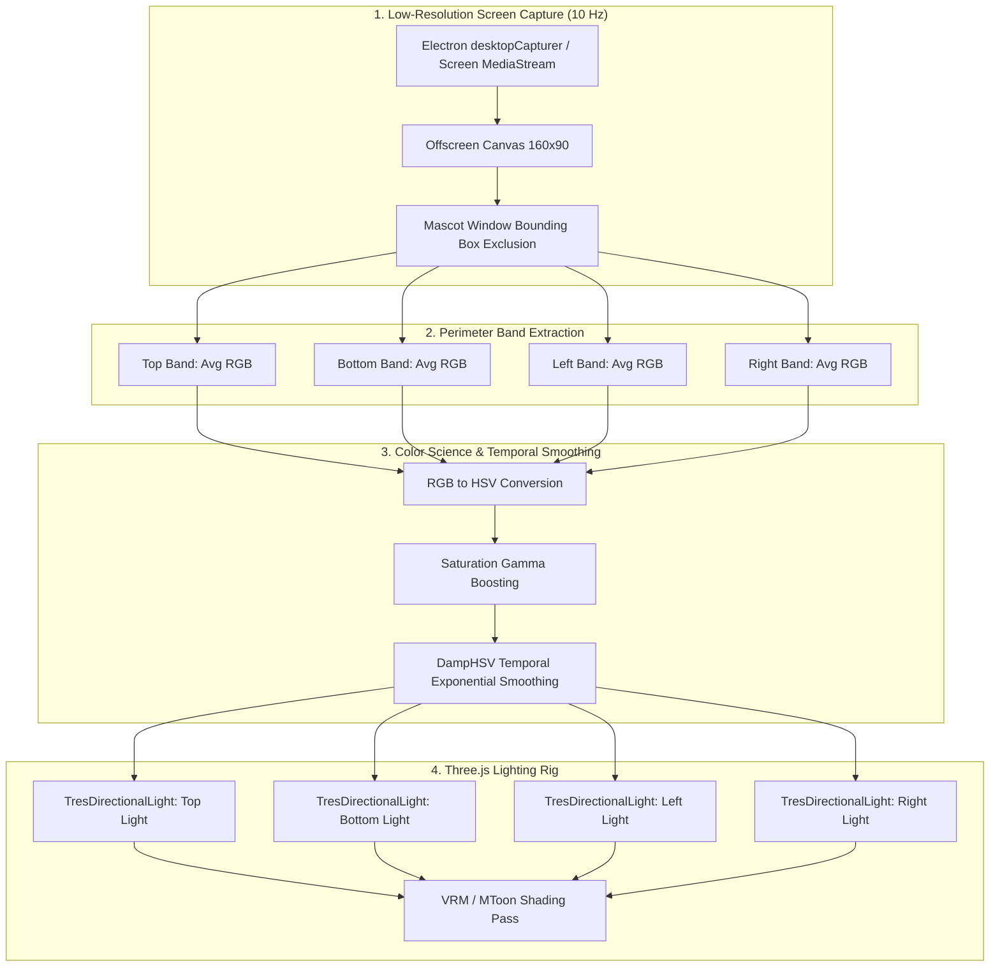

# Design Specification: Dynamic Desktop Ambient Lighting (Screen Bounce) for Three.js / VRM

## 1. Overview & Motivation

When a 3D desktop mascot (VRM / MMD) renders over a transparent desktop window, standard static three-point lighting often makes the character look "pasted on" or detached from the desktop environment. In real-world lighting, desktop monitors and active applications cast strong localized ambient light onto nearby physical objects.

This document specifies the architecture, mathematical model, and implementation roadmap for **Dynamic Desktop Ambient Lighting** in AIRI (`@proj-airi/stage-ui-three` / `@proj-airi/stage-ui-vrm`). Inspired by the desktop global illumination probe in Mate-Engine (`DesktopAmbientProbe.cs`), this system samples the screen perimeter surrounding the mascot, computes continuous color and saturation-boosted light values, and drives a real-time 4-point directional lighting rig in Three.js.

```
                   [ 🖥️ Top Screen Band (Menu Bar / Active App Header) ]
                                          │
                                          ▼
                                   [ topLight (0, 3, 0) ]
                                         ↓
 [ 🖥️ Left Screen Band ] ──► [ leftLight (-3, 0, 0) ]   👩 VRM Model   [ rightLight (3, 0, 0) ] ◄── [ 🖥️ Right Screen Band ]
                                         ↑
                                  [ bottomLight (0, -3, 0) ]
                                          ▲
                                          │
                      [ 🖥️ Bottom Screen Band (Dock / Taskbar) ]
```

---

## 2. Core Architecture & Data Pipeline



---

## 3. Mathematical Models & Color Science

### 3.1 Mascot Exclusion & Band Geometry
Sampling a low-resolution ($160 \times 90$) framebuffer prevents GPU/CPU bottlenecks. To avoid feedback loops (where the mascot samples its own rendered pixels), the screen coordinates of the mascot window are masked out:

$$\text{Margin} = \text{clamp}\left(12 \times \frac{\text{captureHeight}}{\text{virtualHeight}}, 0, \text{captureHeight}\right)$$

The 4 perimeter sampling bands are calculated as:
* **Top Band**: $y \in [0, \max(0, y_{\text{mascot}} - \text{bandThickness})]$
* **Bottom Band**: $y \in [\min(\text{height} - \text{bandThickness}, y_{\text{mascot\_bottom}}), \text{height}]$
* **Left Band**: $x \in [\max(0, x_{\text{mascot}} - \text{bandThickness}), x_{\text{mascot}}]$
* **Right Band**: $x \in [x_{\text{mascot\_right}}, \min(\text{width}, x_{\text{mascot\_right}} + \text{bandThickness})]$

### 3.2 Saturation Gamma Boosting
Neutral grays and whites produce soft illumination, while vibrant user interface elements (e.g. YouTube video, syntax highlighting, vibrant wallpaper) produce intense, directional color bounce:

$$I = \text{lerp}\left(I_{\min}, I_{\max}, S^{\gamma}\right)$$

Where:
* $I_{\min} = 0.35$ (baseline ambient fill intensity)
* $I_{\max} = 1.20$ (maximum vibrant color punch)
* $\gamma = 1.30$ (saturation gamma exponent)
* $S = \text{Saturation} \in [0.0, 1.0]$

### 3.3 Temporal Exponential Smoothing with Angular Hue Wrapping
To prevent abrupt flickering during rapid screen changes (e.g. video playback or window switching), targets are smoothed using delta-time exponential dampening:

$$\alpha = 1 - \exp\left(-\frac{\Delta t}{\tau}\right) \quad \text{where } \tau = 0.05 + 1.5 \cdot \text{smoothingFactor}$$

Because Hue is circular ($0.0 \equiv 1.0$), angular shortest-path delta is used to prevent color jumps across the $0^\circ / 360^\circ$ seam:

$$\Delta h = \text{normalizeAngle}\left(h_{\text{target}} - h_{\text{current}}\right)$$
$$h_{\text{next}} = \left(h_{\text{current}} + \alpha \cdot \Delta h\right) \pmod{1.0}$$
$$s_{\text{next}} = \text{lerp}(s_{\text{current}}, s_{\text{target}}, \alpha)$$
$$v_{\text{next}} = \text{lerp}(v_{\text{current}}, v_{\text{target}}, \alpha)$$

---

## 4. Three.js Scene Integration

### 4.1 Lighting Rig in `ThreeScene.vue`
In `@proj-airi/stage-ui-three`, four dedicated unshadowed directional lights are positioned around the avatar:

```html
<!-- Dynamic Desktop Ambient Bounce Lights -->
<TresDirectionalLight
  v-if="ambientBounceEnabled"
  :color="ambientTopColor"
  :intensity="ambientTopIntensity"
  :position="[0, 3, 0.5]"
/>
<TresDirectionalLight
  v-if="ambientBounceEnabled"
  :color="ambientBottomColor"
  :intensity="ambientBottomIntensity"
  :position="[0, -3, 0.5]"
/>
<TresDirectionalLight
  v-if="ambientBounceEnabled"
  :color="ambientLeftColor"
  :intensity="ambientLeftIntensity"
  :position="[-3, 1, 0.5]"
/>
<TresDirectionalLight
  v-if="ambientBounceEnabled"
  :color="ambientRightColor"
  :intensity="ambientRightIntensity"
  :position="[3, 1, 0.5]"
/>
```

### 4.2 Interaction with MToon / `VRMToonMaterial`
VRM's MToon shader naturally supports multiple directional lights:
1. **Key Direct Light**: Provides primary facial and frontal key illumination.
2. **Left/Right Bounce**: Colors the toon rim and indirect shade boundaries according to the apps flanking the character.
3. **Bottom Bounce**: Picks up the taskbar/dock color, giving soft under-chin/feet grounding.

---

## 5. Web & Non-Electron Fallbacks

When running in browser environments without OS desktop screen capture permissions (`stage-web` or `stage-pocket`):
* **Stage Scenery Fallback**: The probe automatically samples the active background image loaded in `useBackgroundStore().activeBackground`.
* **Quadrant Sampling**: The background image canvas is sliced into Top/Bottom/Left/Right quadrants to generate consistent scene-matched lighting.

---

## 6. Settings & Control Customizer Schema

| Key | Type | Default | Description |
| :--- | :--- | :--- | :--- |
| `ambientScreenLightEnabled` | `boolean` | `false` | Master toggle for dynamic desktop bounce lighting. |
| `ambientScreenLightSmoothing` | `number` | `0.85` | Exponential smoothing factor ($0.0 \to 1.0$). |
| `ambientScreenLightIntensity` | `number` | `1.0` | Global multiplier for ambient bounce intensity. |
| `ambientScreenLightCaptureHz` | `number` | `10` | Screen sampling frequency (Hz). |

---

## 7. Implementation File Roadmap

| Path | Purpose |
| :--- | :--- |
| `packages/stage-ui-three/src/composables/vrm/use-desktop-ambient-lighting.ts` | **NEW**: Pure composable managing capture stream, color extraction, `DampHSV` math, and light state refs. |
| `packages/stage-ui-three/src/components/ThreeScene.vue` | **MODIFY**: Mount the 4 directional bounce lights and bind to composable refs. |
| `packages/stage-ui/src/stores/settings/stage.ts` | **MODIFY**: Add settings schema keys for ambient bounce lighting. |
| `packages/stage-ui/src/constants/control-customizer.ts` | **MODIFY**: Add toggle entry in Control Strip Customizer under `stage-lighting`. |
| `packages/i18n/src/locales/en/settings.yaml` | **MODIFY**: Add localized strings for ambient screen lighting controls. |
