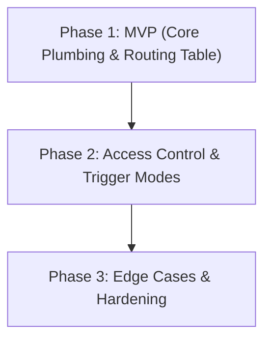

# Design Document: Discord Context Routing & Access Control

**Status:** Proposed / Phased Roadmap Established — **Local Execution Mode Only**

**Scope:** This document covers **local** Discord Gateway routing and ACL only (`executionMode: 'local'`). The Electron desktop app owns the Discord Gateway WebSocket and the chat pipeline, and all routing/ACL decisions are resolved locally. Multi-channel/thread/DM → `(character, session)` mapping, trigger gating, and permission enforcement are the focus. Remote/edge execution is explicitly **out of scope** for this revision.

**Goal:** Provide granular control over how Discord channels, threads, and Direct Messages (DMs) map to AIRI character cards and session histories, alongside a robust permission matrix to restrict slash commands, raw message ingestion, and execution capabilities.

---

## 🏛️ Core Architecture & Design Philosophy

The system separates concerns into a **Discord Context Resolver & Router** and an **Access Control List (ACL) Permission Engine**.

### Where the resolver lives (decided)

The **Context Resolver runs in the renderer**, inside the leadership-elected "Stage" window — *not* in the Electron main process. This is a deliberate correction to earlier drafts that placed resolution in main.

Rationale, grounded in the current codebase:

- The Discord main-process service (`apps/stage-tamagotchi/src/main/services/airi/discord/index.ts`) is intentionally a **dumb pipe**: `MessageCreate` → `pushInboundMessage()` → `broadcastToAllWindows(...)`. It holds no application state and has no access to cards, sessions, or the route table.
- The route table and all card/session state live in per-window **Pinia stores** backed by renderer `localStorage` / IndexedDB.
- Only the renderer owns `chatOrchestrator`, so the resolved `(characterId, sessionId)` is consumed in the renderer regardless. Resolving in main would force a round-trip and a new sync surface for every UI edit of the route table — with no compensating benefit in Phase 1.

A main-process or shared resolver is revisited only in **Phase 2/3**, when ACL rules need a trusted enforcement point the renderer cannot provide.

### Why background-session routing is cheap here

The chat plumbing **already supports** writing to a non-active session, so the router never needs to hijack `activeSessionId` or flip the active card:

- `chatOrchestrator.ingest(sendingMessage, options, targetSessionId?)` (`stores/chat.ts`) accepts an explicit target session; internally `sessionId = targetSessionId || activeSessionId.value`.
- Session store background primitives (`stores/chat/session-store.ts`):
  - `createSession(characterId, { setActive:false, title? }) → Promise<sessionId>` — creates a session without stealing UI focus.
  - `inscribeTurn(message, sessionId = activeSessionId)` — appends one message to an arbitrary session, persists, broadcasts `session-updated`.
  - `getCharacterIndex(characterId) → ChatCharacterSessionsIndex | null`
  - `setSessionMessages(sessionId, next)` / `loadSession(sessionId)`
  - Staleness guards `getSessionGeneration` / `bumpSessionGeneration`.

Identity model (existing): `userId → characters[characterId] → { activeSessionId, sessions[sessionId] }`, `ChatSessionMeta = { sessionId, userId, characterId, title?, messageCount?, universeId?, createdAt, updatedAt, ... }`. **There is no channel/context field on sessions today** — the channel→session mapping is maintained as a separate route table (below), not by extending `ChatSessionMeta`.

### 1. Global Routing Modes
Users can select the default behavior for unmapped incoming channels and messages:
1. **Strict Fallback (Ignore)** *[DEFAULT FOR ALL INSTALLS]*: Any channel, thread, or DM that is not explicitly mapped in the routing table will be completely ignored by the bot. This enforces security by default so the bot never broadcasts unintentionally across public channels.
2. **Shared / Legacy**: All incoming Discord interactions share the single active character and session currently selected in the desktop app GUI (mirroring legacy behavior).
3. **Isolated Fallback (Auto-Create)**: Unmapped channels/DMs will automatically initialize a dedicated, isolated session for that channel (or user ID, in DMs) using a specified default character card.

---

## 🗺️ Context Mapping & Routing Table

The router maintains a key-value mapping of incoming Discord contexts to internal AIRI resources. Routes are **explicit per `(characterId, sessionId)`**; lookups never scan all character session indexes.

### Shared type contracts

Live in `packages/stage-shared/src/discord.ts` so the renderer store and main-process payloads share one definition.

```typescript
export type DiscordFallbackMode = 'ignore' | 'shared' | 'auto-create'

export type DiscordRouteSource = 'explicit' | 'inherited' | 'auto-created'

export interface DiscordRoute {
  contextKey: string // "channel-{id}" | "thread-{id}" | "dm-{userId}"
  channelId?: string // Raw Discord channel/thread ID (when applicable)
  characterId: string // Target AiriCard ID (e.g. "airi", "nan0")
  sessionId: string // Target ChatSession ID owned by characterId
  source?: DiscordRouteSource
  triggerMode?: 'all' | 'mentions' | 'replies' | 'prefix' | 'disabled' // Phase 2
}

/** The persisted route table, keyed by contextKey. */
export type DiscordRouteTable = Record<string, DiscordRoute>
```

A shared context-key builder keeps main and renderer consistent:

```typescript
export function buildDiscordContextKey(input: {
  channelId: string
  guildId: string | null
  userId: string
  channelType?: number // discord.js ChannelType
}): string {
  // no guildId            → "dm-{userId}"
  // ChannelType 10/11/12  → "thread-{channelId}"  (announcement/public/private thread)
  // else                  → "channel-{channelId}"
}
```

### Required payload change (Phase 1 blocker)

To distinguish threads from plain channels, the existing payloads must carry the Discord channel type. Add `channelType: number` to both `DiscordInboundMessage` and `DiscordInteractionPayload`, populated in the main-process handlers:

- `Events.MessageCreate` handler — when building the `DiscordInboundMessage`.
- `Events.InteractionCreate` (`handleInteraction`) — when building the `DiscordInteractionPayload`.

Without `channelType`, the renderer cannot tell a thread from a channel and Phase 1's "threads are distinct `thread-{id}` keys" is not implementable.

### Direct Message (DM) & Private Session Isolation
* Direct Messages are treated as virtual contexts keyed by `dm-{userId}` (`guildId == null`).
* DMs automatically route to a private session isolated to that specific Discord User ID.
* **Privacy Boundary**: Private DM sessions are hidden from global session selectors, `/history` lookups by other users, exports, and shared UI logs to prevent accidental exposure of private roleplay sessions. Auto-created DM sessions should be flagged/titled so the UI can filter them.

### Thread Contexts (MVP Behavior)
* Threads and forum posts are treated as distinct `contextKey` entries (`thread-{id}`).
* In Phase 1, explicitly mapped threads operate independently as separate contexts. Unmapped threads follow the selected global fallback mode (e.g. `ignore`).

### Invalid Route Safety
* If a mapped `characterId` or `sessionId` is deleted or corrupted, the router **safely disables the route** and logs a diagnostic warning. It will never silently redirect or fall back to an unintended character or random session.
* Validation happens **at resolve time** (see §Resolver logic), not via reactive watchers. A route whose card is missing (`!airiCard.cards.has(characterId)`) or whose session is absent from `getCharacterIndex(characterId).sessions` resolves to `invalid`.
* **Orphaned sessions are reported, not purged.** Deleting a card orphans its sessions in the index; the resolver must not auto-delete them. Cleanup is deferred to Phase 3 lifecycle controls.
* **Visibility:** invalid routes should be surfaced in the UI table (greyed row + "target missing" badge) so the failure is visible, not silent in a console log.

---

## ⚙️ Context Resolver Logic (Phase 1)

Pure resolution, run inside the Stage-window "Brain" gate before ingest:

```typescript
type ResolveResult = { characterId: string, sessionId: string } | 'ignore' | 'invalid'

function resolveRoute(msg: DiscordInboundMessage): ResolveResult {
  const key = buildDiscordContextKey(msg)

  // 1. Explicit route
  const route = routes.value[key]
  if (route) {
    const cardExists = airiCard.cards.has(route.characterId)
    const sessionExists = cardExists
      && !!chatSession.getCharacterIndex(route.characterId)?.sessions?.[route.sessionId]
    if (!cardExists || !sessionExists) {
      logRouteInvalid(route) // diagnostic; NEVER fall back to another target
      return 'invalid'
    }
    return { characterId: route.characterId, sessionId: route.sessionId }
  }

  // 2. Fallback for unmapped contexts
  switch (fallbackMode.value) {
    case 'ignore':
      return 'ignore'
    case 'shared':
      // Snapshot the live GUI selection AT RESOLVE TIME (see Concurrency).
      return { characterId: airiCard.activeCardId, sessionId: chatSession.activeSessionId }
    case 'auto-create':
      return autoCreateTarget(msg)
  }
}

async function autoCreateTarget(msg: DiscordInboundMessage) {
  const cardId = autoCreateDefaultCardId.value || airiCard.activeCardId
  const sessionId = await chatSession.createSession(cardId, {
    setActive: false,
    title: `Discord · ${msg.guildName ?? 'DM'} · ${keyFor(msg)}`,
  })
  addRoute({
    contextKey: buildDiscordContextKey(msg),
    channelId: msg.channelId,
    characterId: cardId,
    sessionId,
    source: 'auto-created',
  })
  return { characterId: cardId, sessionId }
}
```

The ingested call pins the session explicitly:

```typescript
void chatOrchestrator.ingest(formattedContent, {
  attachments,
  metadata: { _discordSource: { messageId, channelId, userId, username, contextKey } },
}, target.sessionId)
```

Registering the auto-created route ensures subsequent messages on that context hit the explicit-route branch and stay put.

---

## 🔐 Permission Matrix & Precedence Rules

Slash commands and raw message ingestion are gated by an access check engine. **Phase 1 ships routing only**; the ACL engine below lands in Phase 2.

### Permission Precedence Rules
When evaluating whether a user can execute a command or trigger a response, the engine evaluates rules in strict order:
1. **Explicit Disable Always Wins**: If a command or trigger mode is set to `Disabled`, it is immediately dropped.
2. **Owner Bypass**: The bot owner (matching configured Discord User ID) bypasses standard restrictions for **admin/configuration commands** (`/settings`, `/character`, `/summon`, `/leave`). For conversational/standard commands, owner bypass applies unless explicitly set to `Disabled`.
3. **Explicit User/Role Deny**: Deny rules take precedence over general role permissions.
4. **Role / User Whitelist Allow**: User ID or Role ID match allows execution.
5. **Default Access Level**: Evaluates `Everyone` or fallback policies.
6. **Bot / Webhook Guard**: Messages generated by bots or webhooks are ignored by default to prevent infinite response loops.

### Command Classifications

1. **Admin / Configuration Commands**:
   * Commands: `/settings`, `/character`, `/summon`, `/leave`.
   * Scope: Restricted to **Owner Only** (matching the owner's Discord User ID).

2. **Standard / Conversational Commands**:
   * Commands: `/selfie`, `/history`, `/voicecall`, and raw text messages.
   * Access Levels:
     * `Owner Only`: Only the bot owner can trigger them.
     * `Whitelisted Only`: Only specified Discord User IDs or Role IDs can trigger them.
     * `Everyone`: Publicly accessible to anyone in allowed channels.
     * `Disabled`: The command is disabled globally or on the route.

---

## ⚠️ Concurrency & Race Policy (Phase 1 — must be decided before routing lands)

Per-route isolation multiplies the number of live sessions, so this must be specified up front, not discovered later.

* **Mid-flight UI switch:** Explicit routes are **stable** — `resolveRoute` returns a concrete `(characterId, sessionId)` and `ingest(..., targetSessionId)` pins the session at ingest, so a later GUI switch cannot redirect the in-flight turn. The residual race is confined to `shared` mode, which by definition tracks the live GUI selection. **Mitigation:** in `shared` mode, snapshot `(activeCardId, activeSessionId)` at ingest and stamp them onto `_discordSource`, rather than letting the completion handler re-read live state.
* **Concurrent multi-channel / multi-user sends:** The orchestrator has a single global `sending` flag and one active-session message lens; there is **no per-session send queue**. Generation guards (`getSessionGeneration`/`bumpSessionGeneration`) are staleness *detectors*, not a concurrency serializer. **Phase 1 policy:** serialize ingests **per `sessionId`** (a promise-chain queue keyed by session). Two users in the *same* channel session batch via `followup`/`collect`; two users in *different* sessions get independent queued turns. If cross-session interleaving proves unsafe, serialize **globally** and document the throughput cap.
* **`collect` batching is route-aware:** the existing single global `pendingCollectBatch` would merge two channels' messages into one flushed target. In a routed world the batch must be keyed by resolved `sessionId`, or `collect` mode is incompatible with multi-channel routing for Phase 1.
* **Dedup scope:** inbound `processedMessageIds` lives in the Stage window's memory and resets on window reload, so a gateway retry across a reload could double-ingest. Acceptable for Phase 1; durable dedup is a Phase 3 concern.

---

## 🚀 Phased Implementation Roadmap

To deliver value quickly while laying a solid foundation, implementation is split into three phases.



### Phase 1: MVP — Core Plumbing & Basic Mapping (Target Goal)
*Focus: Get the fundamental context routing working with minimal friction.*

* **1.1 Persistent Route Store** (`packages/stage-ui/src/stores/modules/discord.ts`):
  * Implement route mapping state using `useLocalStorageManualReset`, matching the existing settings pattern in this file:
    * `fallbackMode = useLocalStorageManualReset<DiscordFallbackMode>('settings/discord/routing/fallbackMode', 'ignore')`
    * `routes = useLocalStorageManualReset<DiscordRouteTable>('settings/discord/routing/routes', {})`
    * `autoCreateDefaultCardId = useLocalStorageManualReset<string>('settings/discord/routing/autoCreateCardId', '')`
  * Thin CRUD actions: `addRoute`, `removeRoute`, `getRoute`. Store stays a dumb bag; validity is enforced by the resolver, not watchers.

* **1.2 Context Resolver** (in the renderer store / a small `discord-router.ts` it imports — *not* the main process):
  * Resolve incoming `contextKey` against the routing table (see §Context Resolver Logic).
  * Map inbound text/interactions to the designated `(characterId, sessionId)` via `ingest(..., targetSessionId)`.
  * Implement `ignore` (default) and `shared` (with snapshot) fallbacks.
  * Basic `auto-create`: instantiate a background session via `createSession(cardId, { setActive:false })` and register the route (`source: 'auto-created'`).
  * Handle explicit thread IDs (`thread-{id}`) as independent context keys.
  * Apply the per-session concurrency queue (see §Concurrency).

* **1.3 Main-process payload enrichment** (`apps/stage-tamagotchi/src/main/services/airi/discord/index.ts`):
  * Add `channelType` to the `DiscordInboundMessage` (MessageCreate) and `DiscordInteractionPayload` (InteractionCreate) payloads. No routing logic in main.

* **1.4 MVP Settings UI** (`packages/stage-ui/src/components/modules/MessagingDiscord.vue`, tab `acl`):
  * Replace the existing mock fallback selector and mock table with store-backed bindings.
  * Fallback mode selector bound to `discordStore.fallbackMode` (default **Strict / Ignore**); when `auto-create` is active, reveal a Character-card dropdown bound to `autoCreateDefaultCardId`.
  * Routing table iterated over `Object.values(discordStore.routes)`; each row = `contextKey` ↔ **Character Card dropdown** (`airiCardStore.cards`) ↔ **Session dropdown** (sessions for *that row's* card, via `getCharacterIndex(route.characterId).sessions` — not the active card) ↔ `Delete` (`removeRoute`).
  * `[+ Add Channel Mapping]` appends a blank `DiscordRoute` via `addRoute`. Invalid routes render greyed with a "target missing" badge.
  * `triggerMode` column hidden for MVP (Phase 2).

**Phase 1 file touch list**

| File | Change |
| :--- | :--- |
| `packages/stage-shared/src/discord.ts` | Add `DiscordRoute`, `DiscordFallbackMode`, `DiscordRouteSource`, `DiscordRouteTable`, `buildDiscordContextKey`; add `channelType` to `DiscordInboundMessage` + `DiscordInteractionPayload` |
| `packages/stage-ui/src/stores/modules/discord.ts` | Route/fallback state + CRUD; `resolveRoute`/per-session queue/`autoCreateTarget`; rewire `onInboundMessage` to route-aware `ingest(..., targetSessionId)` |
| `apps/stage-tamagotchi/src/main/services/airi/discord/index.ts` | Populate `channelType` in MessageCreate + InteractionCreate payloads |
| `packages/stage-ui/src/components/modules/MessagingDiscord.vue` | Wire fallback selector + routing table to the store; per-row card & session dropdowns |

---

### Phase 2: Access Control, Trigger Modes & DM Isolation
*Focus: Secure interaction gates and refine how the bot listens in channels.*

* **2.1 Raw Message Trigger Modes**:
  * Per-route or global trigger configuration: `All Messages`, `Mentions Only`, `Replies Only`, `Prefix Only`, `Disabled`.
  * Separate raw-message trigger permissions from slash-command permissions (e.g. allow `/selfie` to everyone, but only reply to chat when mentioned).
* **2.2 ACL Permission Engine**:
  * Command permission matrix UI in settings (`Owner Only` | `Whitelisted` | `Everyone` | `Disabled`).
  * Enforce permission precedence rules before routing or executing slash commands.
* **2.3 DM Privacy Isolation**:
  * Auto-detect DM channels, map to `dm-{userId}` virtual contexts, and enforce strict session privacy boundaries.

---

### Phase 3: Advanced Edge Cases & Production Hardening
*Focus: Scale, stability, and handling Discord server complexities.*

* **3.1 Thread & Forum Inheritance**:
  * Parent-channel inheritance for unmapped threads and forum posts (`source: 'inherited'`).
  * Ability to override thread routing independently (`source: 'explicit'`).
* **3.2 Route Lifecycle & Auto-Create Controls**:
  * Cleanup rules for deleted/archived channels and dangling sessions (`source: 'auto-created'`).
  * Max route counts and auto-create retention policies.
* **3.3 Deduplication & Edit Handling**:
  * Durable event deduplication for Discord gateway retries (survives window reload).
  * Configurable handling for edited messages (ignore vs re-evaluate).

## Relevant Skills

- [[airi-cloud-relay-infrastructure]]
- [[airi-discord-integration]]
