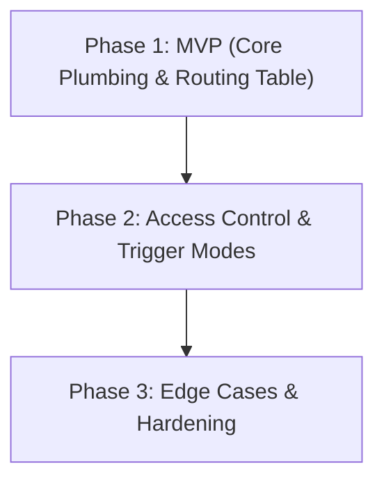

# Design Document: Discord Context Routing & Access Control

**Status:** Proposed / Phased Roadmap Established

**Goal:** Provide granular control over how Discord channels, threads, and Direct Messages (DMs) map to AIRI character cards and session histories, alongside a robust permission matrix to restrict slash commands, raw message ingestion, and execution capabilities.

---

## 🏛️ Core Architecture & Design Philosophy

The system separates concerns into a **Discord Context Resolver & Router** and an **Access Control List (ACL) Permission Engine** in the Electron main process and renderer stores.

### 1. Global Routing Modes
Users can select the default behavior for unmapped incoming channels and messages:
1. **Strict Fallback (Ignore)** *[DEFAULT FOR ALL INSTALLS]*: Any channel, thread, or DM that is not explicitly mapped in the routing table will be completely ignored by the bot. This enforces security by default so the bot never broadcasts unintentionally across public channels.
2. **Shared / Legacy**: All incoming Discord interactions share the single active character and session currently selected in the desktop app GUI (mirroring legacy behavior).
3. **Isolated Fallback (Auto-Create)**: Unmapped channels/DMs will automatically initialize a dedicated, isolated session for that channel (or user ID, in DMs) using a specified default character card.

---

## 🗺️ Context Mapping & Routing Table

The router maintains a key-value mapping of incoming Discord contexts to internal AIRI resources. Sessions are structured per-character (`characterId -> sessionId`) to ensure fast lookups without scanning all character session indexes.

```typescript
interface DiscordRoute {
  contextKey: string // Identifier: "channel-{id}", "thread-{id}", or virtual "dm-{userId}"
  channelId?: string // Raw Discord channel/thread ID (when applicable)
  characterId: string // Target AiriCard ID (e.g. "airi", "nan0")
  sessionId: string // Target ChatSession ID owned by characterId
  source?: 'explicit' | 'inherited' | 'auto-created'
  triggerMode?: 'all' | 'mentions' | 'replies' | 'prefix' | 'disabled'
}
```

### Direct Message (DM) & Private Session Isolation
* Direct Messages are treated as virtual contexts keyed by `dm-{userId}`.
* DMs automatically route to a private session isolated to that specific Discord User ID.
* **Privacy Boundary**: Private DM sessions are hidden from global session selectors, `/history` lookups by other users, exports, and shared UI logs to prevent accidental exposure of private roleplay sessions.

### Thread Contexts (MVP Behavior)
* Threads and forum posts are treated as distinct `contextKey` entries (`thread-{id}`).
* In Phase 1, explicitly mapped threads operate independently as separate contexts. Unmapped threads follow the selected global fallback mode (e.g. `ignore`).

### Invalid Route Safety
* If a mapped `characterId` or `sessionId` is deleted or corrupted, the router **safely disables the route** and logs a diagnostic warning. It will never silently redirect or fall back to an unintended character or random session.

---

## 🔐 Permission Matrix & Precedence Rules

Slash commands and raw message ingestion are gated by an access check engine.

### Permission Precedence Rules
When evaluating whether a user can execute a command or trigger a response, the engine evaluates rules in strict order:
1. **Explicit Disable Always Wins**: If a command or trigger mode is set to `Disabled`, it is immediately dropped.
2. **Owner Bypass**: The bot owner (matching configured Discord User ID) bypasses standard restrictions for **admin/configuration commands** (`/settings`, `/character`, `/summon`, `/leave`). For conversational/standard commands, owner bypass applies unless explicitly set to `Disabled`.
3. **Explicit User/Role Deny**: Deny rules take precedence over general role permissions.
4. **Role / User Whitelist Allow**: User ID or Role ID match allows execution.
5. **Default Access Level**: Evaluates `Everyone` or fallback policies.
6. **Bot / Webhook Guard**: Messages generated by bots or webhooks are ignored by default to prevent infinite response loops.

### Command Classifications

1. **Admin / Configuration Commands**:
   * Commands: `/settings`, `/character`, `/summon`, `/leave`.
   * Scope: Restricted to **Owner Only** (matching the owner's Discord User ID).

2. **Standard / Conversational Commands**:
   * Commands: `/selfie`, `/history`, `/voicecall`, and raw text messages.
   * Access Levels:
     * `Owner Only`: Only the bot owner can trigger them.
     * `Whitelisted Only`: Only specified Discord User IDs or Role IDs can trigger them.
     * `Everyone`: Publicly accessible to anyone in allowed channels.
     * `Disabled`: The command is disabled globally or on the route.

---

## 🚀 Phased Implementation Roadmap

To deliver value quickly while laying a solid foundation, implementation is split into three phases.



### Phase 1: MVP — Core Plumbing & Basic Mapping (Target Goal)
*Focus: Get the fundamental context routing working with minimal friction.*

* **1.1 Persistent Route Store**:
  * Implement the route mapping state in Pinia / `useDiscordStore` using `useLocalStorageManualReset`.
  * Structure: `Record<string, DiscordRoute>` + `fallbackMode` setting (`ignore` | `shared` | `auto-create`).
* **1.2 Context Resolver**:
  * In the main process / Discord service event handler, resolve incoming `contextKey` against the routing table.
  * Map incoming text and interactions directly to the designated `(characterId, sessionId)` pair.
  * Implement `ignore` (default) and `shared` fallback behaviors.
  * Basic `auto-create` behavior: If `auto-create` fallback is enabled, dynamically instantiate a new session for unmapped channels using a specified default character card.
  * Handle explicit thread IDs (`thread-{id}`) as independent context keys.
* **1.3 MVP Settings UI**:
  * Add a route manager section in `MessagingDiscord.vue`.
  * Fallback mode selector dropdown (defaulting to **Strict / Ignore**).
  * Dynamic routing table: `Context / Channel ID` ↔ `Character Card (Dropdown)` ↔ `Session (Dropdown)`.
  * Controls to `[Add Route]` and `[Delete Route]`.

---

### Phase 2: Access Control, Trigger Modes & DM Isolation
*Focus: Secure interaction gates and refine how the bot listens in channels.*

* **2.1 Raw Message Trigger Modes**:
  * Per-route or global trigger configuration: `All Messages`, `Mentions Only`, `Replies Only`, `Prefix Only`, `Disabled`.
  * Separate raw-message trigger permissions from slash-command permissions (e.g. allow `/selfie` to everyone, but only reply to chat when mentioned).
* **2.2 ACL Permission Engine**:
  * Command permission matrix UI in settings (`Owner Only` | `Whitelisted` | `Everyone` | `Disabled`).
  * Enforce permission precedence rules before routing or executing slash commands.
* **2.3 DM Privacy Isolation**:
  * Auto-detect DM channels, map to `dm-{userId}` virtual contexts, and enforce strict session privacy boundaries.

---

### Phase 3: Advanced Edge Cases & Production Hardening
*Focus: Scale, stability, and handling Discord server complexities.*

* **3.1 Thread & Forum Inheritance**:
  * Parent-channel inheritance for unmapped threads and forum posts (`source: 'inherited'`).
  * Ability to override thread routing independently (`source: 'explicit'`).
* **3.2 Route Lifecycle & Auto-Create Controls**:
  * Cleanup rules for deleted/archived channels and dangling sessions (`source: 'auto-created'`).
  * Max route counts and auto-create retention policies.
* **3.3 Deduplication & Edit Handling**:
  * Event deduplication for Discord gateway retries.
  * Configurable handling for edited messages (ignore vs re-evaluate).
