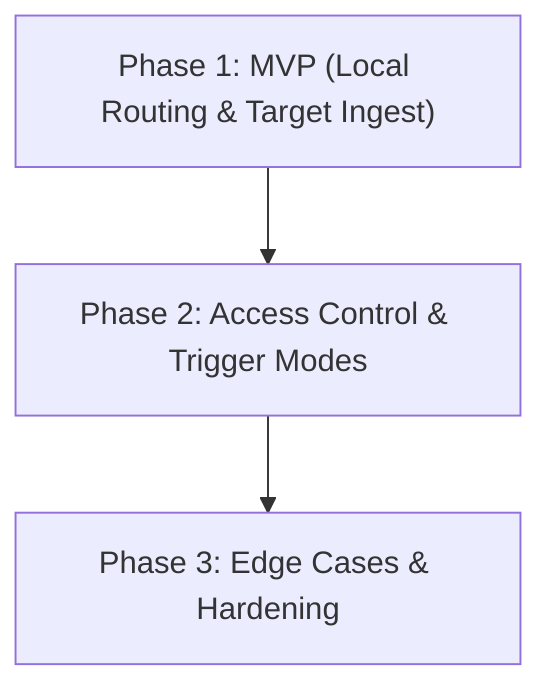

# Design Document: Discord Context Routing & Access Control

**Status:** Proposed / Phased Roadmap Established

**Goal:** Provide granular control over how Discord channels, threads, and Direct Messages (DMs) map to AIRI character cards and session histories, alongside a robust permission matrix to restrict slash commands, raw message ingestion, and execution capabilities.

---

## 🏛️ Core Architecture & Design Philosophy

The system separates concerns into a **Discord Context Resolver & Router** and an **Access Control List (ACL) Permission Engine** in the Electron main process and renderer stores.

### 1. Global Routing Modes
Users can select the default behavior for unmapped incoming channels and messages:
1. **Strict Fallback (Ignore)** *[DEFAULT FOR ALL INSTALLS]*: Any channel, thread, or DM that is not explicitly mapped in the routing table will be completely ignored by the bot. This enforces security by default so the bot never broadcasts unintentionally across public channels.
2. **Shared / Legacy**: All incoming Discord interactions share the single active character and session currently selected in the desktop app GUI (mirroring legacy behavior).
3. **Isolated Fallback (Auto-Create)**: Unmapped channels/DMs will automatically initialize a dedicated, isolated session for that channel (or user ID, in DMs) using a specified default character card.

---

## 🗺️ Context Mapping & Routing Table

The router maintains a key-value mapping of incoming Discord contexts to internal AIRI resources. Sessions are structured per-character (`characterId -> sessionId`) to ensure fast lookups without scanning all character session indexes.

```typescript
interface DiscordRoute {
  contextKey: string // Identifier: "channel-{id}", "thread-{id}", or virtual "dm-{userId}"
  channelId?: string // Raw Discord channel/thread ID (when applicable)
  characterId: string // Target AiriCard ID (e.g. "airi", "nan0")
  sessionId: string // Target ChatSession ID owned by characterId
  source?: 'explicit' | 'inherited' | 'auto-created'
  triggerMode?: 'all' | 'mentions' | 'replies' | 'prefix' | 'disabled'
}
```

### Direct Message (DM) & Private Session Isolation
* Direct Messages are treated as virtual contexts keyed by `dm-{userId}`.
* DMs automatically route to a private session isolated to that specific Discord User ID.
* **Privacy Boundary**: Private DM sessions are hidden from global session selectors, `/history` lookups by other users, exports, and shared UI logs to prevent accidental exposure of private roleplay sessions.

### Thread Contexts (MVP Behavior)
* Threads and forum posts are treated as distinct `contextKey` entries (`thread-{id}`).
* In Phase 1, explicitly mapped threads operate independently as separate contexts. Unmapped threads follow the selected global fallback mode (e.g. `ignore`).

### Invalid Route Safety
* If a mapped `characterId` or `sessionId` is deleted or corrupted, the router **safely disables the route** and logs a diagnostic warning. It will never silently redirect or fall back to an unintended character or random session.

---

## 🔐 Permission Matrix & Precedence Rules

Slash commands and raw message ingestion are gated by an access check engine.

### Permission Precedence Rules
When evaluating whether a user can execute a command or trigger a response, the engine evaluates rules in strict order:
1. **Explicit Disable Always Wins**: If a command or trigger mode is set to `Disabled`, it is immediately dropped.
2. **Owner Bypass**: The bot owner (matching configured Discord User ID) bypasses standard restrictions for **admin/configuration commands** (`/settings`, `/character`, `/summon`, `/leave`). For conversational/standard commands, owner bypass applies unless explicitly set to `Disabled`.
3. **Explicit User/Role Deny**: Deny rules take precedence over general role permissions.
4. **Role / User Whitelist Allow**: User ID or Role ID match allows execution.
5. **Default Access Level**: Evaluates `Everyone` or fallback policies.
6. **Bot / Webhook Guard**: Messages generated by bots or webhooks are ignored by default to prevent infinite response loops.

### Command Classifications

1. **Admin / Configuration Commands**:
   * Commands: `/settings`, `/character`, `/summon`, `/leave`.
   * Scope: Restricted to **Owner Only** (matching the owner's Discord User ID).

2. **Standard / Conversational Commands**:
   * Commands: `/selfie`, `/history`, `/voicecall`, and raw text messages.
   * Access Levels:
     * `Owner Only`: Only the bot owner can trigger them.
     * `Whitelisted Only`: Only specified Discord User IDs or Role IDs can trigger them.
     * `Everyone`: Publicly accessible to anyone in allowed channels.
     * `Disabled`: The command is disabled globally or on the route.

---

## 🚀 Phased Implementation Roadmap

To deliver value quickly while laying a solid foundation, implementation is split into three phases.



### Phase 1: MVP — Core Plumbing & Local Target Ingest (Target Goal)
*Focus: Get fundamental local context routing working using AIRI's background target session ingestion without stealing UI focus.*

* **1.1 Scope Boundary**:
  * Local Channel Context Routing operates strictly during **Local Gateway Execution (`executionMode: 'local'`)**.
  * When executing in Cloud Relay mode (`executionMode: 'remote'`), Discord interaction webhooks route directly to Cloudflare Edge.

* **1.2 Persistent Route Store (`packages/stage-ui/src/stores/modules/discord.ts`)**:
  * Route mapping state persisted in Pinia using `useLocalStorageManualReset`.
  * Structure: `routes = Record<string, DiscordRoute>` + `fallbackMode` (`ignore` | `shared` | `auto-create`) + `autoCreateDefaultCardId`.

* **1.3 Context Resolver (`packages/stage-ui/src/stores/modules/discord.ts`)**:
  * Operates inside the Stage window leadership gate on `onInboundMessage`.
  * Resolves incoming `contextKey` (`channel-{id}`, `thread-{id}`, `dm-{userId}`).
  * Leverages `chatOrchestrator.ingest(content, options, targetSessionId)` to write responses directly into designated background sessions without mutating global `activeSessionId` or stealing desktop UI focus.
  * **Invalid Route Safety**: If a mapped `characterId` or `sessionId` is deleted, the route resolves `invalid` and displays a **"Target Missing"** diagnostic badge in the settings table.

* **1.4 MVP Settings UI (`MessagingDiscord.vue` Tab 3)**:
  * **Fallback Mode Selector**: Dropdown options for `Strict / Ignore` (Default), `Shared / Legacy`, and `Isolated / Auto-Create`.
  * **Dynamic Routing Table**: Live `v-for` over routes displaying `Context Key` ↔ `Character Card Dropdown` ↔ `Session Dropdown` (populated dynamically per card) + `[Delete Route]`.
  * **Add Route**: Button to append a blank `DiscordRoute` mapping.

---

### Phase 2: Access Control, Trigger Modes & DM Isolation
*Focus: Secure interaction gates and refine how the bot listens in channels.*

* **2.1 Raw Message Trigger Modes**:
  * Per-route or global trigger configuration: `All Messages`, `Mentions Only`, `Replies Only`, `Prefix Only`, `Disabled`.
  * Separate raw-message trigger permissions from slash-command permissions (e.g. allow `/selfie` to everyone, but only reply to chat when mentioned).
* **2.2 ACL Permission Engine**:
  * Command permission matrix UI in settings (`Owner Only` | `Whitelisted` | `Everyone` | `Disabled`).
  * Enforce permission precedence rules before routing or executing slash commands.
* **2.3 DM Privacy Isolation**:
  * Auto-detect DM channels, map to `dm-{userId}` virtual contexts, and enforce strict session privacy boundaries.

---

### Phase 3: Advanced Edge Cases & Production Hardening
*Focus: Scale, stability, and handling Discord server complexities.*

* **3.1 Thread & Forum Inheritance**:
  * Parent-channel inheritance for unmapped threads and forum posts (`source: 'inherited'`).
  * Ability to override thread routing independently (`source: 'explicit'`).
* **3.2 Route Lifecycle & Auto-Create Controls**:
  * Cleanup rules for deleted/archived channels and dangling sessions (`source: 'auto-created'`).
  * Max route counts and auto-create retention policies.
* **3.3 Deduplication & Concurrency Handling**:
  * Per-session turn serialization queue to prevent stream interleaving across simultaneous multi-channel interactions.
  * Event deduplication for Discord gateway retries.

---

# Part 1 — Phase 1 MVP Implementation Plan

A key finding shapes everything below: **the plumbing for background-session routing already exists.** The orchestrator `ingest(sendingMessage, options, targetSessionId?)` accepts a target session (`chat.ts:1690`), and the session store exposes `inscribeTurn(msg, sessionId)`, `createSession(characterId, { setActive:false })`, `getCharacterIndex()`, and `setSessionMessages()`. So the router does **not** need to hijack `activeSessionId` — it can resolve a route and ingest into a non-active session directly. That collapses much of the risk this design would otherwise carry.

## 1.1 — Shared types: `packages/stage-shared/src/discord.ts`

Add the canonical route + fallback contracts here so both the renderer store and main process share one definition.

```typescript
export type DiscordFallbackMode = 'ignore' | 'shared' | 'auto-create'

export type DiscordRouteSource = 'explicit' | 'inherited' | 'auto-created'

export interface DiscordRoute {
  contextKey: string // "channel-{id}" | "thread-{id}" | "dm-{userId}"
  channelId?: string // raw Discord channel/thread id (when applicable)
  characterId: string // AiriCard id
  sessionId: string // ChatSession id owned by characterId
  source?: DiscordRouteSource
  triggerMode?: 'all' | 'mentions' | 'replies' | 'prefix' | 'disabled' // Phase 2, not MVP
}

/** Shape persisted to the route store. */
export type DiscordRouteTable = Record<string, DiscordRoute> // keyed by contextKey
```

A helper builds/parses context keys identically across process boundaries:

```typescript
export function buildDiscordContextKey(msg: {
  channelId: string
  guildId: string | null
  userId: string
  channelType?: number // discord.js ChannelType
}): string {
  // DM when no guildId → "dm-{userId}"
  // thread/forum when channelType is 10/11/12 (announcement/public/private thread) → "thread-{channelId}"
  // else → "channel-{channelId}"
}
```

Note: `DiscordInboundMessage` and `DiscordInteractionPayload` will include `channelType: number`, populated in main process handlers to distinguish threads from plain channels.

## 1.2 — Pinia store: `packages/stage-ui/src/stores/modules/discord.ts`

Add persisted state using `useLocalStorageManualReset`:

```typescript
const fallbackMode
  = useLocalStorageManualReset<DiscordFallbackMode>('settings/discord/routing/fallbackMode', 'ignore')
const routes
  = useLocalStorageManualReset<DiscordRouteTable>('settings/discord/routing/routes', {})
const autoCreateDefaultCardId
  = useLocalStorageManualReset<string>('settings/discord/routing/autoCreateCardId', '')
```

CRUD Actions:

```typescript
function addRoute(route: DiscordRoute) {
  routes.value = { ...routes.value, [route.contextKey]: route }
}
function removeRoute(contextKey: string) {
  const next = { ...routes.value }; delete next[contextKey]; routes.value = next
}
function getRoute(contextKey: string): DiscordRoute | null {
  return routes.value[contextKey] ?? null
}
```

## 1.3 — Context Resolver Location & Leadership Dispatcher

The resolver operates inside the Stage window leadership gate on `onInboundMessage`:

```typescript
function resolveRoute(msg: DiscordInboundMessage): { characterId: string, sessionId: string } | 'ignore' | 'invalid' {
  const key = buildDiscordContextKey(msg)

  // 1. Explicit route
  const route = routes.value[key]
  if (route) {
    const cardExists = airiCard.cards.has(route.characterId)
    const sessionExists = cardExists
      && !!chatSession.getCharacterIndex(route.characterId)?.sessions?.[route.sessionId]
    if (!cardExists || !sessionExists) {
      logRouteInvalid(route) // diagnostic; do NOT fall back to another card
      return 'invalid'
    }
    return { characterId: route.characterId, sessionId: route.sessionId }
  }

  // 2. Fallback mode for unmapped contexts
  switch (fallbackMode.value) {
    case 'ignore': return 'ignore'
    case 'shared': return { characterId: airiCard.activeCardId, sessionId: chatSession.activeSessionId }
    case 'auto-create': return autoCreateTarget(msg)
  }
}
```

Rewired `onInboundMessage` inside Stage gate:

```typescript
const target = resolveRoute(msg)
if (target === 'ignore' || target === 'invalid') { return }
void chatOrchestrator.ingest(formattedContent, { attachments, metadata: { _discordSource: {...} } }, target.sessionId)
```

`autoCreateTarget` primitive:

```typescript
async function autoCreateTarget(msg: DiscordInboundMessage) {
  const cardId = autoCreateDefaultCardId.value || airiCard.activeCardId
  const sessionId = await chatSession.createSession(cardId, {
    setActive: false,
    title: `Discord · ${msg.guildName ?? 'DM'} · ${msg.channelId}`,
  })
  addRoute({ contextKey: buildDiscordContextKey(msg), channelId: msg.channelId, characterId: cardId, sessionId, source: 'auto-created' })
  return { characterId: cardId, sessionId }
}
```

## 1.4 — Settings UI: `MessagingDiscord.vue` (Tab 3)

- **Fallback selector** → Bind options to `discordStore.fallbackMode`. Revealing default card dropdown when `auto-create` is selected.
- **Routing table** → `v-for` over `Object.values(discordStore.routes)` with Character Card & Session dropdowns populated per-row.
- **Add Route** → Appends a blank `DiscordRoute` mapping.

### Phase-1 File Touch List

| File | Change |
|---|---|
| `packages/stage-shared/src/discord.ts` | Add `DiscordRoute`, `DiscordFallbackMode`, `buildDiscordContextKey`; add `channelType` |
| `packages/stage-ui/src/stores/modules/discord.ts` | Add route/fallback state + CRUD; add `resolveRoute`/`autoCreateTarget`; rewire `onInboundMessage` to targetSessionId |
| `apps/stage-tamagotchi/src/main/services/airi/discord/index.ts` | Populate `channelType` in `MessageCreate` and `handleInteraction` payloads |
| `packages/stage-ui/src/components/modules/MessagingDiscord.vue` | Wire fallback selector + routing table to the store with per-row dropdowns |

---

# Part 2 — Technical Critique & Edge Cases

## §A. Renderer Store vs. Main Process Resolver Location
Putting the resolver in the Stage window renderer store is architectural best practice for Phase 1: main process is a transport pipe that broadcasts messages across IPC. Since `chatOrchestrator` and Pinia stores live in the Stage window, placing `resolveRoute` inside the Stage window leadership gate avoids complex multi-process state synchronization.

## §B. Mid-Flight UI vs. Gateway Race Conditions
Because `resolveRoute` returns an explicit `(characterId, sessionId)` and passes `targetSessionId` into `ingest()`, explicit routes remain 100% stable even if the user switches active cards or sessions in the desktop UI while a message is in-flight. In `shared` mode, snapshotting `(activeCardId, activeSessionId)` at ingest time prevents response persona desync.

## §C. Session Concurrency & Serialization Queue
When multiple Discord channels ingest messages into different sessions simultaneously, orchestrator streams must be serialized per `sessionId` (a promise-chain queue) to prevent streaming token state from interleaving.

## §D. Dangling Routes & Target Missing Badges
If a target character card or chat session is deleted, the route evaluates as `invalid`. Rather than silently failing, the UI routing table surfaces a visual **"Target Missing"** badge on the row, giving users immediate feedback.

## §E. Scope Isolation (Local Gateway vs. Cloud Relay)
Local Channel Context Routing operates strictly during **Local Gateway Execution (`executionMode: 'local'`)**. Cloud Relay deployments manage edge interactions independently via Cloudflare Workers.
