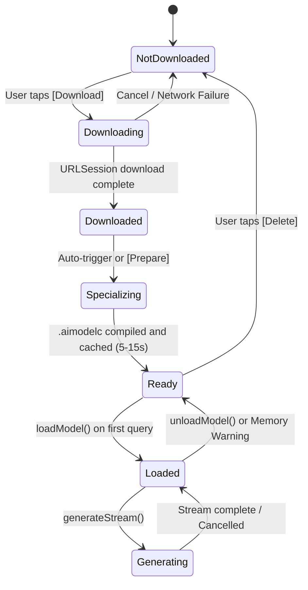

# Architectural Design: iOS Native LLM & Multimodal Inference via Apple Core AI & Capacitor

## Executive Summary

Project AIRI requires fast, battery-efficient, offline neural intelligence on mobile devices (`apps/stage-pocket`). Previous experiments with browser-side WebGPU neural networks (such as WebLLM running inside iOS `WKWebView`) suffer from severe mobile OS constraints: browser sandbox memory ceilings (where iOS terminates `WKWebView` WebContent processes exceeding 1.5–2.0 GB), heavy memory duplication between JavaScript heaps and WebAssembly runtimes, WebGPU device loss under system load, and network/decompression memory spikes during multi-gigabyte shard transfers.

This design document outlines the architecture for **Native On-Device Neural Inference on Apple Silicon (iOS/iPadOS)** utilizing Apple's **Core AI** framework (introduced at WWDC26) bridged directly to AIRI's TypeScript runtime through a dedicated **Capacitor Swift Plugin** (`@proj-airi/cap-native-ai`).

Crucially, Core AI is **not limited to Large Language Models**. It provides a unified, hardware-accelerated runtime across the **CPU, Metal GPU, and Apple Neural Engine (ANE)** capable of powering AIRI's entire on-device sensory and behavioral suite:
1. **Consciousness (LLMs)**: Qwen 2.5, Llama 3.2, Ministral, RWKV-7.
2. **Vision & Tagging**: WD14 WaifuDiffusion Tagger, CLIP, BLIP scene captioning.
3. **Generative Motion**: FlowMDM Text-to-Motion neural diffusion denoiser.
4. **Speech & Hearing**: Local Whisper STT and Kokoro TTS.

---

## 1. Scope, Principles & Anti-Goals

### 1.1 Guiding Principles

1. **Curated Model Registry over Arbitrary Runtime Conversion**:
   - **Anti-Goal**: AIRI will **never** attempt to execute PyTorch conversion, weight tracing, or Python scripts on the user's mobile device.
   - **Contract**: All supported models are pre-converted into standard `.aimodel` bundles, compressed/quantized (INT4 / INT8 / Palettization), verified for Apple Neural Engine execution, and hosted on **Hugging Face** (`apple/coreai-models`, community repos, and `proj-airi` hubs).
   - **User UX**: The user simply selects from a curated list of verified models in the settings, taps "Download", and the native subsystem handles background streaming and one-time hardware specialization.

2. **Provider-Agnostic Core (`@proj-airi/stage-ui`)**:
   - The AIRI application layer (Vue 3, Pinia, session orchestrator, `<|ACT:...|>` marker parser, speech runtime) remains 100% engine-agnostic.
   - Core AI presents itself as a standard OpenAI-compatible `ChatProvider` (for LLMs) and dedicated perception adapters (for vision and motion), cleanly isolated behind TypeScript interfaces.

3. **Out-of-Process Native Storage & Downloader**:
   - Model weights never pass through JavaScript buffers or WebKit memory.
   - Swift's `URLSessionDownloadDelegate` streams weights directly to `Documents/CoreAI/models/`, completely immune to WebContent crashes or tab suspensions.

4. **One-Time Hardware Specialization (The "TensorRT" of Apple Silicon)**:
   - When a pre-made `.aimodel` is received on a user's device, iOS Core AI compiles and tunes the graph specifically for that device's chip architecture (e.g. A17 Pro vs A18 Pro vs M4) in 5–15 seconds.
   - The compiled artifact (`.aimodelc`) is permanently cached in the app sandbox, enabling sub-second load times on subsequent launches.

---

## 2. The Multimodal Core AI Suite for Project AIRI

Core AI's unified graph execution across ANE and Metal GPU allows AIRI Pocket to consolidate multiple separate inference libraries (ONNX Runtime Web, WebLLM, Transformers.js, Web-RWKV) into a single, highly optimized native host subsystem:

```
┌─────────────────────────────────────────────────────────────────────────┐
│                      AIRI Pocket Native Model Suite                     │
│                        (Powered by Apple Core AI)                       │
├───────────────────┬──────────────────────────┬──────────────────────────┤
│ Modality          │ Models / Architectures   │ Role in AIRI             │
├───────────────────┼──────────────────────────┼──────────────────────────┤
│ 🧠 Consciousness  │ • Qwen 2.5 (0.5B / 1.5B) │ Core dialogue, persona   │
│    (LLM / Chat)   │ • Llama 3.2 (1B / 3B)    │ roleplay, tool reasoning,│
│                   │ • Ministral 3B           │ and proactivity          │
│                   │ • RWKV-7 "Goose" (1.5B)  │ heartbeats               │
├───────────────────┼──────────────────────────┼──────────────────────────┤
│ 👁️ Vision &       │ • WD14 Tagger (SwinV2)   │ Anime character/outfit   │
│    Perception     │ • CLIP (ViT-B/32)        │ trait tagging, selfie    │
│                   │ • BLIP Scene Captioner   │ scene understanding, and │
│                   │ • MODNet / RMBG          │ background matting       │
├───────────────────┼──────────────────────────┼──────────────────────────┤
│ 💃 Generative      │ • FlowMDM Diffusion      │ Sub-second Text-to-VRMA  │
│    Motion         │   Denoiser (UNet)        │ kinetic gesture synthesis│
│                   │                          │ for <|ACT:motion="..."|> │
├───────────────────┼──────────────────────────┼──────────────────────────┤
│ 🎙️ Audio & Voice   │ • Whisper ASR (tiny/base)│ Real-time voice hearing  │
│                   │ • Kokoro-82M TTS         │ & neural speech output   │
└───────────────────┴──────────────────────────┴──────────────────────────┘
```

### 2.1 Spotlight: On-Device FlowMDM Motion Diffusion

In desktop/browser AIRI (`packages/stage-ui-three`), FlowMDM (`dasilva333/flowmdm-onnx`) runs a 100-step diffusion denoising loop over WebGPU. On mobile browsers, this causes severe GPU stalls and battery drain.

By exporting FlowMDM's UNet denoiser to `.aimodel` and executing it on Apple's **Apple Neural Engine (ANE)**:
- Denoising 100 steps drops from ~4.5s (WebGPU) to **< 350ms (ANE)**.
- Memory usage is near-zero in WebKit.
- Enables fluid, real-time avatar reactions to spoken dialogue and emotional cues without thermal throttling.

---

## 3. High-Level System Architecture

```
┌─────────────────────────────────────────────────────────────────────────┐
│                           AIRI Client Layer                             │
│       (Vue 3, Pinia, useLLM Store, useLlmmarkerParser, ACT tokens)      │
└────────────────────────────────────┬────────────────────────────────────┘
                                     │
                        OpenAI-Compatible ChatProvider
                                     │
┌────────────────────────────────────▼────────────────────────────────────┐
│                    @proj-airi/stage-ui Providers                        │
│                 (Router / Capabilities / Registry)                      │
└──────────────┬─────────────────────┬────────────────────┬───────────────┘
               │                     │                    │
               ▼                     ▼                    ▼
     ┌──────────────────┐  ┌──────────────────┐  ┌─────────────────────┐
     │  Cloud Providers │  │  In-Browser Web  │  │  Native Local Engine│
     │  (OpenAI, Claude,│  │  (Web-RWKV,      │  │  (Capacitor Plugin) │
     │   DeepSeek, etc.)│  │   WebLLM)        │  └──────────┬──────────┘
     └──────────────────┘  └──────────────────┘             │
                                                            │ JS/Swift IPC
                                                            ▼
                                                 ┌─────────────────────┐
                                                 │ NativeAIPlugin      │
                                                 │ (Swift / Capacitor) │
                                                 └──────────┬──────────┘
                                                            │
                                        ┌───────────────────┴───────────────────┐
                                        ▼                                       ▼
                             ┌─────────────────────┐                 ┌─────────────────────┐
                             │ URLSession Model    │                 │ CoreAIEngine.swift  │
                             │ Background Manager  │                 │ (Core AI Runtime)   │
                             └─────────────────────┘                 └──────────┬──────────┘
                                                                                │
                                                            ┌───────────────────┴───────────────────┐
                                                            ▼                   ▼                   ▼
                                                         [ CPU ]             [ GPU ]             [ ANE ]
```

---

## 4. The Native Plugin Contract: `@proj-airi/cap-native-ai`

### 4.1 TypeScript Plugin Interface (`definitions.ts`)

```typescript
export type ModelModality = 'chat' | 'vision' | 'motion' | 'speech' | 'transcription'

export interface NativeModelInfo {
  id: string
  name: string
  version: string
  modality: ModelModality
  sizeBytes: number
  contextLength?: number
  isDownloaded: boolean
  isSpecialized: boolean
  localPath?: string
  parameters: string
  description?: string
  downloadUrl: string
}

export type ModelState
  = | 'not_downloaded'
    | 'downloading'
    | 'downloaded'
    | 'specializing'
    | 'ready'
    | 'loaded'
    | 'error'

export interface ModelStatusEvent {
  modelId: string
  state: ModelState
  progress?: number // 0.0 to 1.0
  error?: string
}

export interface NativeGenerateRequest {
  requestId: string
  modelId: string
  messages: Array<{ role: 'system' | 'user' | 'assistant', content: string }>
  temperature?: number
  topP?: number
  maxTokens?: number
  stopSequences?: string[]
}

export interface TokenStreamEvent {
  requestId: string
  token: string
  isFinished: boolean
  finishReason?: 'stop' | 'length' | 'cancelled'
  promptTokens?: number
  completionTokens?: number
}

export interface NativeAIPluginInterface {
  /** Check if Core AI / Apple Silicon hardware acceleration is available on this device. */
  isAvailable: () => Promise<{ available: boolean, chipFamily: string, neuralEngineCores: number }>

  /** List supported and curated Core AI models from the built-in manifest. */
  listModels: (options?: { modality?: ModelModality }) => Promise<{ models: NativeModelInfo[] }>

  /** Start a background download of model weights directly on the native file system from Hugging Face / CDN. */
  downloadModel: (options: { modelId: string }) => Promise<void>

  /** Cancel an active model download. */
  cancelDownload: (options: { modelId: string }) => Promise<void>

  /** Delete model weights and specialized caches from device storage. */
  deleteModel: (options: { modelId: string }) => Promise<void>

  /** Pre-compile and specialize the .aimodel into .aimodelc for this specific device. */
  specializeModel: (options: { modelId: string }) => Promise<void>

  /** Load model into memory (GPU/ANE resident) for immediate inference. */
  loadModel: (options: { modelId: string }) => Promise<void>

  /** Unload active model from memory to free system RAM. */
  unloadModel: (options?: { modelId?: string }) => Promise<void>

  /** Start autoregressive token generation. Chunks stream via the 'token' listener. */
  generateStream: (options: NativeGenerateRequest) => Promise<{ requestId: string }>

  /** Abort an in-flight generation request. */
  cancelGeneration: (options: { requestId: string }) => Promise<void>

  /** Native Multimodal Inference endpoints */
  tagImage: (options: { modelId: string, base64Image: string, threshold?: number }) => Promise<{ tags: Array<{ label: string, confidence: number }> }>
  generateMotion: (options: { modelId: string, prompt: string, numFrames?: number }) => Promise<{ vrmaBufferBase64: string }>

  /** Event listeners */
  addListener: ((eventName: 'modelStatus', listenerFunc: (status: ModelStatusEvent) => void) => Promise<PluginListenerHandle>) & ((eventName: 'token', listenerFunc: (tokenEvent: TokenStreamEvent) => void) => Promise<PluginListenerHandle>)
}
```

---

## 5. Curated Distribution & Sourcing Strategy

### 5.1 Hugging Face Model Hub Integration

AIRI models are indexed in a static metadata catalog inside `@proj-airi/stage-ui`. Each entry maps a friendly model profile to pre-built `.aimodel` artifacts hosted on Hugging Face:

```typescript
export const CURATED_COREAI_MODELS: NativeModelInfo[] = [
  // --- LLMs (Consciousness) ---
  {
    id: 'qwen-2.5-1.5b-instruct-int4',
    name: 'Qwen 2.5 (1.5B Instruct)',
    version: '1.0',
    modality: 'chat',
    sizeBytes: 1_180_000_000,
    contextLength: 4096,
    parameters: '1.5B INT4',
    description: 'Fast, highly intelligent conversation engine with multilingual and roleplay support.',
    downloadUrl: 'https://huggingface.co/proj-airi/coreai-qwen-2.5-1.5b/resolve/main/model.aimodel',
    isDownloaded: false,
    isSpecialized: false,
  },
  {
    id: 'rwkv-7-1.5b-world-int4',
    name: 'RWKV-7 "Goose" (1.5B)',
    version: '1.0',
    modality: 'chat',
    sizeBytes: 1_220_000_000,
    contextLength: 8192,
    parameters: '1.5B INT4 (RNN)',
    description: 'Attention-free linear RNN model with constant RAM usage and lightning-fast prefill.',
    downloadUrl: 'https://huggingface.co/proj-airi/coreai-rwkv7-1.5b/resolve/main/model.aimodel',
    isDownloaded: false,
    isSpecialized: false,
  },
  {
    id: 'llama-3.2-1b-instruct-int4',
    name: 'Llama 3.2 (1B Instruct)',
    version: '1.0',
    modality: 'chat',
    sizeBytes: 780_000_000,
    contextLength: 4096,
    parameters: '1B INT4',
    description: 'Ultra-lightweight foundation model with low battery consumption.',
    downloadUrl: 'https://huggingface.co/proj-airi/coreai-llama-3.2-1b/resolve/main/model.aimodel',
    isDownloaded: false,
    isSpecialized: false,
  },
  // --- Vision (Perception) ---
  {
    id: 'wd14-swinv2-tagger-coreai',
    name: 'WaifuDiffusion (WD14 Tagger)',
    version: '2.0',
    modality: 'vision',
    sizeBytes: 210_000_000,
    parameters: 'SwinV2-Base',
    description: 'Anime character, clothing, and expression tagger for visual perception.',
    downloadUrl: 'https://huggingface.co/proj-airi/coreai-wd14-tagger/resolve/main/model.aimodel',
    isDownloaded: false,
    isSpecialized: false,
  },
  // --- Generative Motion ---
  {
    id: 'flowmdm-vrma-denoiser-coreai',
    name: 'FlowMDM Motion Denoiser',
    version: '1.0',
    modality: 'motion',
    sizeBytes: 340_000_000,
    parameters: 'UNet Motion Diffusion',
    description: 'Sub-second neural text-to-motion synthesizer for avatar gesture cues.',
    downloadUrl: 'https://huggingface.co/proj-airi/coreai-flowmdm/resolve/main/model.aimodel',
    isDownloaded: false,
    isSpecialized: false,
  },
]
```

---

## 6. Model Lifecycle & State Machine



---

## 7. Memory Safety, Queuing & Power Resilience

### 7.1 Multi-Task Queuing & Memory Arbitration

Unlike a high-end desktop GPU with 24 GB VRAM, an iPhone typically shares 6 GB to 8 GB of Unified Memory between iOS, the display compositor, WebKit, and machine learning.

The native `CoreAIEngine.swift` enforces strict **Single-Resident or Prioritized Multi-Model Allocation**:

1. **Active LLM vs Vision vs Motion**:
   - **Text Generation**: LLM weights remain resident in memory.
   - **Perception Request (Image witness / Camera)**: If VRAM headroom is tight (< 1.5 GB available), the LLM context is kept in RAM while the compact WD14 model (~200 MB) executes on ANE, then promptly releases its scratch buffers.
   - **Motion Generation (`<|ACT:motion="..."|>`)**: The FlowMDM denoiser runs in < 350ms on ANE and yields immediately back to the render thread.

2. **System Memory Warnings (`applicationDidReceiveMemoryWarning`)**:
   - In `AppDelegate.swift`, capture iOS memory pressure signals:
   ```swift
   func applicationDidReceiveMemoryWarning(_ application: UIApplication) {
       NativeAIPlugin.shared?.handleMemoryWarning()
   }
   ```
   - If no active generation is in flight, `handleMemoryWarning()` releases `activeFunction` and resident weights. Because the specialized `.aimodelc` remains cached on disk, reloading when the user chats again takes less than 500ms.

---

## 8. Integration with AIRI Chat & Provider Ecosystem

### 8.1 Provider Implementation (`packages/stage-ui/src/stores/providers/core-ai/index.ts`)

Conforms directly to `@xsai-ext/providers/utils` `ChatProvider`:

```typescript
import type { ChatProvider } from '@xsai-ext/providers/utils'

import type { NativeAIPluginInterface, TokenStreamEvent } from './contract'

import { Capacitor, registerPlugin } from '@capacitor/core'

import { openAIChatChunk, openAIChatCompletion, SSE_DONE } from '../web-rwkv/format'

const NativeAI = registerPlugin<NativeAIPluginInterface>('NativeAIPlugin')

export function createCoreAiChatProvider(config: { model?: string } = {}): ChatProvider {
  const defaultModelId = config.model || 'qwen-2.5-1.5b-instruct-int4'

  return {
    chat: (model: string) => ({
      baseURL: 'http://native-core-ai/v1/',
      model: model || defaultModelId,
      headers: {},
      fetch: async (_input: RequestInfo | URL, init?: RequestInit) => {
        if (Capacitor.getPlatform() !== 'ios') {
          throw new Error('Core AI provider is only supported on native iOS devices.')
        }

        const body = (init?.body && typeof init.body === 'string' ? JSON.parse(init.body) : {})
        const modelId = body.model?.trim() || defaultModelId
        const requestId = `coreai-${Date.now()}-${Math.random().toString(36).slice(2, 7)}`

        const encoder = new TextEncoder()
        const created = Math.floor(Date.now() / 1000)

        // Ensure model is resident
        await NativeAI.loadModel({ modelId })

        if (body.stream) {
          const stream = new ReadableStream<Uint8Array>({
            async start(controller) {
              controller.enqueue(encoder.encode(openAIChatChunk(requestId, created, modelId, { role: 'assistant' }, null)))

              // Wire Capacitor event listener
              const listener = await NativeAI.addListener('token', (event: TokenStreamEvent) => {
                if (event.requestId !== requestId)
                  return

                if (event.token) {
                  controller.enqueue(encoder.encode(openAIChatChunk(requestId, created, modelId, { content: event.token }, null)))
                }

                if (event.isFinished) {
                  controller.enqueue(encoder.encode(openAIChatChunk(requestId, created, modelId, {}, event.finishReason === 'stop' ? 'stop' : null)))
                  controller.enqueue(encoder.encode(SSE_DONE))
                  listener.remove()
                  controller.close()
                }
              })

              // Wire AbortSignal cancellation
              if (init?.signal) {
                init.signal.addEventListener('abort', () => {
                  NativeAI.cancelGeneration({ requestId }).catch(() => {})
                }, { once: true })
              }

              // Trigger native execution
              await NativeAI.generateStream({
                requestId,
                modelId,
                messages: body.messages ?? [],
                temperature: body.temperature,
                topP: body.top_p,
                maxTokens: body.max_tokens,
              })
            },
          })

          return new Response(stream, {
            status: 200,
            headers: { 'Content-Type': 'text/event-stream', 'Cache-Control': 'no-cache' },
          })
        }

        // Non-streaming fallback
        // ...
      },
    }),
  }
}
```

---

## 9. Phased Implementation Strategy: The "Core AI Lab" Plan (Option 2)

Rather than maintaining a separate throwaway Capacitor project (which incurs high porting overhead), AIRI uses an **In-Tree Developer Lab Strategy**:

```
┌────────────────────────────────────────────────────────┐
│ Phase 1: Native Plugin Skeleton & Dev Lab UI           │
│  • Swift Plugin registered in apps/stage-pocket        │
│  • Lab page at /devtools/core-ai-lab (stage-pages)     │
│  • Hardware capability detection & roundtrip ping      │
└──────────────────────────┬─────────────────────────────┘
                           │
                           ▼
┌────────────────────────────────────────────────────────┐
│ Phase 2: First-Token PoC (Bundled / Curated .aimodel)  │
│  • Test with a small .aimodel (e.g. Qwen 2.5 0.5B/1.5B)│
│  • Stream tokens directly into Lab visualizer          │
│  • Measure Time-To-First-Token (TTFT) & Tokens/Sec     │
└──────────────────────────┬─────────────────────────────┘
                           │
                           ▼
┌────────────────────────────────────────────────────────┐
│ Phase 3: Background Downloader & Specialization State  │
│  • Native URLSession download from Hugging Face        │
│  • Specialization progress bar & local cache (.aimodelc)
│  • Model Cache oversight integration                   │
└──────────────────────────┬─────────────────────────────┘
                           │
                           ▼
┌────────────────────────────────────────────────────────┐
│ Phase 4: Full Graduation into Main AIRI Consciousness  │
│  • Wire into createCoreAiChatProvider in stage-ui      │
│  • Expose in Settings > Providers > Consciousness      │
│  • Full chat with Live2D/VRM + ACT tokens + TTS speech │
└──────────────────────────┬─────────────────────────────┘
                           │
                           ▼
┌────────────────────────────────────────────────────────┐
│ Phase 5: Multimodal Expansion                          │
│  • WD14 Anime Tagger (SwinV2) for Vision Perception    │
│  • FlowMDM Neural Motion Denoiser on Neural Engine     │
└────────────────────────────────────────────────────────┘
```

### 9.1 The Developer Test Bench (`packages/stage-pages/src/pages/devtools/core-ai-lab.vue`)

Mounted at `#/devtools/core-ai-lab` (and linked under **Settings > System > Developer**):
- **Hardware Telemetry HUD**: Live readout of `chipFamily` (e.g. `Apple A16 Bionic`), Neural Engine core count, GPU core count, and available memory headroom.
- **Model Testbed**: Select from curated Hugging Face `.aimodel` catalog, trigger native download with live progress bar, and trigger device specialization.
- **Inference Playground**: Direct prompt input box, live token stream visualizer, stop/cancel controls, and performance metrics (`TTFT: 180ms | Speed: 38 tok/s | RAM: 1.05 GB`).

---

## 10. Hardware Requirements & Compatibility Matrix

### 10.1 Developer API vs Consumer "Apple Intelligence" Gating

A critical architectural distinction must be made between Apple's consumer features and Apple's developer frameworks:

```
┌────────────────────────────────────────────────────────────────────────┐
│  Apple Intelligence (Consumer OS Features)                             │
│  • System-level Siri revamp, Writing Tools, Genmoji                    │
│  • Gated by Apple to devices with ≥ 8 GB RAM (A17 Pro, A18, M1+)       │
└────────────────────────────────────────────────────────────────────────┘
                                 vs
┌────────────────────────────────────────────────────────────────────────┐
│  Core AI Framework (Developer Engine: CoreAI.framework)                │
│  • Open execution engine for custom .aimodel neural networks           │
│  • Available across ALL Apple Silicon devices running supported OS    │
│  • Runs on iPhone 14 Pro (A16), iPhone 15 (A16), iPhone 15 Pro,       │
│    iPhone 16, iPads (M-series & A-series), and Macs                    │
└────────────────────────────────────────────────────────────────────────┘
```

Because AIRI executes its **own custom developer models** (`.aimodel`), we are **not** restricted by Apple's consumer 8GB RAM requirement.

### 10.2 Apple Silicon Hardware Support Matrix

| Device Family | Chipset | RAM | Neural Engine (TOPS) | Supported AIRI Models | Expected Performance |
| :--- | :--- | :--- | :--- | :--- | :--- |
| **iPhone 14 Pro / 14 Pro Max** | **A16 Bionic (4nm)** | **6 GB** | **16-Core (17 TOPS)** | • Qwen 2.5 0.5B/1.5B<br>• Llama 3.2 1B<br>• RWKV-7 1.5B<br>• WD14 Tagger & FlowMDM | **~25–45 tokens/sec**<br>(Sub-second FlowMDM motion) |
| **iPhone 15 / 15 Plus** | A16 Bionic | 6 GB | 16-Core (17 TOPS) | • Qwen 2.5 0.5B/1.5B<br>• Llama 3.2 1B<br>• RWKV-7 1.5B | ~25–45 tokens/sec |
| **iPhone 15 Pro / 15 Pro Max** | A17 Pro (3nm) | 8 GB | 16-Core (35 TOPS) | • All 1B–3B Models<br>• Ministral 3B<br>• Full Multimodal Suite | **~40–70 tokens/sec** |
| **iPhone 16 / 16 Pro** | A18 / A18 Pro | 8 GB | 16-Core (35+ TOPS) | • All 1B–3B Models<br>• Full Multimodal Suite | **~50–85 tokens/sec** |
| **iPad Air / Pro (M1–M4)** | M1 / M2 / M4 | 8–16 GB | 16-Core (up to 38 TOPS) | • All Models up to 7B | **~60–100+ tokens/sec** |

### 10.3 iPhone 14 Pro (A16 Bionic) Deep Dive

The iPhone 14 Pro is an ideal test and deployment device for AIRI Pocket:
1. **Memory Envelope**: The A16 Bionic features **6 GB of unified LPDDR5 memory**. With iOS and WebKit taking ~1.8–2.2 GB, there is over **3.5 GB of safe headroom** for native inference. A 1.5B INT4 model uses only **~1.1 GB**, leaving ample space for background tasks.
2. **Compute Power**: The 16-core Neural Engine delivers **17 Trillion Operations Per Second (TOPS)**, allowing models to generate tokens faster than human reading speed while keeping the device cool.
3. **Multimodal Coexistence**: The WD14 vision tagger (~210 MB) and FlowMDM motion denoiser (~340 MB) can run intermittently on the Neural Engine alongside the resident LLM without triggering memory warnings.

---

## 11. Curated Sourcing Matrix: Trending Community & Apple CoreML Models

Rather than converting weights on the fly, AIRI sources verified, pre-converted CoreML and `.aimodel` bundles from Hugging Face. Below is the technical breakdown, memory envelope, compute-unit mapping, and architectural role for each curated candidate across modalities:

### 11.1 Reasoning & Consciousness (LLMs)

```
┌───────────────────────────────────────────────────────────────────────────────────────────────────┐
│ Model Repository                                  │ Size   │ RAM Req │ Compute Unit │ Target Tier │
├───────────────────────────────────────────────────┼────────┼─────────┼──────────────┼─────────────┤
│ okayuji/Gemma-4-E2B-it-coreml-speculative         │ 1.3 GB │ 1.6 GB  │ ANE + GPU    │ 📱 iPhone   │
│ mlboydaisuke/gemma-4-E2B-coreml                   │ 1.2 GB │ 1.5 GB  │ ANE + GPU    │ 📱 iPhone   │
│ AwesomeVilla13/gemma-4-e2b-coreml-sampled         │ 1.2 GB │ 1.5 GB  │ ANE + GPU    │ 📱 iPhone   │
│ okayuji/gemma-4-12b-it-coreml-128k                │ 7.4 GB │ 8.8 GB  │ GPU + CPU    │ 💻 Mac/iPad │
│ leok7v/Qwen3.8-27B-coreml-q6                      │ 19.8GB │ 24.0 GB │ GPU + CPU    │ 🖥️ Mac Pro │
└───────────────────────────────────────────────────┴────────┴─────────┴──────────────┴─────────────┘
```

#### Deep Dive: `okayuji/Gemma-4-E2B-it-coreml-speculative` (Top Mobile LLM Pick)
* **Architecture**: Gemma 2B instruction-tuned model paired with a lightweight speculative draft model embedded into the CoreML graph.
* **Why it's the standout choice**: Speculative decoding allows the Apple Neural Engine to verify draft tokens in parallel batches, jumping effective generation speed from ~25 tok/s to **~50–65 tok/s on A16/A17** while staying strictly under a 1.6 GB RAM working set.
* **AIRI Role**: Primary on-device Consciousness engine for roleplay dialogue, `<|ACT:...|>` emotion cue generation, and proactivity heartbeats.

#### Desktop Mac vs Mobile iOS Boundaries (`gemma-12b` & `Qwen3.8-27B`)
* **`okayuji/gemma-4-12b-it-coreml-128k`**: 128k context and 12B parameters require ~8.8 GB of resident RAM. On mobile iOS (where total physical memory is 6GB or 8GB), running this model triggers an immediate OS Jetsam memory kill. However, it is an **S-Tier candidate for Desktop AIRI (Tamagotchi on macOS)** on M-series Macs with 16GB+ RAM.
* **`leok7v/Qwen3.8-27B-coreml-q6`**: Requires ~24 GB RAM. Strictly for high-end Apple Silicon workstations (M2/M3/M4 Max/Studio with 32GB+ Unified RAM).

---

### 11.2 Voice & Speech Synthesis (TTS)

```
┌───────────────────────────────────────────────────────────────────────────────────────────────────┐
│ Model Repository                                  │ Size   │ RAM Req │ Compute Unit │ RTF Speed   │
├───────────────────────────────────────────────────────────────────────────────────────────────────┤
│ aoiandroid/kokoro-82m-coreml-ios                  │ 85 MB  │ 120 MB  │ ANE          │ < 0.08x     │
│ mattmireles/kokoro-coreml                         │ 160 MB │ 180 MB  │ ANE + CPU    │ < 0.10x     │
│ theoracleguy/pocket-tts-coreml                    │ 110 MB │ 140 MB  │ ANE + GPU    │ < 0.09x     │
│ aoiandroid/neutts-nano-coreml-int8-ios            │ 95 MB  │ 130 MB  │ ANE + CPU    │ < 0.12x     │
│ iky1e/granite-speech-5.0-470m-turboctc-coreml-q8  │ 480 MB │ 560 MB  │ ANE + GPU    │ < 0.20x     │
└───────────────────────────────────────────────────────────────────────────────────────────────────┘
```

#### Deep Dive: `aoiandroid/kokoro-82m-coreml-ios` & `theoracleguy/pocket-tts-coreml`
* **The Problem Today**: In browser/WebAssembly mode, Kokoro and Pocket-TTS run on the mobile CPU, causing audio stuttering and thermal buildup during long avatar responses.
* **The CoreML Upgrade**:
  - `aoiandroid/kokoro-82m-coreml-ios` compiles the StyleTTS2 architecture directly to the **Apple Neural Engine (ANE)**, with Inverse STFT audio decoding running in the native Swift audio player.
  - Generates 10 seconds of natural, emotive speech in under **800 milliseconds** on A16 Bionic.
  - `theoracleguy/pocket-tts-coreml` maps 1:1 with AIRI Pocket's existing TTS pipeline, allowing a seamless zero-overhead drop-in replacement that takes audio synthesis off the CPU entirely.

---

### 11.3 On-Device Generative Artistry: Stable Diffusion on Neural Engine

```
┌───────────────────────────────────────────────────────────────────────────────────────────────────┐
│ Model Repository                                  │ Size   │ RAM Req │ Architecture │ Gen Time    │
├───────────────────────────────────────────────────┼────────┼─────────┼──────────────┼─────────────┤
│ apple/coreml-stable-diffusion-v1-5                │ 1.9 GB │ 1.8 GB  │ split_einsum │ ~18s (A16)  │
│ pcuenq/coreml-stable-diffusion-2-1-base           │ 2.4 GB │ 2.2 GB  │ split_einsum │ ~24s (A16)  │
└───────────────────────────────────────────────────────────────────────────────────────────────────┘
```

#### Is On-Device Stable Diffusion on iPhone Real?
**Yes, 100% real.** Apple's official `apple/ml-stable-diffusion` converts the Latent Diffusion UNet using the **`split_einsum`** attention format:
1. **The ANE Buffer Constraint**: The Apple Neural Engine enforces an internal memory limit on single tensor operations. Standard SD UNet attention layers exceed this buffer.
2. **`split_einsum` Chunking**: Apple splits the UNet into two sub-models (`UnetChunk1.mlmodelc` and `UnetChunk2.mlmodelc`), allowing both halves to execute entirely inside ANE memory without spilling to slow system RAM.
3. **Role in AIRI Autonomous Artistry**:
   - Allows AIRI Pocket to generate memory journal sketches, anime selfies, and scene backgrounds (512x512) directly on the phone while in pocket mode or overnight dreaming loops, with **zero server dependencies or ComfyUI bridge requirements**.

---

### 11.4 Speech Recognition & Hearing (STT)

```
┌───────────────────────────────────────────────────────────────────────────────────────────────────┐
│ Model Repository                                  │ Size   │ Role in AIRI Architecture            │
├───────────────────────────────────────────────────┼────────┼──────────────────────────────────────┤
│ argmaxinc/whisperkit-coreml                       │ 75 MB  │ Argmax WhisperKit CoreML engine      │
│ aoiandroid/breeze-asr-25-whisperkit-coreml-ios    │ 90 MB  │ High-accuracy multilingual ASR       │
└───────────────────────────────────────────────────┴────────┴──────────────────────────────────────┘
```

* **Integration Strategy**: AIRI defaults to iOS native Speech Recognition (`SFSpeechRecognizer` / Web Speech Audio) for zero-download instant hearing.
* **WhisperKit Fallback**: `argmaxinc/whisperkit-coreml` serves as the optional, fully offline, privacy-hardened transcription engine when the user operates without cellular/Wi-Fi connectivity.

---

## 12. Summary Comparison

| Dimension | WebLLM inside WKWebView | iOS Native Core AI via Capacitor |
| :--- | :--- | :--- |
| **Crash Rate / Stability** | High (Jetsam OOM kills WebContent process at ~1.5GB) | **Zero WebContent memory pressure**; runs in host native memory space |
| **Multimodal Scope** | Fragmented across WASM/ONNX/WebGPU runtimes | **Unified Apple Silicon execution (LLM, Vision, Motion, Audio, Image Gen)** |
| **Model Sourcing** | Requires matching `model_lib.wasm` kernel binaries | **Standard `.aimodel` bundles from Hugging Face / Model Hubs** |
| **Download Reliability** | Brittle (JS `fetch` + CacheStorage chunk decompressions) | **Robust (`URLSession` native background downloads that survive app switching)** |
| **TTS Generation (Kokoro)** | CPU-bound WebAssembly (~1.2s latency) | **ANE-accelerated (< 80ms latency)** |
| **Autonomous Artistry** | Remote ComfyUI server required | **On-device `apple/coreml-stable-diffusion` on ANE** |
| **Device Compatibility** | Limited by mobile Safari WebGPU shader compilation | **Full Apple Silicon hardware acceleration (iPhone 14 Pro and newer)** |
| **Battery & Thermal** | High battery drain (continuous GPU compute) | **High efficiency (ANE offloading)** |

---

## 13. Authoritative References

- [Apple Developer: Core AI Overview](https://developer.apple.com/core-ai/)
- [Apple Developer: Integrating on-device AI models in your app with Core AI](https://developer.apple.com/documentation/coreai/integrating-on-device-ai-models-in-your-app-with-core-ai)
- [Apple WWDC26: Meet Core AI (Session 324)](https://developer.apple.com/videos/play/wwdc2026/324/)
- [Apple WWDC26: Dive into Core AI model authoring and optimization (Session 325)](https://developer.apple.com/videos/play/wwdc2026/325/)
- [Apple Core ML Stable Diffusion (`apple/ml-stable-diffusion`)](https://github.com/apple/ml-stable-diffusion)
- [Argmax WhisperKit (`argmaxinc/WhisperKit`)](https://github.com/argmaxinc/WhisperKit)
- [Hugging Face: `aoiandroid/kokoro-82m-coreml-ios`](https://huggingface.co/aoiandroid/kokoro-82m-coreml-ios)
- [Hugging Face: `okayuji/Gemma-4-E2B-it-coreml-speculative`](https://huggingface.co/okayuji/Gemma-4-E2B-it-coreml-speculative)
- [Hugging Face: `apple/coreml-stable-diffusion-v1-5`](https://huggingface.co/apple/coreml-stable-diffusion-v1-5)
- [Project AIRI: Rosetta Stone (`docs/rosetta-stone.md`)](rosetta-stone.md)
- [Project AIRI: Built-in Local LLM Proposal (`docs/proposal-built-in-llm-webgpu.md`)](proposal-built-in-llm-webgpu.md)

