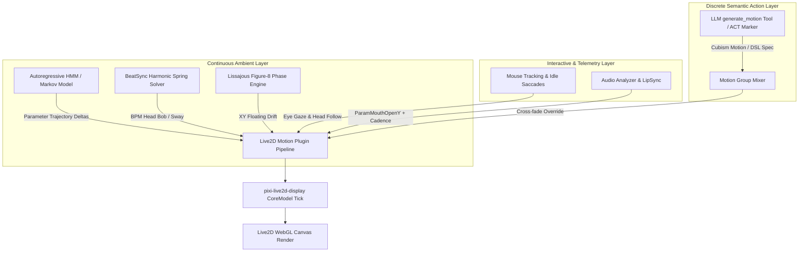

# Design: Autoregressive Live2D Ambient Motion & Micro-Movement Synthesis

This document outlines the canonical design and mathematical foundation for **Autoregressive Live2D Ambient Motion Generation** in **AIRI**. It establishes how learned parameter-space models (such as Autoregressive Hidden Markov Models, Gaussian Mixture Transitions, and Harmonic Spring Solvers) provide natural, continuous 2D avatar presence without relying on 3D skeletal retargeting or looping animation clips.

---

## 1. Motivation & Technical Background

### 1.1 The 3D vs. 2D Avatar Dichotomy

AIRI's motion architecture operates across two distinct avatar rendering paradigms:

| Metric | **3D VRM Avatars (FlowMDM)** | **2D Live2D Avatars (Autoregressive Parametric)** |
| :--- | :--- | :--- |
| **Physics Model** | Hierarchical humanoid joint transforms ($SE(3)$ forward kinematics). | Planar mesh vertex deformers driven by normalized $[-1, 1]$ or $[0, 1]$ parameter values. |
| **Generation Engine** | WebGPU DDIM diffusion over 263-dim HumanML3D tensors (`flow_mdm.onnx`). | Parameter-space Autoregressive HMM / Spring-Damped Harmonic Trajectory Engine. |
| **Target Representation** | glTF binary container with `VRMC_vrm_animation` (`.vrma`). | Continuous parameter updates applied directly to `CubismCoreModel` buffers. |
| **Movement Style** | Biomechanically accurate 3D skeletal movement (jumping jacks, bowing, waving). | Stylized anime VTuber presence (organic idle swaying, rhythmic micro-nodding, saccades). |

### 1.2 The Failure Mode of 3D Skeletal Retargeting for Live2D

Directly projecting 3D human skeletal MoCap (or HumanML3D diffusion outputs) onto Live2D Cubism parameters (`ParamAngleX/Y/Z`, `ParamBodyAngleX`) exhibits fundamental visual flaws:
1. **Planar Distortion & Boundary Clipping**: 3D joint rotations projected into 2D parameter ranges frequently push multi-axis parameters into extreme corners simultaneously (e.g. max $X$ + max $Y$ + max $Z$), causing mesh warping, texture tearing, or flattened eye geometry.
2. **Loss of Anime VTuber Timing**: Human motion captured from real actors lacks the snappy easing, intentional overshoot, and rhythmically accentuated holds characteristic of high-end VTuber rigs (e.g. Neuro-sama).
3. **Rigidity vs. Organic Drift**: Standard Live2D idle animations are finite loops (`Idle.motion3.json`) that repeat predictably. Organic presence requires a continuous, non-repeating parameter trajectory.

---

## 2. System Architecture

### 2.1 Layered Motion Hierarchy & Override Priority

Live2D movement inside [`motion-manager.ts`](file:///Users/richardpinedo/Projects.nosync/airi/airi_dasilva333/packages/stage-ui-live2d/src/composables/live2d/motion-manager.ts) follows a strict top-down override and blend priority:

1. **Layer 0: Continuous Ambient Autoregressive Foundation (Default Resting State)**:
   - Evaluates continuously at $\sim 60\text{ FPS}$ when no higher-priority interaction is active.
   - Provides organic, non-repeating resting sway, head tilt, and breath dynamics.
2. **Layer 1: Gaze & Attention Saccades**:
   - Additively layered onto Layer 0 offsets based on mouse tracking or ambient eye wander.
3. **Layer 2: BeatSync (High-Priority Hard Override)**:
   - When BeatSync is triggered by music or rhythm events, it **overrides** ambient motion targets entirely with spring-driven tempo targets. When the beat sequence releases, control smoothly yields back to Layer 0.
4. **Layer 3: Discrete Semantic Actions**:
   - Triggered via `<|ACT:motion="..."|>` or `generate_motion` tool calls; cross-fades over Layer 0/1, executes the action clip, and returns cleanly to ambient.

---

## 3. Mathematical Foundations & Motion Synthesis Modes

### 3.1 Synthesis Modes: Do You Need Motion Capture?

**No.** Motion capture is not required to generate continuous, lifelike Live2D idle motion. AIRI supports three distinct synthesis methods:

1. **Baked Statistical State-Space (Shipped Out-of-the-Box)**:
   - Pre-calibrated transition matrices baked into the runtime. The avatar exhibits natural, continuous postural transitions immediately upon model load without requiring user calibration or dataset ingestion.
2. **Procedural Multi-Frequency Noise & Lissajous Phase Curves (Zero Data / Pure Math)**:
   - Multi-octave Perlin/Simplex noise coupled with Lissajous figure-8 phase drift ($x(t), y(t)$) passed through a second-order spring-damper. Requires zero external data and produces non-repeating, smooth 2D organic motion.
3. **Automated `.motion3.json` Feature Extraction**:
   - Parses the existing animation files bundled with the Live2D model, extracts parameter velocity distributions and cluster states, and synthesizes continuous stochastic transitions between them.
4. **Optional Custom Mocap Telemetry**:
   - An optional developer avenue for creators who wish to record webcam/VTube Studio streams to train bespoke mannerisms for specific characters.

### 3.2 Autoregressive Parameter State-Space Model

The parameter state vector $\vec{p}_t \in \mathbb{R}^D$ at frame $t$ comprises the active Cubism control channels:
$$\vec{p}_t = \begin{bmatrix} \text{ParamAngleX}_t \\ \text{ParamAngleY}_t \\ \text{ParamAngleZ}_t \\ \text{ParamBodyAngleX}_t \\ \text{ParamBreath}_t \end{bmatrix}$$

The state transitions follow an Autoregressive Hidden Markov Process:
$$\Delta \vec{p}_t = \mathbf{A}(s_t) \vec{p}_{t-1} + \vec{\mu}(s_t) + \vec{\epsilon}_t, \quad \vec{\epsilon}_t \sim \mathcal{N}(0, \mathbf{\Sigma}(s_t))$$
where:
- $s_t \in \{1, \dots, K\}$ is the discrete latent behavioral state (e.g. *attentive*, *relaxed*, *curious*, *rhythmic sway*).
- $\mathbf{A}(s_t)$ is the autoregressive transition matrix for state $s_t$.
- $\vec{\mu}(s_t)$ is the state baseline drift.
- $\mathbf{\Sigma}(s_t)$ is the covariance matrix dictating natural micro-jitter.

### 3.3 Harmonic Lissajous Orbital Drift

To prevent the character from feeling locked to a single pixel coordinate, continuous spatial translation follows a 2D Lissajous phase curve:
$$x(t) = A_x \cos(\omega t - \phi_x), \quad y(t) = -A_y \sin(2\omega t)$$
- Angular tilt roll is coupled to planar displacement: $\theta_{\text{roll}}(t) = k_{\text{tilt}} \cdot x(t)$.
- $A_x \approx 10\text{px}, A_y \approx 20\text{px}, \phi_x = 0.15\pi$ generate a gentle figure-8 sway characteristic of resting characters.

### 3.4 Semi-Implicit Euler Spring Damping

All raw parameter targets $\vec{p}_{\text{target}}$ pass through a second-order spring-damper system to prevent discontinuities:
$$a(t) = \frac{k (\vec{p}_{\text{target}} - p(t)) - c \cdot v(t)}{m}$$
$$v(t + \Delta t) = v(t) + a(t) \cdot \Delta t$$
$$p(t + \Delta t) = p(t) + v(t + \Delta t) \cdot \Delta t$$
- **Default Parameters**: Stiffness $k = 120$, Damping $c = 16$, Mass $m = 1$.
- Provides instant responsiveness with zero overshoot ringing.

---

## 4. Key Code Manifest & Developer Tooling

### 4.1 Live2D Runtime Modules
- [`packages/stage-ui-live2d/src/composables/live2d/motion-manager.ts`](file:///Users/richardpinedo/Projects.nosync/airi/airi_dasilva333/packages/stage-ui-live2d/src/composables/live2d/motion-manager.ts): Orchestrates `pre` and `post` motion plugins per model update tick.
- [`packages/stage-ui-live2d/src/composables/live2d/beat-sync.ts`](file:///Users/richardpinedo/Projects.nosync/airi/airi_dasilva333/packages/stage-ui-live2d/src/composables/live2d/beat-sync.ts): Implements spring-solver motion curves for `punchy-v`, `balanced-v`, `swing-lr`, and `sway-sine`.
- [`packages/stage-ui-live2d/src/components/scenes/live2d/Model.vue`](file:///Users/richardpinedo/Projects.nosync/airi/airi_dasilva333/packages/stage-ui-live2d/src/components/scenes/live2d/Model.vue): Binds canvas lifecycle and hooks into the Cubism core update loop.

### 4.2 Diagnostic & Developer Workbench
- [`packages/stage-pages/src/pages/devtools/beat-sync.vue`](file:///Users/richardpinedo/Projects.nosync/airi/airi_dasilva333/packages/stage-pages/src/pages/devtools/beat-sync.vue): Developer workbench featuring:
  - 2D Canvas Phase-Space XY Trail visualizer.
  - Live target spring telemetry and damping alpha tuning.
  - Multi-style cadence test suite (`Hit beat`, `Hit V sequence`, `Auto style by BPM`).
- [`apps/stage-tamagotchi/src/renderer/pages/settings/system/developer.vue`](file:///Users/richardpinedo/Projects.nosync/airi/airi_dasilva333/apps/stage-tamagotchi/src/renderer/pages/settings/system/developer.vue): Developer entry point hosting the visualizer and runtime inspectors.

---

## 5. Integration Roadmap & Porting Strategy

1. **Phase 1: Ambient Motion Layer Formalization**:
   - Encapsulate the HMM / Lissajous trajectory generator into a modular plugin: `useMotionUpdatePluginAutoregressiveIdle()`.
   - Register it in `useLive2DMotionManagerUpdate` alongside `useMotionUpdatePluginBeatSync`.
2. **Phase 2: Developer Tooling Integration**:
   - Wire the Developer motion visualizer (`/devtools/beat-sync`) to inspect both discrete beat sync triggers and continuous autoregressive phase streams.
3. **Phase 3: Parameter Mapping & Alias Resolution**:
   - Provide a parameter remapping dictionary to ensure non-standard Live2D models (which may use `PARAM_ANGLE_X` instead of `ParamAngleX`) cleanly bind to the autoregressive engine.
4. **Phase 4: Unified Motion Cross-Routing**:
   - Connect with [`docs/design-text-to-motion.md`](./design-text-to-motion.md) so that 3D VRM requests use FlowMDM diffusion while 2D Live2D requests seamlessly leverage the parameter-space engine.

---

## 6. Related Documents & Skills

- [`docs/design-text-to-motion.md`](./design-text-to-motion.md) — Canonical 3D Text-to-Motion and FlowMDM diffusion architecture.
- [`.agents/skills/airi-generative-motion-vrma/SKILL.md`](file:///Users/richardpinedo/Projects.nosync/airi/.agents/skills/airi-generative-motion-vrma/SKILL.md) — Text-to-VRMA generation and WebGPU runtime skill.
- [`.agents/skills/airi-live2d-dsl-interpreter/SKILL.md`](file:///Users/richardpinedo/Projects.nosync/airi/.agents/skills/airi-live2d-dsl-interpreter/SKILL.md) — Live2D runtime script interpreter and parameter heap.
