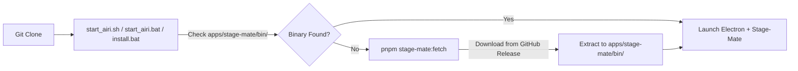

# Stage-Mate Prebuilt Companion Runtime Distribution Guide

This document describes the zero-git-bloat companion runtime distribution system for **Stage-Mate** (the Unity/VRM sidecar engine). It contains the architecture overview, modified source files, and the step-by-step instructions for the **Windows Agent** to compile, package, and publish the Windows companion binary.

---

## 1. Architecture & Design

### Why We Use GitHub Releases + Dynamic Fetching
1. **GitHub 100MB File Limit**: Uncompressed Unity builds contain asset files (e.g. `sharedassets0.assets` ~106MB, `.resS` ~111MB) that exceed GitHub's raw commit limit.
2. **Git History Hygiene**: Storing binary artifacts directly in Git (or Git LFS) rapidly bloats repository clone sizes for community users.
3. **Seamless Git Experience**: Developers who clone the repository can run Stage-Mate immediately without installing the Unity Editor or manually copying files.



---

## 2. Directory Layout & Storage

| Path | Description | Git Status |
|---|---|---|
| `apps/stage-mate/bin/` | **Single canonical location** for companion runtimes (`StageMate.app`, `StageMate.exe`, `StageMate.x86_64`). Used in both local build outputs and dynamic fetches. | **Gitignored** (`.gitignore`) |
| `apps/stage-mate/mate-engine/Build/` | Intermediate Unity Editor scratch build output directory | **Gitignored** |
| `apps/stage-mate/unity-src/` | Pure version-controlled Unity source code, scripts, patches, and assets | **Tracked** |
| `apps/stage-mate/scripts/fetch-runtime.ts` | Platform-aware streaming download & extraction script into `apps/stage-mate/bin/` | **Tracked** |
| `apps/stage-mate/scripts/build.ts` | Native compiler script that automatically syncs outputs to `apps/stage-mate/bin/` | **Tracked** |

---

## 3. Modified Files & System Contracts

1. **`.gitignore`**:
   - Added `apps/stage-mate/bin/` so companion binaries never pollute Git commits.
2. **`apps/stage-mate/scripts/fetch-runtime.ts`**:
   - Detects `process.platform` (`darwin`, `win32`, `linux`).
   - Downloads `StageMate-<Platform>.zip` from GitHub Release `stagemate-engine-v3.4`.
   - Extracts directly into `apps/stage-mate/bin/` using native tools (`unzip` on Unix, `tar -xf` / `Expand-Archive` on Windows).
   - Sets executable permissions (`chmod +x`) on macOS/Linux binaries.
3. **`apps/stage-mate/scripts/build.ts`**:
   - Compiles Unity and automatically syncs the output to `apps/stage-mate/bin/`.
4. **`apps/stage-mate/package.json` & root `package.json`**:
   - Added `"engine:fetch": "tsx scripts/fetch-runtime.ts"` and root script `"stage-mate:fetch"`.
5. **Startup Scripts**:
   - `start_airi.sh`: Auto-checks `apps/stage-mate/bin/` and triggers fetch if missing.
   - `start_airi.bat`: Auto-checks `apps\stage-mate\bin\` and triggers fetch if missing.
   - `install.bat`: Verifies `apps\stage-mate\bin\` during install and suggests launcher options.
6. **`apps/stage-tamagotchi/src/main/services/airi/stage-mate/index.ts` (`resolveBinaryPath`)**:
   - Checks `apps/stage-mate/bin/` exclusively in development mode $\rightarrow$ `process.resourcesPath/StageMate` in packaged production releases.
7. **`apps/stage-tamagotchi/electron-builder.config.ts`**:
   - Bundles from `apps/stage-mate/bin/` for production packaging.
8. **Subtractive Outfits in Unity (`MEClothes.cs` & `VRMLoader.cs`)**:
   - Configured `isSubtractive = true` on dynamic `MEClothes` injection so AIRI outfits hide target meshes (`activeSelf = false`) and keep avatar bodies intact.

---

## 4. Instructions for the Windows Agent

When switching to a Windows development machine, follow these steps to build and publish the Windows companion release asset:

### Step 1: Sync Repository
```bash
git checkout main
git pull origin main
```

### Step 2: Sync Unity Workspace Overlays
```bash
pnpm -F @proj-airi/stage-mate run engine:setup
```

### Step 3: Build the Windows Native Binary
```bash
pnpm -F @proj-airi/stage-mate run build:win
```
*Note: This runs Unity in batchmode and places the compiled executable in `apps/stage-mate/mate-engine/Build/Windows/` (or `Build/StageMate/`).*

### Step 4: Verify Local Windows Build Files
Ensure the following files exist in the build output directory:
- `StageMate.exe` (or `MateEngineX.exe`)
- `UnityPlayer.dll`
- `UnityCrashHandler64.exe`
- `StageMate_Data/` (or `MateEngineX_Data/`)
- `MonoBleedingEdge/`

### Step 5: Create the Windows Zip Archive
In PowerShell:
```powershell
# From the airi repository root:
Compress-Archive -Path "apps\stage-mate\mate-engine\Build\Windows\*" -DestinationPath "StageMate-Windows.zip" -Force
```

### Step 6: Publish to GitHub Releases
Upload `StageMate-Windows.zip` to the existing `stagemate-engine-v3.4` release tag on `dasilva333/airi`:
```bash
gh release upload stagemate-engine-v3.4 StageMate-Windows.zip --repo dasilva333/airi --clobber
```

### Step 7: Test the Fetcher & One-Click Startup
Test that the CLI fetcher and startup script work end-to-end:
```bash
# 1. Clean any local bin folder
rmdir /s /q apps\stage-mate\bin

# 2. Run the fetcher
pnpm run stage-mate:fetch

# 3. Verify apps\stage-mate\bin\StageMate.exe exists
dir apps\stage-mate\bin

# 4. Run the Windows starter
start_airi.bat
```

## Relevant Skills

- [[airi-stage-mate-unity]]
