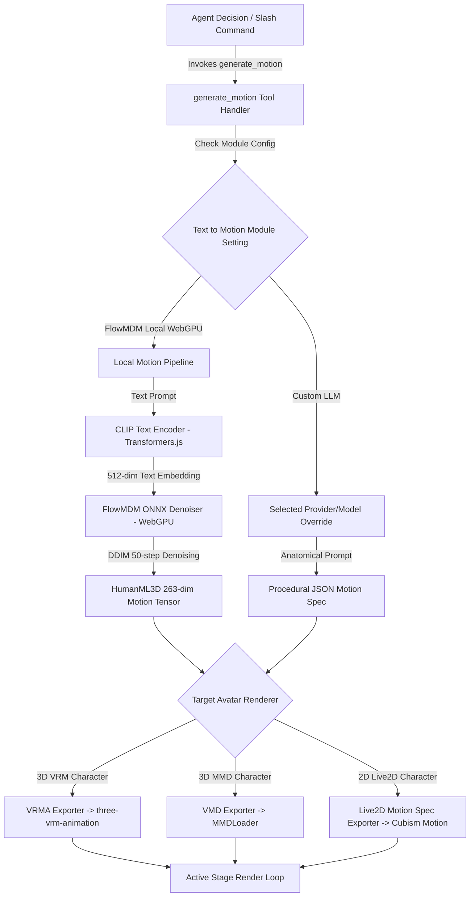

# Design: Text-to-Motion Architecture in AIRI

This document outlines the canonical design for integrating **Text-to-Motion** into **AIRI**. It supercedes [`proposal-text-to-vrma-system.md`](./proposal-text-to-vrma-system.md) by evolving the initial text-to-VRMA proposal into a generalized motion generation framework supporting both local WebGPU neural diffusion and decoupled LLM procedural animation pipelines across 3D and 2D avatar formats.

---

## 1. Executive Summary & Core Objectives

Motion generation in AIRI enables conversational AI agents to dynamically express physical actions (e.g. *"do jumping jacks"*, *"wave enthusiastically"*, *"sit down"*, *"bow nervously"*) during interaction.

### Key Objectives:
1. **Existing Tool Alignment**: Utilize AIRI's existing `generate_motion` tool call contract rather than introducing redundant tool definitions.
2. **First-Class ML Provider Entry**: Introduce **Motion** under `Settings > Providers` with **FlowMDM (Local WebGPU)** as the sole on-device neural motion model provider.
3. **Dual Model Stack (CLIP + FlowMDM)**: Local motion diffusion requires a two-part execution pipeline:
   - **CLIP Text Encoder** (`Xenova/clip-vit-base-patch32` via Transformers.js): Converts the raw text prompt (e.g., *"a person doing jumping jacks"*) into a 512-dimensional text conditioning embedding vector.
   - **FlowMDM Denoiser** (`flow_mdm.onnx` via ONNX Runtime WebGPU): Takes the 512-dim CLIP embedding + Gaussian noise and runs 50-step DDIM denoising to output the 263-dim HumanML3D motion tensor.
4. **Module Configuration & Custom LLM Overrides (`Settings > Modules > Text to Motion`)**: Add a **Text to Motion** module settings page where users select the active motion engine. If **Custom LLM** is selected, users get dedicated dropdowns for **Provider** and **Model** overrides—allowing them to decouple motion generation from their active chat LLM (e.g. using a fast local model for chat, but a specialized remote LLM for procedural motion).
5. **Multi-Avatar Format Decoders**:
   - **3D VRM**: `.vrma` (glTF binary with `VRMC_vrm_animation` extension).
   - **3D MMD**: `.vmd` (Vocaloid Motion Data format for MMD avatars).
   - **2D Live2D**: `motion.json` (Live2D Cubism parameter animation curves).
6. **On-Demand Caching**: Models (`flow_mdm.onnx` + CLIP text encoder weights) download on demand upon activation/invocation and register under AIRI's **Model Cache** settings UI.
7. **Provider Playground**: An interactive testing card under `Settings > Providers > Motion` for testing prompts and downloading/previewing generated motion files.

---

## 2. UI & Settings Integration

### 2.1 Provider Registration (`Settings > Providers > Motion`)

In `packages/stage-pages/src/pages/settings/providers.vue`, a new **Motion** tab is added to the top-level provider navigation strip:

```
┌────────────────────────────────────────────────────────────────────────────────────────┐
│ [ Chat ]  [ Speech ]  [ Transcription ]  [ Artistry ]  [ Vision ]  [ Motion ]  [ Cloud ] │
└────────────────────────────────────────────────────────────────────────────────────────┘
```

Under the **Motion** tab, **FlowMDM (Local WebGPU)** is registered as the single ML model provider entry:

```
┌────────────────────────────────────────────────────────────────────────────────────────┐
│  FlowMDM (Local WebGPU)                                              [ Active / Select ]│
│  On-device 3D motion diffusion using CLIP text encoding + ONNX WebGPU.                  │
│  Deployment: Local (WebGPU)  | Speed: Fast (~2-3s)  | Models: FlowMDM + CLIP Text       │
└────────────────────────────────────────────────────────────────────────────────────────┘
```

---

### 2.2 Module Configuration & LLM Overrides (`Settings > Modules > Text to Motion`)

Under `Settings > Modules`, a new **Text to Motion** module configuration section allows users to define how motion tool calls are fulfilled:

```
┌────────────────────────────────────────────────────────────────────────────────────────┐
│ ⚙️ Text to Motion Module                                                                │
│ Configure how avatar motion requests from the generate_motion tool call are processed. │
│                                                                                        │
│ Motion Engine:                                                                         │
│ [ FlowMDM (Local WebGPU)                              v ]                              │
│   • FlowMDM (Local WebGPU) - Fast (~2-3s) on-device diffusion (CLIP + ONNX)             │
│   • Custom LLM (Procedural Keyframe Generation)                                        │
└────────────────────────────────────────────────────────────────────────────────────────┘
```

#### Custom LLM Provider & Model Overrides
When the user switches **Motion Engine** to **Custom LLM**, two secondary dropdowns appear:

```
┌────────────────────────────────────────────────────────────────────────────────────────┐
│ ⚙️ Text to Motion Module                                                                │
│                                                                                        │
│ Motion Engine:                                                                         │
│ [ Custom LLM (Procedural Keyframe Generation)         v ]                              │
│                                                                                        │
│ ┌────────────────────────────────────────────────────────────────────────────────────┐ │
│ │ LLM Provider Override:                                                             │ │
│ │ [ OpenRouter                                        v ]                            │ │
│ │                                                                                    │ │
│ │ Model Selection:                                                                   │ │
│ │ [ anthropic/claude-3.5-sonnet                       v ]                            │ │
│ └────────────────────────────────────────────────────────────────────────────────────┘ │
│  ℹ️ Decoupled from Chat LLM: Allows using a specialized model for procedural motion     │
│     without changing your primary chat provider.                                       │
└────────────────────────────────────────────────────────────────────────────────────────┘
```

---

### 2.3 Model Cache Registration (CLIP + FlowMDM Stack)

At the bottom of `Settings > Providers`, the **Model Cache** section tracks downloaded inference models in browser cache storage (IndexedDB / Cache API).

Under **Model Cache**, the Motion modality registers the dual-model pipeline:
- **`CLIP Text Encoder (Xenova/clip-vit-base-patch32)`** — `~340 MB` — Status: `Cached` / `Not cached`
- **`FlowMDM Motion Denoiser (ONNX WebGPU)`** — `86.8 MB` — Status: `Cached` / `Not cached`

```
┌────────────────────────────────────────────────────────────────────────────────────────┐
│ Model Cache                                                                 1.9 GB      │
│ Downloaded inference models stored in browser cache                                    │
│                                                                                        │
│ RWKV LLM                                                                 [ Not cached ]│
│ Kokoro TTS                                                               [ Cached     ]│
│ CLIP Text Encoder (Motion)                                               [ Cached     ]│
│ FlowMDM Denoiser (WebGPU)                                                [ Cached     ]│
│ Whisper ASR                                                              [ Not cached ]│
│                                                                                        │
│ [ Refresh ]                                                         [ Clear All Cache ]│
└────────────────────────────────────────────────────────────────────────────────────────┘
```

#### Asset Bundling vs. On-Demand Download Strategy:
* **`flow_mdm.onnx`** (86.8 MB) and the **CLIP text encoder model weights** (`Xenova/clip-vit-base-patch32`) are **not bundled** inside application installer binaries to maintain slim installer sizes.
* Upon first invocation or pre-fetch, AIRI downloads:
  1. The CLIP tokenizer + model via `@xenova/transformers` (running in browser WASM/WebGPU).
  2. The `flow_mdm.onnx` model binary via `onnxruntime-web`.
* Both assets are persisted in browser CacheStorage / IndexedDB for instant subsequent loads.

---

### 2.4 Provider Playground & Verification Suite

Under `Settings > Providers > Motion`, an interactive testing utility allows users to verify motion generation and export files without triggering a chat session:

```
┌────────────────────────────────────────────────────────────────────────────────────────┐
│ 🧪 Motion Provider Playground                                                           │
│ Test text-to-motion generation and download generated animation files.                │
│                                                                                        │
│ Prompt Input:                                                                          │
│ [ a person doing jumping jacks                                                       ] │
│                                                                                        │
│ Output Format: (o) VRMA (.vrma)   ( ) MMD (.vmd)   ( ) Live2D (motion.json)             │
│ Output Length: [ 60 frames (3.0s) v ]                                                  │
│                                                                                        │
│ [ ⚡ Generate Motion ]                                                                 │
│                                                                                        │
│ Status Log:                                                                            │
│ [10:15:01 PM] Loading CLIP Text Encoder (Xenova/clip-vit-base-patch32)...               │
│ [10:15:02 PM] CLIP embedding generated [1, 512].                                       │
│ [10:15:02 PM] WebGPU FlowMDM session loaded.                                           │
│ [10:15:04 PM] 50-step DDIM denoising complete.                                         │
│ [10:15:04 PM] Motion exported successfully. [ Download motion.vrma ]                   │
└────────────────────────────────────────────────────────────────────────────────────────┘
```

---

## 3. System Architecture & Dual-Model Execution Flow



---

## 4. Multi-Avatar Target Format Decoders

While HumanML3D feature vectors (263-dim) represent 3D body joint velocities and 6D rotations, AIRI's motion system acts as a central **motion bridge** capable of retargeting motion output across avatar formats:

### 4.1 3D VRM (`.vrma`)
- Maps 21 HumanML3D body joints to standard VRM humanoid bone nodes (`hips`, `spine`, `chest`, `neck`, `head`, `leftUpperArm`, `leftLowerArm`, `leftHand`, `leftUpperLeg`, etc.).
- Converts 6D orthogonal rotation vectors $(r_{6d})$ to normalized quaternions ($q$).
- Integrates root yaw velocity ($\dot{r}_y$) and 2D planar velocity ($\dot{r}_x, \dot{r}_z$) into world space translation keyframes.
- Encodes output directly into glTF binary (`.vrma`) containers using `VRMC_vrm_animation` extensions for playback via `@pixiv/three-vrm-animation`.

### 4.2 3D MMD (`.vmd`)
- Retargets HumanML3D bone rotations to MMD Japanese bone names (センター, 下半身, 上半身, 首, 頭, 左肩, 左腕, 左ひじ, 右肩, 右腕, 右ひじ, etc.).
- Converts quaternions to MMD bone rotation keyframe structs and exports standard binary `.vmd` motion buffers for playback via `three/addons/loaders/MMDLoader.js`.

### 4.3 2D Live2D (`motion.json`)
- Maps 3D upper-body rotational intensity and root sway to Live2D Cubism parameter curves:
  - `ParamAngleX`, `ParamAngleY`, `ParamAngleZ` (head tilt/turn)
  - `ParamBodyAngleX`, `ParamBodyAngleY`, `ParamBodyAngleZ` (torso sway)
  - `ParamArmLeft`, `ParamArmRight` (arm elevation)
  - `ParamBreath` (rhythmic motion)
- Exports standard Live2D Cubism `motion.json` structures for consumption by `pixi-live2d-display` / `stage-ui-live2d`.
- **Notice on 2D Ambient vs. Semantic Movement**: While 3D skeletal diffusion retargeting applies to discrete semantic gestures, continuous organic idle movement in 2D Live2D relies on a specialized parameter-space autoregressive model. See the companion specification: [`design-live2d-autoregressive-motion.md`](./design-live2d-autoregressive-motion.md).

---

## 5. ONNX Model Export & Reproduction Guide

To ensure open-source maintainability and reproducibility, all Python scripts used to export, inspect, and validate the WebGPU ONNX binaries are committed to `scripts/motion-export/`.

### 5.1 Export Scripts Manifest (`scripts/motion-export/`)
- [`scripts/motion-export/compile_onnx.py`](file:///Users/richardpinedo/Projects.nosync/airi/airi_dasilva333/scripts/motion-export/compile_onnx.py): Exports `flow_mdm.onnx` from the PyTorch checkpoint (`ZeyuLing/hftrainer-flowmdm-humanml3d`).
- [`scripts/motion-export/inspect_sampler.py`](file:///Users/richardpinedo/Projects.nosync/airi/airi_dasilva333/scripts/motion-export/inspect_sampler.py): Extracts `alphas_cumprod` and DDPM/DDIM posterior variance coefficients to `diffusion_stats.json`.
- [`scripts/motion-export/test_onnx_parity.py`](file:///Users/richardpinedo/Projects.nosync/airi/airi_dasilva333/scripts/motion-export/test_onnx_parity.py): Validates mathematical parity between PyTorch pipeline output and python-side `onnxruntime` 50-step DDIM execution.

### 5.2 Key Export Workarounds & JIT Patches
1. **WebGPU `Einsum` Type Mismatch Fix**:
   PyTorch's default `ScaledSinusoidalEmbedding` and `BPE_Rotary` generate position ranges using `torch.arange(..., dtype=torch.int64)`. In browser WebGPU, `onnxruntime-web` rejects `Einsum` nodes with mixed `int64` and `float32` inputs. `compile_onnx.py` monkeypatches `ScaledSinusoidalEmbedding.forward` to explicitly cast position arange tensors to `float32` prior to matrix multiplication.
2. **Classifier-Free Guidance (CFG) Graph Fusion**:
   The ONNX wrapper module bakes CFG directly into the exported graph. Execution computes:
   $$\text{denoised\_motion} = \text{uncond} + \text{scale} \cdot (\text{cond} - \text{uncond})$$
   allowing browser JS to make a single model call per step rather than separate conditional/unconditional passes.
3. **In-Memory Weight Inlining (CORS Bypass)**:
   PyTorch's default ONNX exporter serializes models larger than 2GB (or complex graph structures) with external `.data` files. Browsers block relative `.data` file access under security sandboxes (`MountedFiles` errors). `compile_onnx.py` exports to an in-memory `io.BytesIO()` buffer, forcing PyTorch to inline all weight tensors into a single standalone `flow_mdm.onnx` binary (86.8 MB).

---

## 6. Implementation Roadmap

1. **Phase 1: Docs & Specification (Current)**:
   - Committed [`docs/design-text-to-motion.md`](./design-text-to-motion.md) as the canonical motion design reference.
   - Committed reproducible export scripts to [`scripts/motion-export/`](../scripts/motion-export/).
   - Updated [`docs/rosetta-stone.md`](./rosetta-stone.md) index with Motion entries.
2. **Phase 2: Module Settings & Provider UI**:
   - Add `Text to Motion` module card under `Settings > Modules` with Motion Engine dropdown and Custom LLM Provider/Model overrides.
   - Add `Motion` tab to `Settings > Providers` with `FlowMDM (Local WebGPU)` and Model Cache telemetry for both CLIP and FlowMDM.
3. **Phase 3: WebGPU Inference Engine & Exporters**:
   - Integrate Transformers.js CLIP text encoder + DDIM WebGPU inference engine into `packages/stage-ui/src/libs/inference/motion/`.
   - Implement format decoders (`.vrma`, `.vmd`, `motion.json`).
4. **Phase 4: Tool Handler & Playground**:
   - Wire `generate_motion` tool call handler to inspect `Settings > Modules > Text to Motion` and dispatch to the selected engine.
   - Build interactive Motion Provider Playground.

---

## 7. Multi-Tier Motion Hierarchy & Next-Gen Research (Kimodo & TMR-SOMA)

To balance immediate on-device speed, zero external dependencies, and future cinematic motion fidelity, AIRI adopts a **Three-Tier Motion Hierarchy**:

```
┌────────────────────────────────────────────────────────────────────────────────────────┐
│                                 AIRI MOTION TIERS                                      │
├────────────────────────────────────────────────────────────────────────────────────────┤
│ Tier 1: On-Device Core (Current)  │ FlowMDM + CLIP (~427MB, WebGPU, ~2-3s)            │
│ Tier 2: Semantic Retrieval Cache   │ TMR-SOMA Embeddings (<50ms, Pre-baked .vrma library)│
│ Tier 3A: Kimodo-Lite (WebGPU)     │ Distilled 282M + CLIP/T5 (~280MB INT8, ~3s)        │
│ Tier 3B: Kimodo-Pro (CUDA Daemon) │ Full 282M + LLaMA-3-8B (Waypoints, 2D Paths)       │
└────────────────────────────────────────────────────────────────────────────────────────┘
```

### 7.1 Tier Breakdown

#### Tier 1: Default On-Device Core (FlowMDM + CLIP)
* **Status**: Primary production baseline.
* **Mechanism**: CLIP Text Encoder (`Xenova/clip-vit-base-patch32`) + FlowMDM ONNX Denoiser running via `onnxruntime-web` WebGPU.
* **Pros**: Complete offline autonomy, zero backend server requirement, lightweight browser footprint (~427 MB total), fast ~2–3s generation.

#### Tier 2: Sub-50ms Semantic Retrieval Cache (TMR-SOMA)
* **Mechanism**: Leverages Text-to-Motion Retrieval ([`nvidia/TMR-SOMA-RP-v1`](https://huggingface.co/nvidia/TMR-SOMA-RP-v1), based on *TMR: Text-to-Motion Retrieval Using Contrastive 3D Human Motion Synthesis*, ICCV 2023).
* **Execution**:
  1. A library of standard, verified `.vrma` animations is pre-encoded with the TMR motion encoder into vector embeddings.
  2. Incoming motion prompts (e.g. *"wave politely"*, *"stretch"*, *"nod"*) are embedded via the lightweight TMR text encoder.
  3. If cosine similarity exceeds a threshold (e.g. $\ge 0.88$), the pre-baked `.vrma` is served in **<50ms**, bypassing diffusion entirely.
  4. If no cache match exists, execution falls back to Tier 1 / Tier 3 generation.

#### Tier 3: Next-Gen High-Fidelity Kinematic Diffusion ([NVIDIA Kimodo](https://github.com/nv-tlabs/kimodo))
NVIDIA's Kimodo family introduces a two-stage transformer architecture separating global root motion from body joint rotations, trained on 700+ hours of optical MoCap (*Bones Rigplay*).

* **Tier 3A: Kimodo-Lite (WebGPU On-Device Distillation)**
  * **Text Encoder Swap**: Replace `Meta-Llama-3-8B-Instruct` with `Xenova/clip-vit-base-patch32` (or `google/flan-t5-base`) by fine-tuning the cross-attention projection matrices ($W_k, W_v \in \mathbb{R}^{d_{\text{text}} \times d_{\text{model}}}$) on the [`nvidia/Kimodo-SOMA-SEED-v1.1`](https://huggingface.co/nvidia/Kimodo-SOMA-SEED-v1.1) / HumanML3D datasets.
  * **Step Distillation**: Distill from 50 DDPM steps down to 8–12 steps via Consistency Distillation or Flow Matching.
  * **ONNX WebGPU Quantization**: Export in INT8/FP16 (~280 MB binary) with CFG fusion and `float32` RoPE monkeypatches per AIRI's ONNX export playbook.
* **Tier 3B: Kimodo-Pro (Local CUDA Sidecar / Remote API)**
  * **Mechanism**: External Python/CUDA daemon or FastAPI endpoint serving the full 282M model ([`nvidia/Kimodo-SOMA-RP-v1.1`](https://huggingface.co/nvidia/Kimodo-SOMA-RP-v1.1) or [`nvidia/Kimodo-SMPLX-RP-v1`](https://huggingface.co/nvidia/Kimodo-SMPLX-RP-v1)).
  * **Capabilities**: Supports 2D screen waypoint navigation, path tracking, and full cinematic avatar movement across desktop multi-window stages.

---

### 7.2 Research References & Model Manifest
* **NVIDIA Kimodo Repository**: [`nv-tlabs/kimodo`](https://github.com/nv-tlabs/kimodo)
* **Model Checkpoints**:
  * [`nvidia/Kimodo-SOMA-RP-v1.1`](https://huggingface.co/nvidia/Kimodo-SOMA-RP-v1.1) (30-joint SOMA skeleton on Rigplay)
  * [`nvidia/Kimodo-SOMA-SEED-v1.1`](https://huggingface.co/nvidia/Kimodo-SOMA-SEED-v1.1) (SOMA skeleton on SEED open benchmark)
  * [`nvidia/Kimodo-SMPLX-RP-v1`](https://huggingface.co/nvidia/Kimodo-SMPLX-RP-v1) (22-joint SMPL-X mesh)
  * [`nvidia/Kimodo-G1-RP-v1`](https://huggingface.co/nvidia/Kimodo-G1-RP-v1) (34-joint Unitree G1 robot)
  * [`nvidia/TMR-SOMA-RP-v1`](https://huggingface.co/nvidia/TMR-SOMA-RP-v1) (Text-to-Motion Retrieval encoder)
  * [`nvidia/Kimodo-Motion-Gen-Benchmark`](https://huggingface.co/datasets/nvidia/Kimodo-Motion-Gen-Benchmark) (Standardized evaluation benchmark)

## Relevant Skills & Companion References

- [[airi-generative-motion-vrma]]
- [`docs/design-live2d-autoregressive-motion.md`](./design-live2d-autoregressive-motion.md) — Autoregressive Live2D Ambient Motion & Micro-Movement Synthesis
