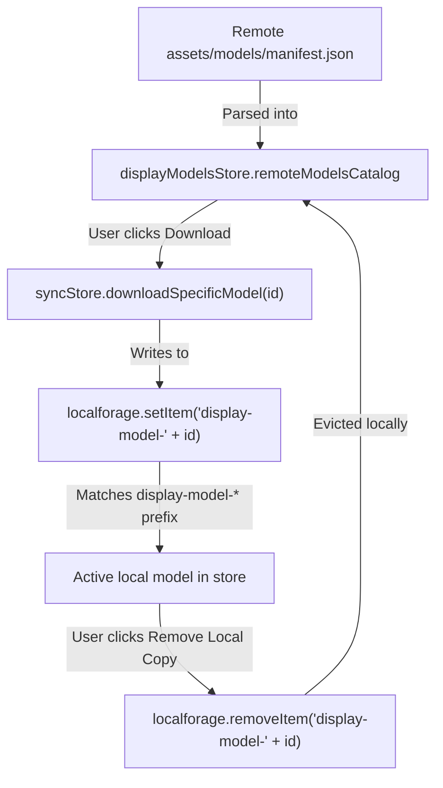

# Design Document: Remote Cloud Model Catalog Browsing

**Status:** Proposed / Under Review
**Goal:** Allow users to browse their remote 3D/Live2D model catalogs directly within the model selector, letting them selectively preview, search, download, and delete models on demand to conserve local disk space.

---

## 🏛️ Background & Problem Statement

Users running AIRI on devices with constrained storage (e.g., a MacBook Air with 256GB SSD) cannot store their entire 3D model library locally. For instance, a complete Live2D/3D collection can easily exceed 320GB, while the user's active, curated set may only be 6–7GB.

To solve this, AIRI implements a BYOS (Bring Your Own Storage) Cloud Sync engine. However, the current UX for syncing is mechanical and detached:
- Users must go to **Settings > Modules > Cloud Sync > Selective Sync Modal**.
- The modal presents a flat list of remote files or directories to download.
- This creates a major friction point during character editing or creation: a user who wants to pick a remote model from their cloud collection must leave the character editor, open the sync settings, check the files to sync, wait for synchronization to finish, return to the character editor, and then select the newly downloaded model.

---

## ⚖️ Alternatives Considered

### Option A: Revamping the Selective Sync Modal (On-Deck)
Transform the existing `selective-sync-panel.vue` from a simple tree checklist into a rich gallery view with a search input.

* **Pros:**
  - Self-contained and isolated from the main model selector.
  - Simpler implementation within the sync module scope.
* **Cons:**
  - Fails the core UX flow. Users must still switch settings pages and context to fetch a model.
  - Re-invents search, pagination, tags/groups filters, and sorting that are already highly polished in the main model selector.
* **Decision:** Placed on-deck for future consideration if specialized sync-only batch management is ever requested.

### Option B: Integrated "Cloud Mode" inside the Model Selector (Selected)
Introduce a "Cloud" or "Remote Catalog" tab/toggle directly into the main `model-selector.vue` component.

```
+-------------------------------------------------------------+
| Model Selector                                              |
| [ Library ]  [ Explore ]  [ Cloud / Remote ] <--- New Tab   |
+-------------------------------------------------------------+
| [ Search Models... ]                                        |
+-------------------------------------------------------------+
| [ Grid / List of Remote Models from Remote Manifest ]       |
|                                                             |
| +-------------------+  +-------------------+                |
| | Model A           |  | Model B           |                |
| | [Downloaded]      |  | [Cloud Icon]      |                |
| | [Pick]            |  | [Download]        |                |
| +-------------------+  +-------------------+                |
+-------------------------------------------------------------+
```

* **Pros:**
  - **Frictionless UX:** Users can browse remote files directly in the character creation wizard or card editor, triggering a download and picking it immediately.
  - **Reuses Existing Rich UI:** Uses the existing filter/search/sort system in `model-selector.vue` instead of writing custom gallery code.
  - **Disk-Efficient:** Only downloads the lightweight remote metadata manifest until the user explicitly requests a model download.

---

## ⚙️ Architecture & Safety Heuristics

To prevent accidental data corruption or triggering unwanted sync operations, we implement a strict isolation model between local models and remote-only metadata.

### 1. Strict Key Isolation (Zero Local Pollution)
The sync engine identifies local models by scanning `localforage` keys that start with the prefix `display-model-`.
- **Rule:** We **never** write remote-only model entries under the `display-model-*` namespace in `localforage`.
- **Reasoning:** Writing placeholder metadata entries under `display-model-` would cause the sync engine to identify them as local models. During sync, it would assume they are modified local assets and attempt to upload them, overwriting or corrupting the healthy remote model binaries with empty metadata shells.

### 2. Parallel Metadata Track
Remote-only models are held in a separate runtime state:
- Inside `useDisplayModelsStore`, we maintain a parallel ref `remoteModelsCatalog`.
- This array is populated directly from the remote `manifest.json` via the sync store's `getRemoteCatalog()` API.
- This ensures remote catalog metadata is kept completely separate from the active local database layer.

### 3. Lazy-Loaded Previews
To avoid massive network and memory overhead (e.g. downloading hundreds of base64 preview thumbnails at once):
- The model cards in the catalog display a placeholder or spinner initially.
- Previews are fetched **lazily** on-demand when the card component is mounted/rendered in the UI.
- The UI calls the active storage client to fetch `assets/models/${id}-preview.png` on the fly, optionally caching it in an ephemeral/isolated in-memory cache.

---

## 🔄 Model Lifecycle & State Transitions

The transition between local and remote states follows a strict cycle:



### Transition States

1. **Remote-Only State:**
   - Model entry exists *only* in `remoteModelsCatalog`.
   - UI renders a **Cloud / Download** button.
2. **Local Activation (Downloading):**
   - When the user triggers download, the sync engine fetches `assets/models/${id}.bin`, `${id}-preview.png`, and `${id}-textures.json`.
   - It writes them to `localforage` using the standard local keys: `display-model-${id}` and `display-model-${id}-textures`.
   - `displayModelStore` is reloaded, and the model seamlessly shifts into the local library.
3. **Local Eviction (Space Reclamation):**
   - The user can choose to **Remove Local Copy**.
   - This deletes `display-model-${id}` from `localforage`.
   - Because the model is still defined in the remote `manifest.json`, it reverts to a remote-only catalog item.

---

## 🛠️ Implementation Plan

### Phase 1: Store & Core Method Setup
1. **Extend `useDisplayModelsStore`:**
   - Add `remoteModelsCatalog` state.
   - Add a loading state `remoteCatalogLoading`.
   - Add a method `fetchRemoteCatalog()` that retrieves remote models using `syncEngineStore.getRemoteCatalog()`.
2. **Implement Targeted Downloader in `sync-engine.ts`:**
   - Implement `downloadSpecificModel(id)` to download only the model binary, preview, and texture JSON, write them to localforage, and broadcast the update.
3. **Implement Eviction Method in `useDisplayModelsStore`:**
   - Implement `removeLocalCopy(id)` to delete local model keys.

### Phase 2: UI Integration (`model-selector.vue`)
1. **Add "Cloud" Tab:**
   - Add `'cloud'` to `currentTab`.
   - Trigger `fetchRemoteCatalog()` on tab activation.
2. **Adapt Filters & Search:**
   - Ensure the filters (format, groups, tags, search query) apply dynamically to the `remoteModelsCatalog` when the Cloud tab is active.
3. **Modify Action Bar / Cards:**
   - Display dynamic action buttons based on local vs. remote status:
     - **If Local:** Show **Select** / **Pick** and a sub-menu to **Remove Local Copy**.
     - **If Remote-Only:** Show **Download & Select** button.
