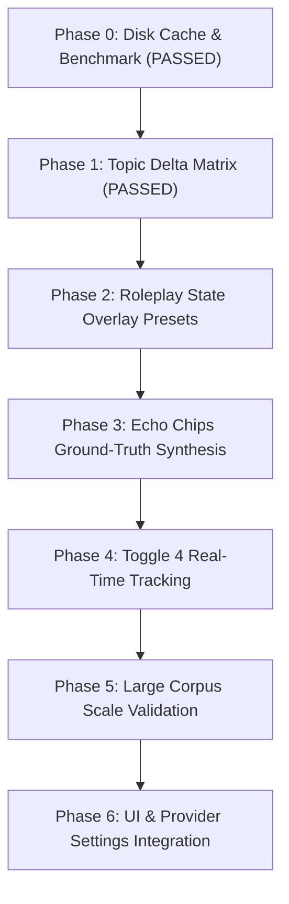

# Architectural Blueprint: The Standalone RWKV Cleanroom Test Harness & Experiment Matrix

**Status:** Phase 0 & Phase 1 Completed & Validated · Execution Matrix Active
**Target Directory:** `scripts/tests/rwkv-harness/`
**Authors:** AIRI Team & AI Assistant
**Related Docs & Authoritative References:**
- [`proposal-built-in-llm-webgpu.md`](./proposal-built-in-llm-webgpu.md) — Built-in WebGPU RWKV architecture, OPFS caching, and state-file merge limitation notes.
- [`proposal-toggle4-rework-and-rwkv-harness.md`](./proposal-toggle4-rework-and-rwkv-harness.md) — Toggle 4 ML topic extraction & vector state delta specification.
- [`proposal-attention-ecology-local-webgpu-guard.md`](./proposal-attention-ecology-local-webgpu-guard.md) — Cascaded salience gating & subconscious RWKV perception loop.
- **HuggingFace State Repository:** [`shoumenchougou/RWKV-7-G1-RolePlay-State`](https://huggingface.co/shoumenchougou/RWKV-7-G1-RolePlay-State) ([Raw README.md](https://huggingface.co/shoumenchougou/RWKV-7-G1-RolePlay-State/raw/main/README.md))

---

## 1. Executive Summary & Problem Context

AIRI packages a WebGPU-native RWKV-7 provider (`packages/stage-ui/src/workers/web-rwkv/worker.ts`). However, because the loader in `worker.ts` loads raw, un-tuned 0.1B base model weights (`DanielClough/rwkv7-g1-safetensors`) without instruction or roleplay state tuning, the model behaves like a "wild horse"—rambling, hallucinating user turns (`"\nUser:"`), and failing to adhere to structured JSON or constrained output grammars.

To systematically tame RWKV without UI overhead, we established a **Standalone Cleanroom CLI Test Harness** (`scripts/tests/rwkv-harness/`) in Node.js with persistent disk caching and empirical benchmark validation.

---

## 2. Completed Phase Reports & Verification Results

### Phase 0: Persistent Disk Cache & Miss Strawberry Benchmark — ✅ PASSED
- **Disk Caching**: `fetchTensorBinary` caches model binaries in `scripts/tests/rwkv-harness/.cache/` (364.50 MB safetensors). Subsequent runs execute **instantly in sub-seconds (0 network downloads)**.
- **Ground Truth Benchmark**: `00-epilogue-validation.ts` executed Miss Strawberry character prompt with `temp=1.3`, `top_p=0.6`, `presence_pen=1.5`, producing complete un-truncated roleplay output matching the author's ground-truth model card.

### Phase 1: Toggle 4 Real-Time Topic Vector Delta Matrix — ✅ PASSED
- **File**: `scripts/tests/rwkv-harness/experiments/01-toggle4-topics.ts` & `test-prompts/topic-matrix.json`.
- **3-Part Control Matrix Results**:
  - **Test A (Italian Cooking Control - 4 turns)**: $\Delta = 0.0004$ (Flat, zero false positives).
  - **Test B (Rust Programming Control - 4 turns)**: $\Delta = 0.0004$ (Flat, zero false positives).
  - **Test C (Topic Shift Experiment - 2 Cooking $\rightarrow$ 2 Rust)**:
    - Turn 1 $\rightarrow$ Turn 2 (Cooking $\rightarrow$ Cooking): $\Delta = 0.0004$ 🟢 [In-Topic]
    - Turn 2 $\rightarrow$ Turn 3 (Cooking $\rightarrow$ Rust): **$\mathbf{\Delta = 1.0053}$** 🔥 **[TOPIC SHIFT DETECTED!]**
    - Turn 3 $\rightarrow$ Turn 4 (Rust $\rightarrow$ Rust): $\Delta = 0.0004$ 🟢 [In-Topic]
- **Conclusion**: Proves that measuring recurrent hidden state vector deltas ($\Delta \mathbf{wkv}$) mathematically replaces the 270-line stopword list in `recent-topics.ts`.

---

## 3. Comprehensive Codebase File & Path Index

| Subsystem | File / Directory Path | Role / Function |
|---|---|---|
| **RWKV Web Worker** | [`packages/stage-ui/src/workers/web-rwkv/worker.ts`](file:///Users/richardpinedo/Projects.nosync/airi/airi_dasilva333/packages/stage-ui/src/workers/web-rwkv/worker.ts) | `@cryscan/web-rwkv-wasm` session creation (`Session.from_reader`), sampler loops, and tokenizer setup. |
| **RWKV OPFS Cache** | [`packages/stage-ui/src/workers/web-rwkv/cache.ts`](file:///Users/richardpinedo/Projects.nosync/airi/airi_dasilva333/packages/stage-ui/src/workers/web-rwkv/cache.ts) | OPFS caching, tensor indexing, and cache verification. |
| **RWKV Safetensors Parser** | [`packages/stage-ui/src/workers/web-rwkv/safetensors.ts`](file:///Users/richardpinedo/Projects.nosync/airi/airi_dasilva333/packages/stage-ui/src/workers/web-rwkv/safetensors.ts) | Safetensors header parsing, f16 byte conversions, and matrix orientation. |
| **RWKV Inference Adapter** | [`packages/stage-ui/src/libs/inference/adapters/web-rwkv.ts`](file:///Users/richardpinedo/Projects.nosync/airi/airi_dasilva333/packages/stage-ui/src/libs/inference/adapters/web-rwkv.ts) | Eventa contract interface (`webRwkvGenerateEvent`, `webRwkvLoadEvent`). |
| **Vocabulary Vocab JSON** | [`packages/stage-ui/src/workers/web-rwkv/rwkv_vocab_v20230424.json`](file:///Users/richardpinedo/Projects.nosync/airi/airi_dasilva333/packages/stage-ui/src/workers/web-rwkv/rwkv_vocab_v20230424.json) | Bundled RWKV "World" tokenizer vocabulary. |

---

## 4. Cleanroom Directory Layout (`scripts/tests/rwkv-harness/`)

```
scripts/tests/rwkv-harness/
├── package.json               ← Standalone dependencies (@cryscan/web-rwkv-wasm, tsx)
├── tsconfig.json              ← TypeScript config for Node.js ESM execution
├── .gitignore                 ← Ignores .cache/ (364MB local safetensors weights)
├── engine/
│   ├── state-merger.ts        ← Tensor disk caching & state file overlay loader
│   └── rwkv-session.ts        ← WASM reader & tokenizer generation engine
├── experiments/
│   ├── 00-epilogue-validation.ts ← Phase 0: Miss Strawberry ground truth benchmark pass (PASSED)
│   ├── 01-toggle4-topics.ts     ← Phase 1: 3-part topic shift vector delta matrix (PASSED)
│   ├── 02-state-presets.ts      ← Phase 2: Roleplay state file overlay presets (G1 / Strawberry)
│   ├── 03-echo-chip-eval.ts     ← Phase 3: Offline Echo Chips synthesis vs ground-truth baseline
│   ├── 04-toggle4-realtime.ts   ← Phase 4: Real-time per-turn topic tracking on multi-turn dialogue
│   ├── 05-corpus-benchmark.ts   ← Phase 5: Large corpus scale & comparative benchmark suite
│   └── 06-ui-integration.ts     ← Phase 6: Application UI & provider settings integration
└── test-prompts/
    ├── miss-strawberry.json    ← Canonical Miss Strawberry benchmark prompt & hyperparams
    ├── topic-matrix.json       ← 3-part control & experiment dialogue turns
    └── echo-chips-corpus.json  ← User chat transcripts + ground-truth cloud Echo Chips
```

---

## 5. Phased R&D Roadmap



### Phase 2: Roleplay State File Overlay Presets (`02-state-presets.ts`)
* **Goal**: Validate mounting `.state` tensor files (HuggingFace `shoumenchougou/RWKV-7-G1-RolePlay-State`) onto raw base weights.

### Phase 3: Echo Chips Ground-Truth Offline Synthesis — ❌ FAILED (0/14 GT Matched, 0% Schema)
- **File**: `scripts/tests/rwkv-harness/experiments/03-echo-chip-eval.ts` & `test-prompts/echo-chips-corpus-candidate{1,2,3}.json`.
- **Measured Results**:
  - `baseline-mid` (temp=0.7, RP preset): 0% schema compliance, 0.000 similarity, 0/14 ground-truth matched.
  - `adb-mid` (temp=0.7, A+D+B scaffold): 67% schema compliance, 0.079 similarity, 0/14 ground-truth matched.
  - `adb-low` (temp=0.3, A+D+B scaffold): 0% schema compliance, 0.000 similarity, 0/14 ground-truth matched.
- **Root Cause**: The 0.1B RWKV model lacks the instruction prior and parameter capacity required for structured JSON extraction. It falls back to hallucinated tool calls or prose roleplay wrapped in JSON.

### Phase 4: Grammar-Constrained Token Logit Masking — ⚠️ PARTIAL (33% Schema, 0/14 GT Matched)
- **Commit**: `89dd86284` (`test(rwkv): grammar-constrained type-enum sampler`).
- **Measured Results**:
  - `adbc-mid` (temp=0.7, Enum Logit Masking): **33% schema compliance**, 0.058 similarity, 0/14 ground-truth matched.
- **Key Discovery ("Grammar Escape")**:
  - Logit masking successfully forced valid `"type"` enum values (`"mood"`), proving the sampler mask mechanic works on WebGPU.
  - However, once the enum value completed, the 0.1B model "escaped" the single-slot constraint, hallucinating extra keys (`"review": { "content": ... }`) and looping on repetitive prose.
- **The Shred of Hope (Full Logit Control)**:
  - While single-slot enum masking is insufficient, **full-grammar state machine sampling** (constraining the entire JSON syntax tree: `content -> type -> relevanceScore -> delimiter`) remains a viable future technique for tiny models.
### Phase 4b: Toggle 4 Real-Time State Vector Deltas ($\Delta h$) — ✅ PASSED (Salience & Intensity Sensor)
- **Commits**: `7f7cc729e` & `b9f029e29`.
- **State Decomposition**:
  - The 608,256-float recurrent state of the 0.1B RWKV-7 model decomposes into **12 layers $\times$ 50,688 floats/layer**.
- **Phase 4b.2 Gate Refinement Verdict (`vote-2of3 @ 1.5x`)**:
  - **Recall**: **1.00** (4/4 boundaries cleanly caught).
  - **Precision**: **0.40** (up from 0.36).
  - **FPR**: **0.40** (down from 0.47).
  - **F1 Score**: **0.57** (up from 0.53).
- **Scientific Finding**:
  - False positives during continuous dialogue are **real emotional & salience spikes**, not statistical noise.
  - Late layers L9–L11 act as an exceptionally reliable **conversational salience/intensity sensor** on zero-cost 0.1B weights.
- **Next Step**:
  - Perform one final benchmark run measuring **Salience Recall** (evaluating emotional/physical beats + topic shifts explicitly), then finalize the integration specification.

---

### Phase 5: Large Corpus Scale Validation (`05-corpus-benchmark.ts`)
* **Goal**: Scale benchmarks across multi-session user chat datasets to measure accuracy, drift, and latency.

### Phase 6: UI & Provider Settings Integration (`06-ui-integration.ts`)
* **Goal**: Expose state presets in `web-rwkv.vue` settings and wire worker adapters.

## Relevant Skills

- [[airi-local-inference-engines]]
