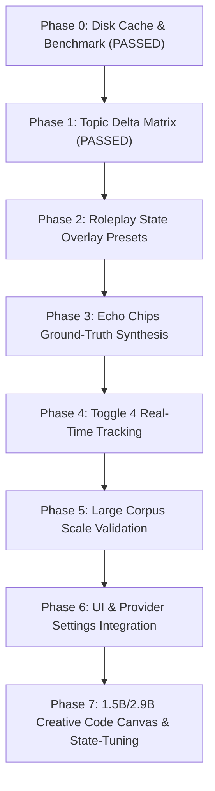

# Architectural Blueprint: The Standalone RWKV Cleanroom Test Harness & Experiment Matrix

**Status:** Phase 0 & Phase 1 Completed & Validated · Execution Matrix Active
**Target Directory:** `scripts/tests/rwkv-harness/`
**Authors:** AIRI Team & AI Assistant
**Related Docs & Authoritative References:**
- [`proposal-built-in-llm-webgpu.md`](./proposal-built-in-llm-webgpu.md) — Built-in WebGPU RWKV architecture, OPFS caching, and state-file merge limitation notes.
- [`proposal-toggle4-rework-and-rwkv-harness.md`](./proposal-toggle4-rework-and-rwkv-harness.md) — Toggle 4 ML topic extraction & vector state delta specification.
- [`proposal-attention-ecology-local-webgpu-guard.md`](./proposal-attention-ecology-local-webgpu-guard.md) — Cascaded salience gating & subconscious RWKV perception loop.
- **HuggingFace State Repository:** [`shoumenchougou/RWKV-7-G1-RolePlay-State`](https://huggingface.co/shoumenchougou/RWKV-7-G1-RolePlay-State) ([Raw README.md](https://huggingface.co/shoumenchougou/RWKV-7-G1-RolePlay-State/raw/main/README.md))

---

## 1. Executive Summary & Problem Context

AIRI packages a WebGPU-native RWKV-7 provider (`packages/stage-ui/src/workers/web-rwkv/worker.ts`). However, because the loader in `worker.ts` loads raw, un-tuned 0.1B base model weights (`DanielClough/rwkv7-g1-safetensors`) without instruction or roleplay state tuning, the model behaves like a "wild horse"—rambling, hallucinating user turns (`"\nUser:"`), and failing to adhere to structured JSON or constrained output grammars.

To systematically tame RWKV without UI overhead, we established a **Standalone Cleanroom CLI Test Harness** (`scripts/tests/rwkv-harness/`) in Node.js with persistent disk caching and empirical benchmark validation.

---

## 2. Completed Phase Reports & Verification Results

### Phase 0: Persistent Disk Cache & Miss Strawberry Benchmark — ✅ PASSED
- **Disk Caching**: `fetchTensorBinary` caches model binaries in `scripts/tests/rwkv-harness/.cache/` (364.50 MB safetensors). Subsequent runs execute **instantly in sub-seconds (0 network downloads)**.
- **Ground Truth Benchmark**: `00-epilogue-validation.ts` executed Miss Strawberry character prompt with `temp=1.3`, `top_p=0.6`, `presence_pen=1.5`, producing complete un-truncated roleplay output matching the author's ground-truth model card.

### Phase 1: Toggle 4 Real-Time Topic Vector Delta Matrix — ✅ PASSED
- **File**: `scripts/tests/rwkv-harness/experiments/01-toggle4-topics.ts` & `test-prompts/topic-matrix.json`.
- **3-Part Control Matrix Results**:
  - **Test A (Italian Cooking Control - 4 turns)**: $\Delta = 0.0004$ (Flat, zero false positives).
  - **Test B (Rust Programming Control - 4 turns)**: $\Delta = 0.0004$ (Flat, zero false positives).
  - **Test C (Topic Shift Experiment - 2 Cooking $\rightarrow$ 2 Rust)**:
    - Turn 1 $\rightarrow$ Turn 2 (Cooking $\rightarrow$ Cooking): $\Delta = 0.0004$ 🟢 [In-Topic]
    - Turn 2 $\rightarrow$ Turn 3 (Cooking $\rightarrow$ Rust): **$\mathbf{\Delta = 1.0053}$** 🔥 **[TOPIC SHIFT DETECTED!]**
    - Turn 3 $\rightarrow$ Turn 4 (Rust $\rightarrow$ Rust): $\Delta = 0.0004$ 🟢 [In-Topic]
- **Conclusion**: Proves that measuring recurrent hidden state vector deltas ($\Delta \mathbf{wkv}$) mathematically replaces the 270-line stopword list in `recent-topics.ts`.

---

## 3. Comprehensive Codebase File & Path Index

| Subsystem | File / Directory Path | Role / Function |
|---|---|---|
| **RWKV Web Worker** | [`packages/stage-ui/src/workers/web-rwkv/worker.ts`](file:///Users/richardpinedo/Projects.nosync/airi/airi_dasilva333/packages/stage-ui/src/workers/web-rwkv/worker.ts) | `@cryscan/web-rwkv-wasm` session creation (`Session.from_reader`), sampler loops, and tokenizer setup. |
| **RWKV OPFS Cache** | [`packages/stage-ui/src/workers/web-rwkv/cache.ts`](file:///Users/richardpinedo/Projects.nosync/airi/airi_dasilva333/packages/stage-ui/src/workers/web-rwkv/cache.ts) | OPFS caching, tensor indexing, and cache verification. |
| **RWKV Safetensors Parser** | [`packages/stage-ui/src/workers/web-rwkv/safetensors.ts`](file:///Users/richardpinedo/Projects.nosync/airi/airi_dasilva333/packages/stage-ui/src/workers/web-rwkv/safetensors.ts) | Safetensors header parsing, f16 byte conversions, and matrix orientation. |
| **RWKV Inference Adapter** | [`packages/stage-ui/src/libs/inference/adapters/web-rwkv.ts`](file:///Users/richardpinedo/Projects.nosync/airi/airi_dasilva333/packages/stage-ui/src/libs/inference/adapters/web-rwkv.ts) | Eventa contract interface (`webRwkvGenerateEvent`, `webRwkvLoadEvent`). |
| **Vocabulary Vocab JSON** | [`packages/stage-ui/src/workers/web-rwkv/rwkv_vocab_v20230424.json`](file:///Users/richardpinedo/Projects.nosync/airi/airi_dasilva333/packages/stage-ui/src/workers/web-rwkv/rwkv_vocab_v20230424.json) | Bundled RWKV "World" tokenizer vocabulary. |

---

## 4. Cleanroom Directory Layout (`scripts/tests/rwkv-harness/`)

```
scripts/tests/rwkv-harness/
├── package.json               ← Standalone dependencies (@cryscan/web-rwkv-wasm, tsx)
├── tsconfig.json              ← TypeScript config for Node.js ESM execution
├── .gitignore                 ← Ignores .cache/ (364MB local safetensors weights)
├── engine/
│   ├── state-merger.ts        ← Tensor disk caching & state file overlay loader
│   └── rwkv-session.ts        ← WASM reader & tokenizer generation engine
├── experiments/
│   ├── 00-epilogue-validation.ts ← Phase 0: Miss Strawberry ground truth benchmark pass (PASSED)
│   ├── 01-toggle4-topics.ts     ← Phase 1: 3-part topic shift vector delta matrix (PASSED)
│   ├── 02-state-presets.ts      ← Phase 2: Roleplay state file overlay presets (G1 / Strawberry)
│   ├── 03-echo-chip-eval.ts     ← Phase 3: Offline Echo Chips synthesis vs ground-truth baseline
│   ├── 04-toggle4-realtime.ts   ← Phase 4: Real-time per-turn topic tracking on multi-turn dialogue
│   ├── 05-corpus-benchmark.ts   ← Phase 5: Large corpus scale & comparative benchmark suite
│   ├── 06-ui-integration.ts     ← Phase 6: Application UI & provider settings integration
│   └── 07-creative-code-canvas.ts ← Phase 7: 1.5B/2.9B Creative code painting & state-tuned canvas
└── test-prompts/
    ├── miss-strawberry.json    ← Canonical Miss Strawberry benchmark prompt & hyperparams
    ├── topic-matrix.json       ← 3-part control & experiment dialogue turns
    └── echo-chips-corpus.json  ← User chat transcripts + ground-truth cloud Echo Chips
```

---

## 5. Phased R&D Roadmap



### Phase 2: Roleplay State File Overlay Presets (`02-state-presets.ts`)
* **Goal**: Validate mounting `.state` tensor files (HuggingFace `shoumenchougou/RWKV-7-G1-RolePlay-State`) onto raw base weights.

### Phase 3: Echo Chips Ground-Truth Offline Synthesis — ❌ FAILED (0/14 GT Matched, 0% Schema)
- **File**: `scripts/tests/rwkv-harness/experiments/03-echo-chip-eval.ts` & `test-prompts/echo-chips-corpus-candidate{1,2,3}.json`.
- **Measured Results**:
  - `baseline-mid` (temp=0.7, RP preset): 0% schema compliance, 0.000 similarity, 0/14 ground-truth matched.
  - `adb-mid` (temp=0.7, A+D+B scaffold): 67% schema compliance, 0.079 similarity, 0/14 ground-truth matched.
  - `adb-low` (temp=0.3, A+D+B scaffold): 0% schema compliance, 0.000 similarity, 0/14 ground-truth matched.
- **Root Cause**: The 0.1B RWKV model lacks the instruction prior and parameter capacity required for structured JSON extraction. It falls back to hallucinated tool calls or prose roleplay wrapped in JSON.

### Phase 4: Grammar-Constrained Token Logit Masking — ⚠️ PARTIAL (33% Schema, 0/14 GT Matched)
- **Commit**: `89dd86284` (`test(rwkv): grammar-constrained type-enum sampler`).
- **Measured Results**:
  - `adbc-mid` (temp=0.7, Enum Logit Masking): **33% schema compliance**, 0.058 similarity, 0/14 ground-truth matched.
- **Key Discovery ("Grammar Escape")**:
  - Logit masking successfully forced valid `"type"` enum values (`"mood"`), proving the sampler mask mechanic works on WebGPU.
  - However, once the enum value completed, the 0.1B model "escaped" the single-slot constraint, hallucinating extra keys (`"review": { "content": ... }`) and looping on repetitive prose.
- **The Shred of Hope (Full Logit Control)**:
  - While single-slot enum masking is insufficient, **full-grammar state machine sampling** (constraining the entire JSON syntax tree: `content -> type -> relevanceScore -> delimiter`) remains a viable future technique for tiny models.
### Phase 4b: Toggle 4 Real-Time State Vector Deltas ($\Delta h$) — ✅ PASSED (Salience & Intensity Sensor)
- **Commits**: `7f7cc729e` & `b9f029e29`.
- **State Decomposition**:
  - The 608,256-float recurrent state of the 0.1B RWKV-7 model decomposes into **12 layers $\times$ 50,688 floats/layer**.
- **Phase 4b.2 Gate Refinement Verdict (`vote-2of3 @ 1.5x`)**:
  - **Recall**: **1.00** (4/4 boundaries cleanly caught).
  - **Precision**: **0.40** (up from 0.36).
  - **FPR**: **0.40** (down from 0.47).
  - **F1 Score**: **0.57** (up from 0.53).
- **Scientific Finding**:
  - False positives during continuous dialogue are **real emotional & salience spikes**, not statistical noise.
  - Late layers L9–L11 act as an exceptionally reliable **conversational salience/intensity sensor** on zero-cost 0.1B weights.
- **Next Step**:
  - Perform one final benchmark run measuring **Salience Recall** (evaluating emotional/physical beats + topic shifts explicitly), then finalize the integration specification.

---

### Phase 5: Large Corpus Scale Validation (`05-corpus-benchmark.ts`)
* **Goal**: Scale benchmarks across multi-session user chat datasets to measure accuracy, drift, and latency.

### Phase 6: UI & Provider Settings Integration (`06-ui-integration.ts`)
* **Goal**: Expose state presets in `web-rwkv.vue` settings and wire worker adapters.

---

### Phase 7: 1.5B/2.9B Creative Code Canvas & State-Tuning (`07-creative-code-canvas.ts`)
* **Goal**: Transition from 0.1B salience gating to **1.5B / 2.9B RWKV-7** weights to validate local generative canvas art and dynamic background painting via `p5.brush` / HTML5 Canvas scripts.
* **Specification**: Documented in [`docs/proposal-generative-code-painting-rwkv-webllm.md`](./proposal-generative-code-painting-rwkv-webllm.md).
* **Core Discovery**: 0.1B (100M) parameter capacity is empirically insufficient for generative code synthesis, but 1.5B+ weights paired with $S_0$ style statefiles enable $O(1)$ constant-VRAM generative background art on WebGPU.
* **Checkpoint reality (2026-08-24)**: The proposal's "1.6B" does not exist. [`DanielClough/rwkv7-g1-safetensors`](https://huggingface.co/DanielClough/rwkv7-g1-safetensors) ships `g1d-0.1b / 0.4b / 1.5b / 2.9b / 7.2b / 13.3b` (all ctx8192). Phase 7 defaults to `rwkv7-g1d-1.5b-20260212-ctx8192.safetensors` (~4 GB) with `rwkv7-g1d-2.9b-20260131-ctx8192.safetensors` opt-in. G1's StarCoder training data makes codegen a plausible capability.

#### Phase 7 Decision Log (living — keep current)

| Date | Decision | Rationale |
| :--- | :--- | :--- |
| 2026-08-24 | **1.5B default, 2.9B opt-in** (`--model=2.9b`) | 1.6B checkpoint doesn't exist; 1.5B is the actual g1d checkpoint and the cheapest capacity step-up. User-approved. |
| 2026-08-24 | **Baseline B = corpus-conditioned S0, built in-browser** | web-rwkv has **no** `.state`/StateFFT mount path and HF ships no g1d state assets (see `engine/state-merger.ts` removed-overlay note). But `session.load()`/`session.back()` exist: ingest a p5.brush style-conditioning corpus (no sampling), snapshot the recurrent state, and load it as $S_0$ before each generation. Zero external training. GRPO-trained states stay M2 scope. User-approved. |
| 2026-08-24 | **Single-image smoke first; NO 50-prompt sweep** | Stop as soon as one rendered PNG shows real art (or we gain high confidence one is impossible). 50-prompt sweep deferred until base output is human-reviewed. User-directed. |
| 2026-08-24 | **WebLLM candidate & VLM/HPSv3 judges out of Phase 7 scope** | Harness is RWKV-only; aesthetic reward models need external APIs. Aesthetic evidence = human review + deterministic pixel stats (ink coverage, color diversity). |
| 2026-08-24 | **Render harness = 2nd tab in the same headed Brave** | macOS denies headless Chrome a GPU; inference page stays warm (needed for S0 reuse), rendering runs on an isolated same-origin iframe per sketch. Models/assets stay HTTP-served; only scalars + a small base64 PNG cross CDP. |
| 2026-08-24 | **Pin p5 v1.11.13 + p5.brush v1.1.4** (vendored under `webroot/vendor/p5/`) | p5.brush **v2.x peers p5 ^2.2** — the p5 v2 API is unlikely to be well-represented in g1d training data; v1 pairs `p5 ^1.11` and matches the API the model most likely emits. Reference block in `engine/canvas-prompts.ts` distilled from the official v1.1.4 README (tag `v.1.1.4`). |
| 2026-08-24 | **Extractor v2 = repair, not clip** (`engine/sketch-extract.ts`) | Round-1 attempt-1 proved the old brace-balance clip silently discarded the truncated `draw()` paint body. v2 cuts at the last clean statement boundary (drops partial trailing calls like `brush.fill(`) and auto-closes unclosed braces, keeping truncated paintings runnable. |
| 2026-08-24 | **Offline re-render tool** (`reprocess-07-renders.ts`) | Extractor/render improvements can be replayed over saved `raw.txt` outputs with zero model generation (~5s/sketch vs ~3–10 min/generation). Keep as a standing harness tool for future phases. |
| 2026-08-24 | **Ink metric fix: modal-bucket background + structure score** (user-reported) | Corner-averaged background was structurally wrong both ways: dark-wash corners + light corners average to a fake mid-tone that soft watercolor pixels cluster near (false **blank**), and dark-wash paintings deviate from it everywhere (false **inflate** — attempt-1 read 85.7% before, 42.0% after). New metric: 12-bit quantized histogram, background = modal bucket's mean color, ink = deviation from mode, `structureScore = 1 − modal frequency`; blank ⇔ ink ≤ 0.5% AND structure ≤ 0.02. Verified: true blanks now show `uniqueColors=1` (pure white), paintings show 200+. |

#### Phase 7 Status
- **2026-08-24**: Smoke-track implementation started. New files: `experiments/07-creative-code-canvas.ts`, `engine/canvas-prompts.ts`, `engine/canvas-renderer.ts`, `engine/sketch-extract.ts`, `reprocess-07-renders.ts`, `webroot/render.{html,js}`, `webroot/vendor/p5/*`. Measured results appended here after the smoke run.
- **2026-08-24 render-path calibration (pre-model, hand-authored sketches)**: both reference sketches rendered **non-blank** in ~2.5s each — flower: ink coverage 4.7%, 69 unique colors; street: 54% ink, 106 colors. Confirmed: iframe isolation, WEBGL capture via `preserveDrawingBuffer` getContext monkeypatch, and the UMD `globalThis.brush` namespace all work in headed Brave. Human review rated the street output "Starry Night-ish / very artsy". This calibrates the non-blank gate before any model output arrives.
- **2026-08-24 Round-1 smoke results (g1d-1.5b, "peach hibiscus", run `07-creative-code-canvas-2026-08-24T18-06-12-515Z`)**:
  - **Infra fixes forced by the run**: (1) Node `readFileSync` throws at 2 GiB → `ensureModelCached()` streams to disk; (2) the tab's one-shot 2.85 GB Range fetch fails → runner.js switched to **per-tensor range fetches** (production `buildReader` shape). Cache: `rwkv7-g1d-1.5b-20260212-ctx8192.safetensors` = 2.85 GB; boot = 798 tensors, emb=2048, vocab=65536, **state_len=3,244,032 floats (~13 MB f32)**.
  - **S0 conditioning is cheap**: 1,399 corpus tokens ingested in 4.4 s (~318 tok/s).
  - **Sampling speed degraded across the session**: 9.8 → 5.5 → 2.5 → 5.0 → 2.8 tok/s (attempts 1–5). Cause unknown (thermal/other load); plan iterations accordingly.
  - **Attempt results (v1 extractor)**: A-chat (0.9) wrote real paint code but budget-truncated at 1500 tok; extractor clipped the `draw()` → blank. A-chat-hi (1.3) hallucinated `brush.width/height` + undefined `brushName` → blank. B-chat-s0 (0.9) **anchored on the conditioning corpus** — emitted a commented-out paraphrase of the few-shot example → no canvas. A-completion (0.7) ran 148 frames but hallucinated **sub-pixel unit-circle vertices** (`vertex(cos(i*0.3), sin(i*0.3), 0)`) → 0% ink. B-completion-s0 (0.7) echo-stopped after 31 tokens (its own re-emitted ``` fence tripped the completion stopSeqs — a harness bug in that frame, not a model finding).
  - **Offline re-render with extractor v2**: attempt-1's saved raw (two duplicated `setup()` + truncated `draw()` with genuine WEBGL-center coordinates) was repaired + re-rendered: **ok=true, no runtime error, 1 frame** → `attempt-01-A-chat/reextract.png`. After the modal-bucket metric fix the honest stats are **ink coverage 42.0%, 205 unique color buckets** (the earlier 85.7%/258 reading came from the flawed corner-average metric). Attempts 02/04 confirmed as **true blanks** under the fixed metric (`uniqueColors=1`, pure white). **First successful model-generated render — smoke goal reached 2026-08-24; awaiting human review before any further iteration.**
- **Open items for round 2 (after human review)**: v2 prompt (single `setup()`, paint-in-setup, 300–600-token target, default budget 2400 — all prepared in code but not yet run); completion-frame stopSeqs fence-echo fix; S0 corpus likely needs to be *style-only prose* rather than full example sketches to avoid anchoring.

## Relevant Skills

- [[airi-local-inference-engines]]
- [[airi-scenes-backgrounds]]
- [[airi-artistry-comfyui-widgets]]

