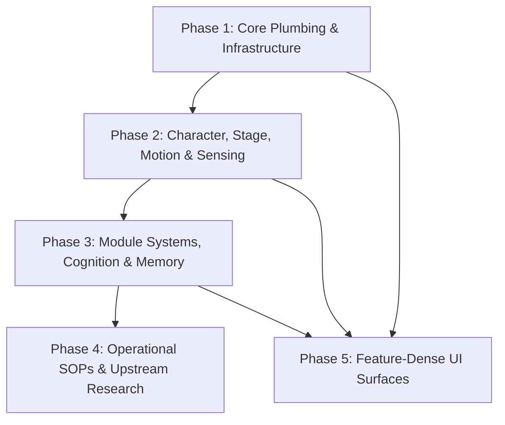

# Project Specialized Skills Master Plan & Skill Catalog

This document outlines the strategic blueprint, architecture, and comprehensive sitemap catalog for building purpose-built AIRI Agent Skills under `.agents/skills/<skill_name>/SKILL.md`.

The goal is to equip AI agents and pair-programming assistants with modular, domain-specific Standard Operating Procedures (SOPs), code locations, and technical guidelines covering **every architectural domain** in AIRI as cataloged by [`docs/rosetta-stone.md`](./rosetta-stone.md).

---

## 1. Skill Architecture & Matching Mechanism

### What is an AIRI Skill?
An **AIRI Skill** is a purpose-built directory under `.agents/skills/<skill_name>/` containing a required `SKILL.md` entry point. It provides concise, high-density instructions, key code paths, pitfalls, and verification steps for a specific domain.

```text
.agents/skills/<skill-name>/
├── SKILL.md                 # Required: Entry point with YAML frontmatter
├── scripts/                 # Optional: Helper scripts & CLI tools
├── examples/                # Optional: Reference code & implementation patterns
└── references/              # Optional: Domain documentation & specs
```

### The Matching Mechanism (`description` trigger)
Skill selection relies on semantic triggering via the YAML frontmatter `description`:
```yaml
---
name: airi-ipc-eventa
description: >-
  Use when defining, wiring, or debugging Electron typed IPC/RPC between main
  and renderer: `@moeru/eventa` contracts in `shared/eventa.ts`, `defineInvokeEventa`
  / `defineEventa`, renderer invocations, main-process handlers, and cross-window
  `BroadcastChannel` relays (e.g. `airi:cards-sync`, `airi:director-notes-sync`).
  Trigger for work on Electron IPC, eventa context serialization, or multi-window
  event/state synchronization.
---
```
At session startup, the agent sitemap indexes these `description` triggers. When a task matches a skill's description, the agent automatically reads that skill's `SKILL.md` via `view_file` to follow its instructions.

---

## 2. 5-Phase Rollout & Batch Execution Strategy

To build this comprehensive library without context fragmentation, skills will be authored in **5 phased execution batches**:



---

## 3. Comprehensive Domain Skill Sitemap Catalog

Below is the complete, categorized sitemap of all 41 specialized skills mapped against AIRI's architectural domains in [`docs/rosetta-stone.md`](./rosetta-stone.md).

> **Authoring requirement for worker agents.** Every authored `SKILL.md` **must** include a keyword-rich `description:` frontmatter trigger of the form `Use when working with …`, explicitly naming the domain, the key technologies (e.g. `eventa`, `unstorage`, `localforage`, `defineProvider`, `BroadcastChannel`), and the kinds of tasks it applies to. Model it on the example in §1.

---

### 🟢 Phase 1: Core Plumbing & Infrastructure

#### 1.1 `airi-app-entry-wiring`
- **Target Domain**: Application Bootstrap, Window Management, DI Composition Root (`injeca`).
- **Key Paths**: `apps/stage-tamagotchi/src/main/index.ts`, `apps/stage-tamagotchi/src/main/windows/`, `apps/stage-web/src/App.vue`.
- **Content**: Service injection via `injeca`, main process window manager lifecycles (Control Strip, Stage, Chat, Caption, Widgets, Settings), renderer routing via Vite, and web app entry.

#### 1.2 `airi-ipc-eventa`
- **Target Domain**: Typed Electron IPC/RPC Contracts & Cross-Window Messaging.
- **Key Paths**: `apps/stage-tamagotchi/src/shared/eventa.ts`, `packages/electron-eventa/`.
- **Content**: Defining typed `eventa` IPC calls, main-to-renderer event emissions, avoiding the Eventa context serializer pitfall, and handling `BroadcastChannel` cross-window event relays.

#### 1.3 `airi-data-persistence`
- **Target Domain**: Database Repos, Dual IndexedDB Layer (`unstorage` + `localforage`), Sync Engine.
- **Key Paths**: `packages/stage-ui/src/database/storage.ts`, `packages/stage-ui/src/database/repos/`, `packages/stage-ui/src/stores/sync-engine.ts`, `docs/data-catalog.md`.
- **Content**: Writing repo actions for `local:` namespaces, avoiding Vue 3 binary proxy destruction in `localforage`, handling S3/ElectronFS sync engine reconciliations, and outbox queue management.

#### 1.4 `airi-provider-core-registry`
- **Target Domain**: Provider Architecture, `defineProvider()` Schemas & API Capability Contracts.
- **Key Paths**: `packages/stage-ui/src/libs/providers/providers/registry.ts`, `packages/stage-ui/src/libs/providers/types.ts`, `docs/provider-catalog.md`, `docs/project-provider-metadata-catalog.md`.
- **Content**: Defining new provider backends via `defineProvider()`, implementing `ProviderMetadata` and `SpeechCapabilitiesInfo` contracts, `capabilities` (`listModels`, `listVoices`, `loadModel`), and Zod validation schemas.

#### 1.5 `airi-provider-store-instances`
- **Target Domain**: Multi-Instance Provider Store, Account Catalog & Persistence.
- **Key Paths**: `packages/stage-ui/src/stores/provider-catalog.ts` (`providersStore`), `packages/stage-ui/src/database/repos/providers.repo.ts` (`local:providers`), `docs/design-multi-instance-provider-studio.md`, `docs/arch-provider-store-current-structure.md`, `docs/project-provider-store-restructuring-plan.md`.
- **Content**: `providersStore` Pinia state, `providersRepo` IndexedDB persistence, multi-instance provider configuration (allowing multiple API keys / endpoints per provider), data boundaries, and account validation state (`useProviderValidation`).

#### 1.6 `airi-card-schema`
- **Target Domain**: Character Card Specifications (CCv2/CCv3) & AIRI Extension Schema.
- **Key Paths**: `packages/stage-ui/src/types/card.schema.ts`, `packages/stage-ui/src/stores/modules/airi-card.ts`, `packages/ccc/src/define/card.ts` (base `Card` shape), `docs/airi-card-design.md`.
- **Content**: `AiriCard` and `AiriExtension` structure, Valibot schema validation, PNG `tEXt` chunk writing (`chara` keyword → base64 UTF-8 JSON → zlib CRC-32 per PNG tEXt chunk rules), and Electron webview `will-download` interception for `.png` card imports.

#### 1.7 `airi-cloud-relay-infrastructure`
- **Target Domain**: Serverless Edge Workers, BYOS Cloud Sync & Remote Proxy Infrastructure.
- **Key Paths**: `apps/stage-edge/`, `docs/cloud-relay-design.md`, `docs/project-byos-cloud-sync.md`, `docs/project-audit-cloudsync.md`, `docs/superpowers/specs/2026-07-04-commercial-backend-phase-1-provider-data-boundary-design.md`.
- **Content**: Deploying and maintaining Cloudflare Workers, Edge KV memory models, BYOS cloud sync outbox queues, commercial API server proxy boundaries, and `PERSONAL_DATA_CLOUD_SYNC_ENABLED` storage guards.

---

### 🔵 Phase 2: Character, Stage, Motion & Sensing

#### 2.1 `airi-character-rendering`
- **Target Domain**: 3D & 2D Avatar Display Models (VRM, Live2D, Spine, MMD).
- **Key Paths**: `packages/stage-ui-three/`, `packages/stage-ui-live2d/`, `packages/stage-ui-spine/`, `packages/stage-ui-mmd/`.
- **Content**: Rendering pipelines for VRM (Three.js), Live2D (Canvas & DSL VM adapter), Spine, and MMD. Expression mappings, parameter controls, motion triggers, and `displayModelsStore` binary fetching.

#### 2.2 `airi-audio-pipeline`
- **Target Domain**: TTS Speech Output, STT Hearing Input, Audio Studio & UST.
- **Key Paths**: `packages/stage-ui/src/stores/modules/speech.ts`, `hearing.ts`, `stores/audio.ts`, `packages/audio-pipelines-transcribe/`.
- **Content**: TTS output flow (VoiceProfile, UST speech transformers, PCM/WAV playback), STT input flow (microphone device switching, VAD detection, streaming transcription). Note: "Audio Studio" refers to the voice-profile / UST feature spec (`docs/feat-audio-studio.md`).

#### 2.3 `airi-local-inference-engines`
- **Target Domain**: Local WebGPU & WASM Inference (Kokoro TTS, Whisper STT, WebLLM, Web-RWKV).
- **Key Paths**: `packages/stage-ui/src/libs/inference/` (protocol/coordinator/`gpu-resource-coordinator`, `adapters/`), `packages/stage-ui/src/workers/kokoro/`, `packages/stage-ui/src/libs/workers/whisper/`. Note: WebLLM/Web-RWKV run as workers under `packages/stage-ui/src/workers/`.
- **Content**: Message protocol (`load-model`, `run-inference`, `progress`), serialized load queues, `GpuResourceCoordinator` VRAM pressure telemetry, and WebGPU detection.

#### 2.4 `airi-stage-ui-surfaces`
- **Target Domain**: Cross-app Control Strip (desktop Electron pill + `mode="mobile"` integration in stage-web/stage-pocket), floating Electron window overlays, `ControlStripHost.vue`/`WidgetStage`, `RendererStage.vue`, control islands, and the action-dispatch / button-catalog layer.
- **Key Paths**: `packages/stage-ui/src/components/scenarios/layout/ControlStrip.vue`, `packages/stage-ui/src/composables/use-control-strip-action.ts`, `packages/stage-ui/src/stores/settings/control-strip.ts` + `controls-island.ts`, `packages/stage-ui/src/constants/control-customizer.ts`, `packages/stage-ui/src/components/scenes/ControlStripHost.vue` (exported as `WidgetStage`), `RendererStage.vue`, `apps/stage-tamagotchi/src/renderer/pages/index.vue`, `apps/stage-web/src/pages/index.vue`, `apps/stage-pocket/src/pages/index.vue`, `packages/stage-pages/src/pages/settings/stage/index.vue`.
- **Content**: One shared `ControlStrip.vue` rendered in three app shells via a `mode` prop; `DEFAULT_BUTTONS` vs `DEFAULT_MOBILE_BUTTONS` selected on `isStageTamagotchi()`; `BUTTONS_CATALOG_VERSION` gating + keyed merge (do NOT bump to add buttons); `useControlStripAction` dispatcher + `control-strip:*` CustomEvent bus + `airi-control-strip-actions` BroadcastChannel; desktop-only event listeners (open-customizer/open-settings) that web/pocket do NOT implement; opposite-edge chatbox rule for `dockedEdge`; notch-mode geometric hit-testing and click-through; portrait vs landscape integration planes. Pitfalls: version bump wipes user layouts, `useLocalStorage` vs ManualReset for `buttons`, shared localStorage key for fadeOnHoverEnabled, `stageViewControlsEnabled` transparency trap, stale mobile-revamp doc naming unbuilt files.

#### 2.5 `airi-live2d-dsl-interpreter`
- **Target Domain**: Live2D Scripting DSL Virtual Machine & Kinetic Staging Engine.
- **Key Paths**: `docs/live2d-dsl-interpreter-spec.md`, `docs/handoff-live2d-dsl-phase2.md`, `packages/stage-ui-live2d/src/components/scenes/live2d/Model.vue`.
- **Content**: `pixi-live2d-display` instruction parser, `VarFloats` reactive heap (conditional guards & state modifiers), Sequencer pipeline (`start_mtn`, `clear_exp`), `change_cos` zero-latency WebGL costume hot-swapping, and `Live2DStageManager` delta ticking loop.

#### 2.6 `airi-generative-motion-vrma`
- **Target Domain**: Text-to-VRMA Generative Motion & Skeletal Retargeting Engine.
- **Key Paths**: `docs/proposal-text-to-vrma-system.md`, `docs/design-text-to-motion.md`, `@pixiv/three-vrm-animation`, `generate_motion` tool call, IndexedDB motion cache (`"jumping_jacks"`), Rehearsal Room motion sandbox.
- **Content**: Compiling LLM JSON keyframes into `.vrma` binary buffers in the browser, Mixamo-to-VRM bone retargeting maps, Euler-to-quaternion GLB builders, bone rotation safety clamping, and synchronized motion playback via `<|ACT:motion="..."|>`.

#### 2.7 `airi-attention-ecology-vision`
- **Target Domain**: Continuous Vision Perception & Attention Ecology Gate.
- **Key Paths**: `docs/proposal-attention-ecology-local-webgpu-guard.md`, `docs/implementation-plan-vision-witness.md`, `packages/stage-ui/src/stores/modules/vision/orchestrator.ts`.
- **Content**: Cascaded Salience Gate (pHash → CLIP vision embedding & novelty scoring → WASM OCR / RWKV-7 gate → VLM forwarder), privacy app exclusion filters, push/pull cognitive mechanics, and Vibe Island integration.

---

### 🟣 Phase 3: Module Systems, Cognition & Memory

#### 3.1 `airi-onboarding-v2`
- **Target Domain**: Onboarding V2 7-Step Sequence & Draft Assembly Architecture.
- **Key Paths**: `packages/stage-ui/src/components/scenarios/dialogs/onboarding/v2/`, `docs/project-onboarding-modernize.md`.
- **Content**: Implementing V2 onboarding steps, `onboardingV2Gate` contracts, transient `onboardingV2Draft` composition state (Principle 6), in-context model shard downloads, and Step 7 atomic card synthesis.

#### 3.2 `airi-mcp-integration`
- **Target Domain**: Model Context Protocol (MCP) Server Integration.
- **Key Paths**: `apps/stage-tamagotchi/src/main/services/airi/mcp-servers/`, `packages/stage-ui/src/stores/mcp-tool-bridge.ts`, `mcp.json`.
- **Content**: Electron stdio MCP service manager, tool listing and invocation IPC bridge (`window.__AIRI_MCP_BRIDGE__`), builtin meta-tools (`mcp_list_tools`, `mcp_call_tool`), and configuration schemas.

#### 3.3 `airi-discord-integration`
- **Target Domain**: Discord Bot Integration & Multi-Modal Routing.
- **Key Paths**: `apps/stage-tamagotchi/src/main/services/airi/discord/`, `packages/stage-ui/src/stores/modules/discord.ts`.
- **Content**: Main process Discord gateway service, slash command registration (`COMMANDS_VERSION`), image attachment vision routing, and tool availability fallthrough.

#### 3.4 `airi-memory-systems`
- **Target Domain**: Long-Term Journal, Short-Term Summaries, Lifetime Memory Synthesis, Echo-Chips.
- **Key Paths**: `packages/stage-ui/src/stores/memory-{text-journal,short-term,lifetime}.ts`, `echo-chips.ts`, `packages/stage-ui/src/database/repos/{text-journal,short-term-memory,lifetime-memory,provisioning-session,echo-chips}.repo.ts`, `packages/stage-ui/src/libs/search/layered-memory.ts`.
- **Content**: Long-term text journal (Orama/Voy semantic index), daily summary token budget rebuilding, Lifetime Memory Eternal Thread multi-pass synthesis pipeline, and Echo-Chips RWKV-7 salience sensor gating.

#### 3.5 `airi-prompt-builder-engine`
- **Target Domain**: System Prompt Builder, ACT Pipeline & Dating Sim Engine.
- **Key Paths**: `packages/stage-ui/src/stores/modules/airi-card.ts` (`buildSystemPrompt`), `packages/stage-ui/src/stores/chat/session-store.ts` (`refreshActiveSystemMessage`, `buildShortTermMemoryContext`), `packages/stage-ui/src/composables/llm-marker-parser.ts`, `packages/stage-ui/src/stores/dating-sim.ts`.
- **Content**: Composing character card fields, acting prompts, artistry instructions, and runtime overlays (dating sim storylines). ACT token parsing (`<|ACT:...|>`), kinetic manifestation triggers, and response formatting.

#### 3.6 `airi-gemini-live-api`
- **Target Domain**: Real-Time Bidirectional Multimodal WebSocket Streaming (`google-genai`).
- **Key Paths**: `docs/content/en/docs/advanced/architecture/design-gemini-live-api-integration.md`, `packages/stage-ui/src/stores/modules/live-session.ts`.
- **Content**: Sub-second latency WebSocket Bidi streaming (`LiveSessionStore`), mandatory `['AUDIO']` modality rule (prevents Error 1007/1011), zero-length TTS suppress hack, live marker parsing, and native tool calling.

#### 3.7 `airi-proactivity-sensory-telemetry`
- **Target Domain**: OS Sensor Polling, Environmental Telemetry & Attention Ecology Gate.
- **Key Paths**: `docs/content/en/docs/advanced/architecture/design-proactivity-heartbeats-engine.md`, `packages/stage-ui/src/stores/proactivity.ts`.
- **Content**: OS sensor polling (Active Window Title, Program Name, AFK status, Volume, Time), 5-event rolling clipboard buffer, invisible emotion meters (Trust, Patience, Playfulness), heuristic gating, and `NO_REPLY` decision logic.

#### 3.8 `airi-memory-retrieval-engine`
- **Target Domain**: Ultimate Hybrid Memory Retrieval Engine & Ranking Architecture.
- **Key Paths**: `docs/memory_lab/retrieval-and-ranking-spec.md`, `docs/memory_lab/search-probe-harness-plan.md`, `packages/stage-ui/src/libs/search/layered-memory.ts`.
- **Content**: Tiered Router (Literal Mode for single-hop exact recall, Bridge Mode for C1 multi-hop fact linking, Detective Mode for C3 open-domain reasoning), 5W extraction schema (`who/what/where/when/why`), concept normalization, candidate search across 10+ metadata fields, and fused signal reranking.

#### 3.9 `airi-memory-consolidation-dreaming`
- **Target Domain**: Triple-Store Memory Model, Sacred Journal Rule & Dreaming Worker.
- **Key Paths**: `docs/memory_lab/design-prospective-rich-journal.md`, `docs/memory_lab/memory-schema-and-lifecycle-spec.md`, `docs/memory_lab/memory-lifecycle-and-features.md`.
- **Content**: Triple-Store Model (Ephemeral STMM, Immutable Sacred LTMM, Dynamic DRMM), Sacred Irreplaceable Journal Rule (workers derive insights but never rewrite manual entries), PCL contradiction handling with invalidation gates, Dreaming Worker, and Emotional Exhaust deltas updating global `MoodState`.

#### 3.10 `airi-interaction-pipelines`
- **Target Domain**: End-to-end Interaction & Voice Pipelines (Cross-Cutting Map-of-Maps).
- **Key Paths**: `docs/content/en/docs/advanced/architecture/arch-chat-stt-proactivity-pipelines.md`, `packages/stage-ui/src/stores/chat.ts`, `packages/stage-ui/src/stores/modules/live-session.ts`, `packages/stage-ui/src/services/speech/`, `apps/stage-tamagotchi/src/main/services/airi/discord/index.ts`.
- **Content**: The seven input→hub→output routes (typed text × 4 surfaces, app mic STT, Discord classic voice → STT, proactivity heartbeats, Discord gemini voice, in-app Gemini Live mic, typed-text-mid-call short-circuit), the module-level hooks bus (HMR lesson, `chat.ts:96`), the six-layer TTS chain (`emitTokenLiteralHooks` → host intent → speech runtime → UST pipeline → playback), `performSend` generation-gated checkpoints (`bumpSessionGeneration` as the canonical mid-flight lever, Discord steer mode as the working precedent), the stop/cancel-in-flight audit (decorative stop button at `WhisperComposerBar.vue:233`, propose-first stop recipe), and a current-status reconciliation of the arch-doc Failure Log. Peer skills: `airi-audio-pipeline`, `airi-gemini-live-api`, `airi-proactivity-sensory-telemetry`, `airi-discord-integration`. Phase 3 foundation referenced by Phase 5 `airi-desktop-chatbox`.

#### 3.11 `airi-llm-dispatch-gateway`
- **Target Domain**: LLM Request Dispatch Gateway (`useLLM` store).
- **Key Paths**: `packages/stage-ui/src/stores/llm.ts`, `packages/stage-ui/src/stores/chat.ts`, `docs/content/en/docs/advanced/architecture/arch-chat-stt-proactivity-pipelines.md`.
- **Content**: The single renderer-side LLM funnel (`stream`/`generate`/`generateObject`/`discoverToolsCompatibility`), the `StreamOptions` contract (abortSignal, waitForTools, supportsTools, lazy tools resolver, requestOverrides sanitization), the `StreamEvent` protocol, the dual-settlement stream promise, message/system-message sanitization, and the one-way per-model tools-compatibility cache. Peer skills: `airi-provider-core-registry`, `airi-tool-registry-builtin-tools`, `airi-interaction-pipelines`.

#### 3.12 `airi-tool-registry-builtin-tools`
- **Target Domain**: Tool Registry, Builtin Tool Authoring & Per-Surface Availability.
- **Key Paths**: `apps/stage-tamagotchi/src/renderer/stores/tools/builtin/index.ts`, `packages/stage-ui/src/stores/proactivity.ts`, `packages/stage-ui/src/stores/chat.ts`, `packages/stage-ui/src/stores/llm.ts`.
- **Content**: The two registries (chat `toolsResolver` + ProactivityStore `registerTools`/`resolveRegisteredTools`), the `builtinTools` factory composition and gateables, ACT-marker tool bridging, card-level `allowedTools` gating, the per-surface availability matrix (desktop/secondary-windows/proactivity/Discord text+voice+steer/Gemini Live native/web-stage/pocket/VLM), tool-call rendering in chat slices and Discord outbound formatting, and builtin tool authoring. Peer skills: `airi-mcp-integration`, `airi-interaction-pipelines`, `airi-llm-dispatch-gateway`.

---

### 🟡 Phase 4: Operational SOPs & Upstream Research

#### 4.1 `airi-i18n-localization`
- **Target Domain**: Monorepo i18n Translations & YAML Management.
- **Key Paths**: `packages/i18n/`, `scripts/yaml-manager.js`, `docs/settings-yaml.md`.
- **Content**: Using `scripts/yaml-manager.js` to locate, validate, and manage locale YAML files without brute-forcing translation keys.

#### 4.2 `airi-binary-safety`
- **Target Domain**: Binary Asset Serialization & Vue 3 Proxy Handling.
- **Key Paths**: `packages/stage-ui/src/database/storage.ts`, `stores/display-models.ts`.
- **Content**: Preventing Vue 3 proxy destruction of `File`/`Blob` objects during `JSON.stringify()`. Using `toRaw()` and lightweight metadata catalogs with on-demand binary loading.

#### 4.3 `airi-codebase-verification`
- **Target Domain**: Validation Commands & Verification Workflows.
- **Key Paths**: `AGENTS.md`, workspace `package.json` scripts.
- **Content**: Selecting minimal verification targets (`pnpm -F <workspace> typecheck`, workspace builds), handling Electron vs web typechecks, git status reporting rules, and fork release safety constraints.

#### 4.4 `airi-prefix-cache-alignment`
- **Target Domain**: LLM Prefix Cache Alignment & Prompt Compilation Optimization.
- **Key Paths**: `docs/proposal-prefix-cache-alignment.md`, `docs/proposal-director-cache-alignment-analysis.md`, `packages/stage-ui/src/stores/chat/session-store.ts`.
- **Content**: Multi-phase prompt compilation layout geometry for DeepSeek, OpenRouter & Gemini to prevent KV prefix cache invalidation across automated sub-loops, drastically reducing LLM latency and token costs.

#### 4.5 `airi-roadmap-upstream-research`
- **Target Domain**: Project Roadmap Navigation, Proposal RFC Analysis, Fork Research & Upstream Syncing.
- **Key Paths**: `docs/content/en/docs/chronicles/roadmap.md`, `docs/memory_lab/`, `docs/` proposal RFCs, fork diff tools (`git remote`).
- **Content**: Evaluating unbuilt features, reading architectural proposals, inspecting upstream repository changes, comparing divergent fork paths, and planning feature implementations safely without scope creep.

---

### 🟠 Phase 5: Feature-Dense UI Surfaces

#### 5.1 `airi-desktop-chatbox`
- **Target Domain**: The desktop (stage-tamagotchi Electron) chat window as a whole: the `pages/chat.vue` hub, its hamburger Workspace Routes and the 9 sub-views (Chat View, Director's Monitor, World Bible, Studio, Media Library, Eternal Thread, Event Ledger, Notes, Rehearsal), the desktop composer host, chat message bubbles, toolbar strips, context menus, journal chips, grounding panel, ACT/Director-note bubbles — plus a concise map of the three (+1) distinct chatboxes (desktop, web/pocket portrait `MobileWhisperSheet`, web/pocket landscape `Layouts/InteractiveArea`, and WhisperDock as input-dock-only).
- **Key Paths**: `apps/stage-tamagotchi/src/renderer/pages/chat.vue`, `apps/stage-tamagotchi/src/renderer/components/chat/` (`chat_messages.vue`, `chat_director.vue`, `chat_world.vue`, `chat_studio.vue`, `chat_media.vue`, `chat_lifetime.vue`, `chat_event_log.vue`, `chat_notes.vue`, `chat_rehearsal.vue`), `apps/stage-tamagotchi/src/renderer/components/InteractiveArea.vue`, `packages/stage-ui/src/components/scenarios/chat/` (`history.vue`, `assistant-item.vue`, `user-item.vue`, `response-part.vue`, `tool-call-block.vue`, `DirectorNoteBubble.vue`, `WhisperDock.vue`, `WhisperComposerBar.vue`, `components/action-menu/index.vue`), `packages/stage-layouts/src/components/Widgets/ChatArea.vue`.
- **Content**: Desktop chatbox maintenance — Workspace Route/sub-view wiring (both duplicated inline arrays in `chat.vue`), text-vs-edit bubble rendering, Reka action-menu (copy/delete/edit/retry/fork/journal moment), image drag-and-drop, journal preview vs. moment modal, mood strip, Act token rendering, and which ingestion path each of the four surfaces uses. Pitfalls: per-window broadcast sync, `healMozibake` Unicode repair, eager `{ deep: true }` watchers on store data (Rosetta §16), `index: 0` tool-call field for bridged gateways, the `INVOKE_CHARACTER_FIRST` sentinel path.

#### 5.2 `airi-card-editor-wizard`
- **Target Domain**: AIRI Card Editor, Character Creation Wizard (9-tab guided flow suite: Identity, Cognition, Generation, Acting, Artistry, Modules, Proactivity, Tools, ProductionStudio), Card Import modal.
- **Key Paths**: `packages/stage-pages/src/pages/settings/airi-card/index.vue`, `guided.vue`, `tabs/`, `components/CardImportWizard.vue`; card data layer: `packages/stage-ui/src/stores/modules/airi-card.ts`.
- **Content**: Schema-driven tab navigation, Identity/Cognition/Generation/Acting/Artistry/Modules/Proactivity/Tools/ProductionStudio tab responsibilities, SillyTavern metadata mapping in the import wizard, and edit-vs-preview flows. Avoids re-saving the whole card during wizard edits (write only mutated `extensions.airi` slice).

#### 5.3 `airi-scenes-backgrounds`
- **Target Domain**: Stage background layers, scene style galleries, background picker dialogs, background store.
- **Key Paths**: `packages/stage-ui/src/components/scenes/RendererStage.vue`, `packages/stage-ui/src/components/scenarios/dialogs/stage-background-picker/StageBackgroundPicker.vue`, `packages/stage-pages/src/pages/settings/scene/index.vue`, `packages/stage-ui/src/stores/background.ts` (localforage `bg-{nanoid}` + `airi:background-sync`).
- **Content**: Layer ordering vs. stage model (`Z` offsets), picker dialog flows, per-card `activeBackgroundId`, background-store storage/sync contract. Pitfall: background blobs are **not** in the `storage` outbox — reconciliation is handled by `reconcileBackgrounds()` in the sync engine.

#### 5.4 `airi-dating-sim-engine`
- **Target Domain**: Dating Sim game layer, storyline presets, overlay UI, mood/intimacy state machine.
- **Key Paths**: `packages/stage-ui/src/stores/dating-sim.ts`, `packages/stage-ui/src/components/scenes/DatingSimOverlay.vue`, `StorySelectorModal.vue`, `constants/dating-sim/storylines.ts`.
- **Content**: Amagami-inspired mechanics — intimacy/tension/action points, mood state computation (`low/normal/high/max`), branching choices, storyline presets, motion/expression triggers. Pitfall: dating-sim state is **ephemeral localStorage** (not synced), and its system-prompt injections override `card.scenario` when active.

#### 5.5 `airi-artistry-comfyui-widgets`
- **Target Domain**: Image-generation widgets, ComfyUI bridge, `image_journal` tool, autonomous artistry.
- **Key Paths**: `apps/stage-tamagotchi/src/renderer/stores/tools/builtin/widgets.ts`, `image-journal.ts`; `apps/stage-tamagotchi/src/main/services/airi/widgets/` (`artistry-bridge.ts`, `providers/comfyui.ts`); `packages/stage-ui/src/stores/modules/artistry.ts`, `artistry-autonomous.ts`.
- **Content**: Widget window lifecycle (spawn/bg/inline), ComfyUI workflow selection, `image_journal` tool contracts, director-note grading loop. Pitfall: all widget→renderer events cross processes — match `airi:*` BroadcastChannel or Eventa contract exactly.

#### 5.6 `airi-broadcast-channels`
- **Target Domain**: Cross-window `BroadcastChannel` relay registry (25+ channels) and multi-window state synchronization.
- **Key Paths**: `grep -r "useBroadcastChannel" packages/ apps/` (channel names source of truth), plus Rosetta §13.
- **Content**: Complete channel registry with publisher/subscriber roles, message payloads, and lifecycle. Pitfall: two API styles coexist — `useBroadcastChannel` (VueUse) and raw `new BroadcastChannel`; naming is inconsistent (`airi-kebab` / `airi:snake` / odd `airi::beat-sync` double-colon); adding a channel requires registering payload types in every consuming window. **Canonical registry lives in `docs/rosetta-stone.md` §13** (now verified against 28 channels in source) — this skill references and explains those channels rather than re-listing them, and must keep Rosetta §13 updated when a channel is added or removed.

#### 5.7 `airi-modular-outfits-system`
- **Target Domain**: Character `outfits` in the `AiriExtension` schema, Live2D/VRM costume variants, and visual-asset manifestations.
- **Key Paths**: `packages/stage-ui/src/types/card.schema.ts` (`outfits` field), `packages/stage-ui/src/stores/modules/airi-card.ts`, `docs/design-modular-outfits-system.md`, `docs/project-live2d-multimoc-changecos-design.md`.
- **Content**: `AiriOutfit` structure, outfit→display-model and outfit→visual_asset manifestation mapping, and how outfit switching propagates through the card and renderer. Pitfalls: not a standalone store — it rides on the card schema (Phase 1.5) and Live2D/VRM rendering (Phase 2.1). Cross-link to both.

#### 5.8 `airi-provider-ui-pages`
- **Target Domain**: Provider Settings UI Pages, Category Cards, Inline Configuration Panels & Validation Composables.
- **Key Paths**: `packages/stage-pages/src/pages/settings/providers/` (`chat/`, `speech/`, `transcription/`, `vision/`, `embed/`), `packages/stage-ui/src/components/scenarios/providers/provider-settings-layout.vue`, `packages/stage-ui/src/components/scenarios/dialogs/onboarding/v2/step-provider-configuration.vue`, `packages/stage-ui/src/composables/use-provider-validation.ts`.
- **Content**: Provider settings UI panels, category filtering (chat, speech, transcription, vision, embed), inline credential forms in onboarding vs full settings pages, and live connection testing with `useProviderValidation`.

#### 5.9 `airi-vrm-vhack-studio`
- **Target Domain**: V-HACK DevTools & Live VRM Binary Modding Studio.
- **Key Paths**: `docs/vhack-design-doc.md`, `packages/stage-ui/src/components/scenarios/settings/model-settings/vrm-vhack/` (`HackerPanel.vue`), `packages/stage-ui/src/stores/vhack.ts`.
- **Content**: In-memory Three.js VRM material inspector (`_RimWidth`, `_ShadeShift`), Texture Deck hot-swapper, glTF JSON / GLB byte-level repacker, and AI UV map generation via Artistry.

#### 5.10 `airi-memory-ui-pages`
- **Target Domain**: Memory Settings Control Hub UI Surface.
- **Key Paths**: `docs/memory_lab/memory-settings-home-page-plan.md`, `packages/stage-pages/src/pages/settings/modules/memory-short-term.vue`.
- **Content**: Maintaining `Settings > Memory` 4-lane control hub (Short-Term Memory, Long-Term Memory, Lifetime Archive, Chips/LTMM Artifacts), top contract status strips, lane budget controls, manual session rebuild triggers, and memory artifact preview cards.

---

## 4. Execution Roadmap Summary

| Phase | Target Scope | Output Skills | Count |
|---|---|---|---|
| **Phase 1** | Core Plumbing, IPC, Data Persistence, Providers, Cards, Cloud Relay | `airi-app-entry-wiring`, `airi-ipc-eventa`, `airi-data-persistence`, `airi-provider-core-registry`, `airi-provider-store-instances`, `airi-card-schema`, `airi-cloud-relay-infrastructure` | 7 |
| **Phase 2** | Character Rendering (VRM/Live2D/Spine/MMD), Audio, Local Inference, Motion, Sensing | `airi-character-rendering`, `airi-audio-pipeline`, `airi-local-inference-engines`, `airi-stage-ui-surfaces`, `airi-live2d-dsl-interpreter`, `airi-generative-motion-vrma`, `airi-attention-ecology-vision` | 7 |
| **Phase 3** | Onboarding V2, MCP, Discord, Memory Engine, Gemini Live, Proactivity, Interaction Pipelines | `airi-onboarding-v2`, `airi-mcp-integration`, `airi-discord-integration`, `airi-memory-systems`, `airi-prompt-builder-engine`, `airi-gemini-live-api`, `airi-proactivity-sensory-telemetry`, `airi-memory-retrieval-engine`, `airi-memory-consolidation-dreaming`, `airi-interaction-pipelines`, `airi-llm-dispatch-gateway`, `airi-tool-registry-builtin-tools` | 12 |
| **Phase 4** | i18n Localization, Binary Safety, Verification SOPs, Prefix Cache, Upstream Research | `airi-i18n-localization`, `airi-binary-safety`, `airi-codebase-verification`, `airi-prefix-cache-alignment`, `airi-roadmap-upstream-research` | 5 |
| **Phase 5** | Feature-Dense UI Surfaces (Chatbox, Wizard, Scenes, Dating Sim, Memory UI, V-HACK) | `airi-desktop-chatbox`, `airi-card-editor-wizard`, `airi-scenes-backgrounds`, `airi-dating-sim-engine`, `airi-artistry-comfyui-widgets`, `airi-broadcast-channels`, `airi-modular-outfits-system`, `airi-provider-ui-pages`, `airi-vrm-vhack-studio`, `airi-memory-ui-pages` | 10 |
| | **TOTAL** | | **41** |

> **Phasing note.** Phases 1–4 remain the dependency-ordered build sequence (plumbing → rendering → modules → SOPs). **Phase 5 skills depend on Phases 1–3** (they reference the card schema, rendering engines, and provider/memory stores) and should be authored **after** the foundations they link to are stable, so their "Surface Map / State & Store Map" sections can accurately deep-link the underlying skills. Interleave them: author Phase 5 entries in parallel with, or immediately after, their Phase 1–3 dependencies rather than as a strictly serial fifth batch.
