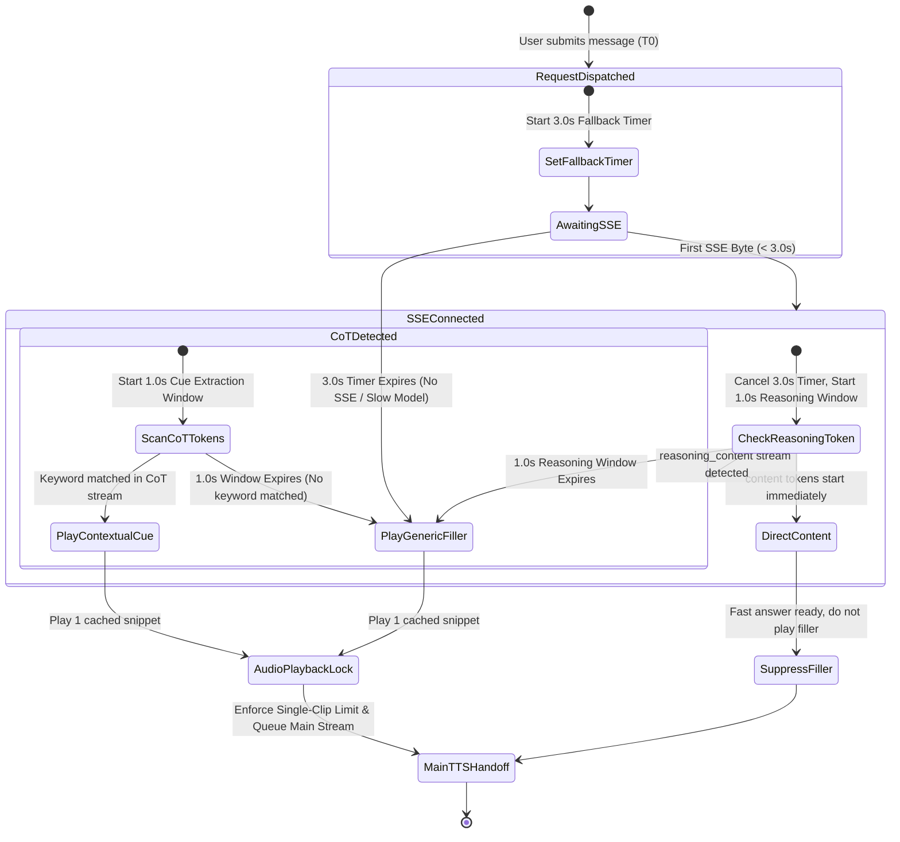
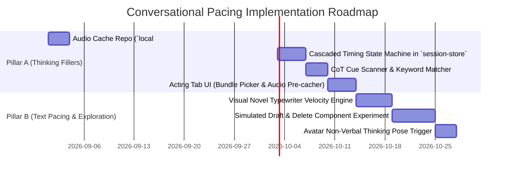

# Architectural Proposal: Conversational Pacing, Dynamic Thinking Fillers & Post-CoT Text Velocity

**Status:** Proposed Architecture & Research Specification
**Authors:** AIRI Team (Richy / dasilva333) & AI Assistant
**Target Components:**
- `packages/stage-ui/src/stores/chat/session-store.ts` (Chat orchestration & SSE stream lifecycle)
- `packages/stage-ui/src/stores/modules/speech.ts` (TTS playback queue & dynamic audio cache)
- `packages/stage-ui/src/stores/modules/airi-card.ts` (Acting tab, Personality Thinking Bundles, Cue Keywords)
- `packages/stage-ui/src/composables/llm-marker-parser.ts` (Streaming CoT & marker interceptors)
- `packages/stage-ui/src/components/scenarios/chat/` (Chatbox message rendering, typing velocity & visual stutters)
- `apps/stage-tamagotchi/src/renderer/pages/chat.vue` (Desktop chatbox container)

**Related Documentation & Skills:**
- [`docs/arch-chat-stt-proactivity-pipelines.md`](./arch-chat-stt-proactivity-pipelines.md) — Core interaction pipelines & chat orchestration.
- [`docs/data-catalog.md`](./data-catalog.md) — Local persistence keys and caching boundaries.
- Skills: `airi-audio-pipeline`, `airi-acting-cue-act-tokens`, `airi-desktop-chatbox`, `airi-interaction-pipelines`, `airi-llm-dispatch-gateway`, `airi-character-rendering`.

---

## 1. Problem Statement & Executive Summary

In conversational AI and virtual companion interactions, conversational flow breaks down at two critical points:

```
User Submits Message
       │
       ▼
┌────────────────────────────────────────────────────────┐
│ 🔴 THE DEAD SILENCE GAP (High TTFT / Deep Reasoning)   │
│   • 2s to 8s+ of awkward silence while model computes. │  ===> Solved by: Pillar A
│   • High cognitive dissonance for voice interactions.  │       (Dynamic Thinking Fillers)
└────────────────────────────────────────────────────────┘
       │
       ▼
┌────────────────────────────────────────────────────────┐
│ 🔴 THE INSTANT TOKEN DUMP (Uncanny Text/Voice Velocity)│
│   • Text streams at raw API token speed (robotic).     │  ===> Solved by: Pillar B
│   • Emotionally flat (e.g. angry "what" dumps instantly│       (Post-CoT Text Velocity
│     instead of a tense, deliberate "w-h-a-t.").        │        & Visual Hesitation)
│   • No human typing hesitation, backspacing, or pauses.│
└────────────────────────────────────────────────────────┘
       │
       ▼
Final Rendered Message
```

This proposal establishes a unified architecture addressing both challenges:
1. **Pillar A (Mature / Immediate Implementation)**: **Dynamic Thinking Fillers & Cascaded CoT Audio Cue Interception**. Masking high Time-to-First-Token (TTFT) and reasoning pauses by dynamically synthesizing and caching personality-aligned audio fillers, paired with an exact multi-tiered timing cascade for Chain-of-Thought (CoT) keyword extraction.
2. **Pillar B (Exploratory / Complex UX Problems)**: **Post-CoT Expressive Text Pacing, Visual Hesitation & Non-Verbal Staging**. Rendering chatbox text with emotional velocity, simulated retyping/stuttering, visual deletion, and avatar non-verbal cues.

---

## 2. Pillar A: Dynamic Thinking Fillers & Timing State Machine

### 2.1 The Dynamic Audio Cache (Zero-Bloat Architecture)

A critical requirement is **preventing static asset bloat**. Rather than shipping bulky, pre-recorded audio files that cannot match custom user voices, AIRI leverages its existing active TTS engine to synthesize filler lines dynamically on demand or during first configuration:

```
                    ┌──────────────────────────────────────────┐
                    │      Active TTS Engine / VoiceProfile    │
                    │   (Kokoro, EdgeTTS, OpenAI, ElevenLabs)  │
                    └─────────────────────┬────────────────────┘
                                          │ (Dynamic Synthesis)
                                          ▼
┌──────────────────────────────────────────────────────────────────────────────────┐
│  IndexedDB / Localforage Audio Cache: `local:audio:thinking-cache/{voiceId}`     │
├──────────────────────────────────────────────────────────────────────────────────┤
│  • tsundere_01.mp3 ("Hmph... let me think...")                                   │
│  • tsundere_02.mp3 ("Wait a second, don't rush me!")                             │
│  • kuudere_01.mp3  ("Analyzing...")                                              │
│  • custom_cue_richy.mp3 ("Richy...? Hold on...")                                │
└──────────────────────────────────────────────────────────────────────────────────┘
```

* **Storage Footprint**: Tiny text strings (< 1 KB) in character card / settings.
* **Audio Availability**: Generated once in the background per voice profile; subsequent triggers load instantly from IndexedDB with 0ms synthesis overhead.

---

### 2.2 Personality Thinking Bundles

Character cards can define or select from preset "Thinking Bundles" in the **Acting Tab**:

| Bundle Archetype | Example Thinking Fillers | Use Case |
|---|---|---|
| **Tsundere** | *"H-Hold on a second..."*, *"Don't rush me, baka!"*, *"Let me think..."* | Tsundere personas, defensive/flustered moments |
| **Kuudere / Analytical** | *"Processing..."*, *"Give me a moment to review this..."*, *"Hmm..."* | Calm, analytical, robotic, or stoic characters |
| **Yandere** | *"Fufu... let me see..."*, *"Thinking about what you just said..."* | Possessive, deliberate, intense personas |
| **Genki / Playful** | *"Ooh, let me check!"*, *"Wait wait wait, thinking!"*, *"Hmm-hmm~"* | Energetic, cheerful, bouncy characters |
| **Custom / User-Defined** | Custom text lines + associated trigger keywords | Tailored roleplay cards & specific creator prompts |

---

### 2.3 Cascaded Timing State Machine

To balance responsiveness, support for CoT reasoning models (e.g. DeepSeek R1, OpenAI o1/o3, Qwen-QWQ), and fallback compatibility with slow non-CoT models, execution follows an exact cascaded timeline:

```
T0: User Sends Message
 │
 ├──▶ Start Timer 1: [Fallback Threshold: 3.0s]
 │    Start Avatar Non-Verbal Staging (Thinking Gaze / Puzzled Expression)
 │
 ▼
T_SSE: SSE Stream Connects (First Chunk Arrives)
 │
 ├── If T_SSE < 3.0s:
 │    ├── Cancel 3.0s Fallback Timer
 │    └── Start Timer 2: [Reasoning Window: 1.0s]
 │
 ▼
T_REASONING: Check for `reasoning_content` stream
 │
 ├── Case 1: `reasoning_content` detected within 1.0s window
 │    │
 │    ├── Start Timer 3: [CoT Cue Extraction Window: 1.0s]
 │    │
 │    ▼
 │    Scan incoming CoT tokens for registered Cue Keywords (e.g. "Richy", "angry", "math")
 │    │
 │    ├── [Match Found]: Play contextual/surrounding cue audio from cache
 │    └── [No Match / Timer 3 Expires]: Play generic personality bundle filler from cache
 │
 ├── Case 2: Direct `content` stream begins immediately (Fast non-CoT model)
 │    └── Discard filler entirely (Response is already generating; zero delay needed)
 │
 └── Case 3: SSE connected but stalled (No content or reasoning for > 1.0s)
      └── Fallback: Play generic personality bundle filler from cache
```



---

### 2.4 Audio Queue & Concurrency Safeguards

1. **Single-Clip Limit**: Exactly **one** thinking audio clip is permitted per chat turn. Once a filler starts playing, the thinking state machine locks and prevents any secondary filler triggers.
2. **Main TTS Handoff**:
   - The main response TTS stream is queued behind the thinking filler.
   - If the main response finishes generating while the filler is playing, it waits for the short filler snippet (typically 0.8s–1.8s) to conclude before speaking the main response.
   - **No Engine Double-Triggering**: The speech runtime pipeline treats the thinking snippet as the initial item in the turn's speech queue, preventing audio driver restarts.

---

### 2.5 Event-Driven Lifecycle & Dynamic Duration Calibration

While fixed wall-clock timers ($3.0\text{s}$ fallback, $1.0\text{s}$ CoT window) provide a predictable baseline model, real-world network conditions and model response profiles introduce significant timing variance. A rigid clock-only approach risks brittleness if a stream takes $3.1\text{s}$ to connect or if reasoning tokens take slightly longer to ramp up.

To solve this, the execution architecture incorporates an **Event-Driven Transition Layer**:

1. **State-Driven Milestones**:
   - `STREAM_DISPATCHED` ($T_0$): Dispatches request, triggers non-verbal avatar staging, starts adaptive safety timer.
   - `SSE_HEADER_RECEIVED`: Marks stream connectivity; pauses/aborts fixed fallback timers immediately.
   - `REASONING_CHUNK_DETECTED`: Shifts directly into active CoT scanning mode upon the first `reasoning_content` token.
   - `CONTENT_CHUNK_DETECTED`: Indicates final speech/content generation has begun; immediately suppresses pending fillers if audio has not yet started playback.
2. **Adaptive Latency Calibration**:
   - Moving average tracking of provider Time-to-First-Token (TTFT) and Time-to-First-Reasoning (TTFR).
   - If a provider consistently responds in $800\text{ms}$, the system dynamically tightens thresholds to avoid unnecessary filler scheduling.
   - If a provider (e.g. deep local reasoning model) consistently takes $5\text{s}$, the fallback safely scales to avoid premature generic filler firing before reasoning stream extraction begins.

---

### 2.6 TTS Velocity Variability & Audio Buffer Scheduling

Different TTS engines exhibit drastically different synthesis speeds and playback velocities:
- **Local WebGPU (Kokoro)**: Fast first-chunk synthesis (~200–400ms), fixed playback duration.
- **EdgeTTS / Cloud Providers (OpenAI, Azure, ElevenLabs)**: Network round-trip latency (300–1200ms) with variable audio compression and pacing.
- **Self-Hosted / Sidecar Engines (FastAPI / SGLang)**: Variable batching performance depending on local GPU VRAM pressure.

#### Audio Buffer Coordination Contract
To prevent race conditions where main speech audio arrives while a thinking filler is still playing:
- **Audio Chaining Queue**: The speech pipeline (`packages/pipelines-audio/src/speech-pipeline.ts`) schedules the thinking snippet as `PlaybackItem[0]`.
- **Pre-buffering Subsequent Chunks**: As the main LLM response generates and streams chunks via `chunkTTSInput()` or `chunkTtsInput()`, the main speech audio is synthesized and decoded in the background while `PlaybackItem[0]` is playing.
- **Zero-Gap Handoff**: When `PlaybackItem[0].onEnd` fires, `PlaybackItem[1]` starts immediately with zero audio gap or driver reset.

---

### 2.7 Situational & Conditional CoT Activation

CoT audio cue scanning is not designed as a heavy, mandatory per-turn tax. Instead, it operates as a **situational capability**:
- **Explicit Keyword Rules**: Evaluated against the lightweight streaming buffer without full JSON parsing.
- **Card-Level Configuration**: Creators can toggle CoT scanning on or off per card or per personality archetype.
- **Prompt Complexity Heuristics**: Lightweight heuristics (e.g., presence of analytical inquiries, decision-making, or complex questions) determine whether CoT extraction is prioritized or if direct fast response routing is favored.

---

## 3. Pillar B: Post-CoT Text Velocity & Emotional Messaging (Exploratory)

While Pillar A resolves the auditory and latency gap, the visual rendering of messages in the chatbox poses distinct challenges that extend beyond simple token streaming.

### 3.1 Emotional Typing Velocity

Currently, text appears at the rate the LLM streams tokens. In visual novels and rich chat interfaces, typing speed conveys emotion:

| Emotional State | Target Typing Behavior | Visual VN / Chat Mechanics |
|---|---|---|
| **Anger / Tension** | Deliberate, slow, rhythmic cadence (e.g. *"w - h - a - t ."*) | Pauses between letters/words; heavy punctuation stops |
| **Excitement / Panic** | High-velocity bursts followed by sudden pauses | Rapid burst of tokens, followed by ellipsis pause |
| **Hesitation / Shyness** | Stuttering, micro-pauses before key words | Letter repetition (*"I-I just wanted to say..."*), comma delays |

---

### 3.2 Visual Hesitation & Simulated Retyping (The "Draft & Delete" Problem)

One of the most human interactions in chat messaging is seeing the other person type, stop, erase what they wrote, and rephrase:

```
[Visual Chat Preview During Stream]
Step 1 (Drafting):  Airi is typing: "I really hate when you do that..."
Step 2 (Hesitation): [Pause 600ms]
Step 3 (Deleting):   Backspace animation: "I really..." -> "I..." -> ""
Step 4 (Final Text): Airi: "It's not like I care, but please be careful next time."
```

#### Complexities & Open Problems
* **Markdown Parser Stability**: Erasing characters during active Markdown/HTML parsing can cause malformed tags and visual glitches.
* **Storage Invariance**: Visual backspacing must remain purely cosmetic in the transient UI renderer; the final persisted session message must only contain the clean final text.
* **CoT-Driven Stutter Clues**: Extracting potential hesitation points by inspecting reasoning tokens (e.g. model reconsidering tone in CoT) without leaking raw chain-of-thought into the user's permanent transcript.

---

### 3.3 Avatar Non-Verbal Staging During Thinking

When $T_0$ fires, the 3D (VRM) or 2D (Live2D) avatar should immediately break neutral idle:
* **Gaze Shift**: Deflect gaze upwards or sideways (the universal human cue for cognitive retrieval).
* **Head Tilt**: Subtle $5^\circ$ roll and pitch.
* **Expression**: Blendshape transition into a subtle `thinking` / `puzzled` expression, relaxing back to neutral/target emotion when the main speech stream begins.

---

## 4. UI & Configuration Placement

The configuration will be integrated into the **Acting Tab** in Character Settings (`packages/stage-pages/src/pages/settings/airi-card/components/tabs/acting.vue`):

```
┌─────────────────────────────────────────────────────────────────────────────┐
│ 🎭 Conversational Pacing & Thinking Fillers                                 │
├─────────────────────────────────────────────────────────────────────────────┤
│ [X] Enable Dynamic Thinking Fillers (Masks response latency with audio)     │
│                                                                             │
│ Preset Thinking Bundle:                                                     │
│ [ Tsundere (Baka, wait up!) ▼ ]  [ ⚡ Pre-cache Audio for Current Voice ]   │
│                                                                             │
│ Thinking Quotes:                                                            │
│ ┌─────────────────────────────────────────────────────────────────────────┐ │
│ │ • "Hold on a second..."                                             [X] │ │
│ │ • "Don't rush me, let me think!"                                    [X] │ │
│ │ • "Wait, what did you just say...?"                                 [X] │ │
│ │ + [Add Custom Quote]                                                    │ │
│ └─────────────────────────────────────────────────────────────────────────┘ │
│                                                                             │
│ CoT Cue Keyword Interceptors:                                               │
│ ┌─────────────────────────────────────────────────────────────────────────┐ │
│ │ Keyword: [ Richy        ] ➔ Audio: [ "Richy...? Let me see..." ]    [X] │ │
│ │ Keyword: [ math/calculate] ➔ Audio: [ "Hmm, let me do the math..."  ] [X] │ │
│ │ + [Add Keyword Trigger]                                                 │ │
│ └─────────────────────────────────────────────────────────────────────────┘ │
│                                                                             │
│ Advanced Timing Calibration:                                                │
│ Fallback Timeout: [=====|=========] 3.0s                                    │
│ CoT Extraction Window: [===|=============] 1.0s                             │
└─────────────────────────────────────────────────────────────────────────────┘
```

---

## 5. Architectural Implementation Roadmap



---

## 6. Codebase Reference Index

| Subsystem | Path | Responsibility |
|---|---|---|
| **Chat Session Store** | [`packages/stage-ui/src/stores/chat/session-store.ts`](file:///Users/richardpinedo/Projects.nosync/airi/airi_dasilva333/packages/stage-ui/src/stores/chat/session-store.ts) | Message dispatch lifecycle, SSE timers, CoT chunk listening |
| **Speech Module** | [`packages/stage-ui/src/stores/modules/speech.ts`](file:///Users/richardpinedo/Projects.nosync/airi/airi_dasilva333/packages/stage-ui/src/stores/modules/speech.ts) | TTS playback queue, dynamic audio cache generation |
| **Acting Tab** | [`packages/stage-pages/src/pages/settings/airi-card/components/tabs/acting.vue`](file:///Users/richardpinedo/Projects.nosync/airi/airi_dasilva333/packages/stage-pages/src/pages/settings/airi-card/components/tabs/acting.vue) | UI bundle configuration, keyword triggers, timing controls |
| **Marker Parser** | [`packages/stage-ui/src/composables/llm-marker-parser.ts`](file:///Users/richardpinedo/Projects.nosync/airi/airi_dasilva333/packages/stage-ui/src/composables/llm-marker-parser.ts) | CoT stream filtering, reasoning content isolation |
| **Chat History / View**| [`packages/stage-ui/src/components/scenarios/chat/history.vue`](file:///Users/richardpinedo/Projects.nosync/airi/airi_dasilva333/packages/stage-ui/src/components/scenarios/chat/history.vue) | Visual chat rendering & typewriter velocity controls |
