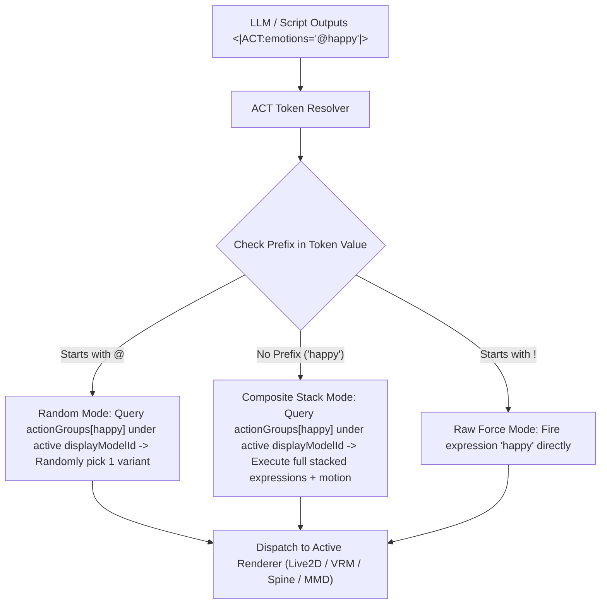

# Emotion / Motion Expression Library — Design Proposal (Rev 4)

> **Rev 1 (2026-08-03):** Initial draft.
>
> **Rev 2 (2026-08-03):** Code audit. Corrected 4 assumptions: hooks exist, Live2D resolver handles fileName directly, connector lifecycle moved to ControlStripHost, `updateCard` is shallow-spread only → 4-layer manual spread required.
>
> **Rev 3 (2026-08-03):** Architecture change to **plugin model** (`plugins/motion-exp-manager/`), storing data in flat `localStorage` and intercepting events via `BroadcastChannel` inside settings page view.
>
> **Rev 4 (2026-08-06) [CURRENT REFINED ARCHITECTURE]:** Core architecture refinement. Audited Rev 3 and resolved three fundamental design flaws:
> 1. **Storage Isolation**: Storing presets in flat `localStorage` causes expression preset leakage across character cards and models. Stored presets MUST be **keyed by `displayModelId`** since `.exp3` and `.motion3` files are bound to physical model assets.
> 2. **Lifecycle Persistence**: Initializing `useLibraryConnector()` inside `index.vue` (the settings page) causes the listener to unmount and die the moment the user leaves the settings screen.
> 3. **Native UI & Resolver Integration**: Replaces sidecar `BroadcastChannel` piggybacking with direct integration into **`ModelCustomizer.vue`** (the unified model capability editor for VRM, Live2D, Spine, MMD) and extends `<|ACT|>` token prefix parsing natively in the core ACT resolver.

---

## Retrospective: Why Rev 3 Needed Refinement

While Rev 3 introduced great UX inspiration from AI-VTuber System (SCHALE Lounge), a deep code audit revealed three technical roadblocks in its plugin architecture:

| Component | Rev 3 Approach | Technical Flaw in Rev 3 | Rev 4 Solution |
|---|---|---|---|
| **Storage** | Flat `localStorage: plugin/motion-exp-manager/library` | Expressions (`.exp3`) and motions (`.motion3`) belong to specific physical model files. Flat global storage causes preset leakage across different models/cards and breaks on card exports. | Store preset groups directly on `DisplayModel` (keyed by `displayModelId`) in `displayModelsStore` / `localforage`. |
| **Lifecycle** | BroadcastChannel listener initialized inside settings page `index.vue` | Component unmounts on page navigation. When the user leaves Settings to chat or view Stage, the listener unmounts and composite actions stop firing. | Integrated directly into the background model resolver pipeline — active whenever the model is loaded on stage. |
| **UI Location** | Standalone settings entry page | Fragmented UI. AIRI already has `ModelCustomizer.vue` as the single unified capability editor across all renderers. | Embedded directly as a utility control on the Expressions/Motions tabs of `ModelCustomizer.vue`. |

---

## Motivation

Current expression and motion editing in AIRI has three pain points:

1. **1:1 Mapping Restriction** — Core mappings currently resolve 1 emotion token to 1 single expression file. There is no native way to say: *"When `happy` fires, trigger `smile_01` + `star_eyes` + `blush` simultaneously and play `dance_joy` motion."*
2. **Lack of Dynamic Entropy** — AI actors firing the exact same single animation every time an emotion triggers feels robotic.
3. **No Declarative Token Prefix Syntax** — Script writers / LLMs cannot specify whether an emotion trigger should force a specific expression or pick randomly from a pool of variants.

This proposal defines a **Composite Action Group System** that:

- Integrates natively into **`ModelCustomizer.vue`** (works identically across **VRM**, **Live2D**, **Spine**, and **MMD**).
- Keys all preset groups by **`displayModelId`** so model files carry their own composite expression groups.
- Extends `<|ACT|>` token values with SCHALE Lounge prefix semantics (`!`, `@`, base name).
- Resolves composite stacks and random variant pools seamlessly in the background.

---

## Reference: AI-VTuber System (SCHALE Lounge) Syntax

The `AI-VTuber-System` project uses a declarative prefix syntax for emotion tokens:

| Prefix | Token Example | Meaning | Behavior |
|---|---|---|---|
| `!` | `<|ACT:emotions="!happy"|>` | **Forced Raw Single** | Bypasses group lookup; fires raw expression target `"happy"` directly. |
| `@` | `<|ACT:emotions="@happy"|>` | **Random Variant Pick** | Looks up group `"happy"` under `displayModelId` and randomly selects 1 variant preset. |
| *(none)* | `<|ACT:emotions="happy"|>` | **Full Composite Stack** | Looks up group `"happy"` under `displayModelId` and fires all stacked expressions + motion. |

---

## Data Schema & Storage

Preset groups are stored directly on the `DisplayModel` interface in `packages/stage-ui/src/stores/display-models.ts`, automatically persisting via `localforage`:

```typescript
// packages/stage-ui/src/stores/display-models.ts

export type PrefixMode = 'force' | 'random' | 'pick-one'

export interface CompositeLibraryItem {
  id: string
  name: string
  targetId: string // VRM blendshape / Live2D fileName / motion key
  type: 'expression' | 'motion'
  prefix: PrefixMode
  weight?: number // 0–1 (expressions only)
}

export interface DisplayModelActionGroup {
  id: string // Token trigger name (e.g. "happy", "angry")
  label: string // Friendly UI label (e.g. "Happy Jump & Sparkle")
  items: CompositeLibraryItem[]
  exclusive?: boolean
}

// Extended DisplayModel interface
export interface DisplayModelBase {
  id: string
  name: string
  // ... existing fields ...
  actionGroups?: Record<string, DisplayModelActionGroup> // Keyed by trigger name
}
```

---

## ModelCustomizer UI Integration

Instead of creating a isolated settings tab, the **Action Group Manager** is embedded directly inside [`ModelCustomizer.vue`](file:///Users/richardpinedo/Projects.nosync/airi/airi_dasilva333/packages/stage-ui/src/components/scenarios/settings/model-settings/ModelCustomizer.vue).

```
┌──────────────────────────────────────────────────────────────┐
│ ModelCustomizer — [ Live2D: lain08.zip ]                     │
├──────────────────────────────────────────────────────────────┤
│  [ Expressions ]   [ Motions ]   [ 🎯 Action Groups ]        │
├──────────────────────────────────────────────────────────────┤
│  Action Groups for this Model               [ + New Group ]  │
│  ┌────────────────────────────────────────────────────────┐  │
│  │ 🎯 happy   4 items (3 exp, 1 motion)                   │  │
│  │    └─ ! smile_01 (force 1.0)                          │  │
│  │    └─ @ star_eyes (random 0.8)                        │  │
│  │    └─ ! jump_joy (motion)                             │  │
│  │   [ Edit Group ]  [ Duplicate ]  [ Delete ]            │  │
│  ├────────────────────────────────────────────────────────┤  │
│  │ 🎯 angry   2 items (2 exp)                             │  │
│  │   [ Edit Group ]  [ Duplicate ]  [ Delete ]            │  │
│  └────────────────────────────────────────────────────────┘  │
└──────────────────────────────────────────────────────────────┘
```

---

## ACT Token Execution Pipeline

When an ACT token like `<|ACT:emotions="@happy"|>` is processed by AIRI:



---

## Summary of Implementation Benefits

1. **Model-Bound Integrity**: Action groups belong to the model file (`displayModelId`). Exporting a card or switching characters retains model animation integrity.
2. **Zero Route/Build Pollution**: No changes to `electron.vite.config.ts`, routing, or sidecar plugins.
3. **Always-Active Background Resolution**: No component unmounting issues; works across all pages, stage views, and floating desktop tamagotchi widgets.
4. **Unified Capability Across All 4 Renderers**: Works out-of-the-box for **Live2D**, **VRM**, **Spine**, and **MMD** via `ModelCustomizer.vue`.
