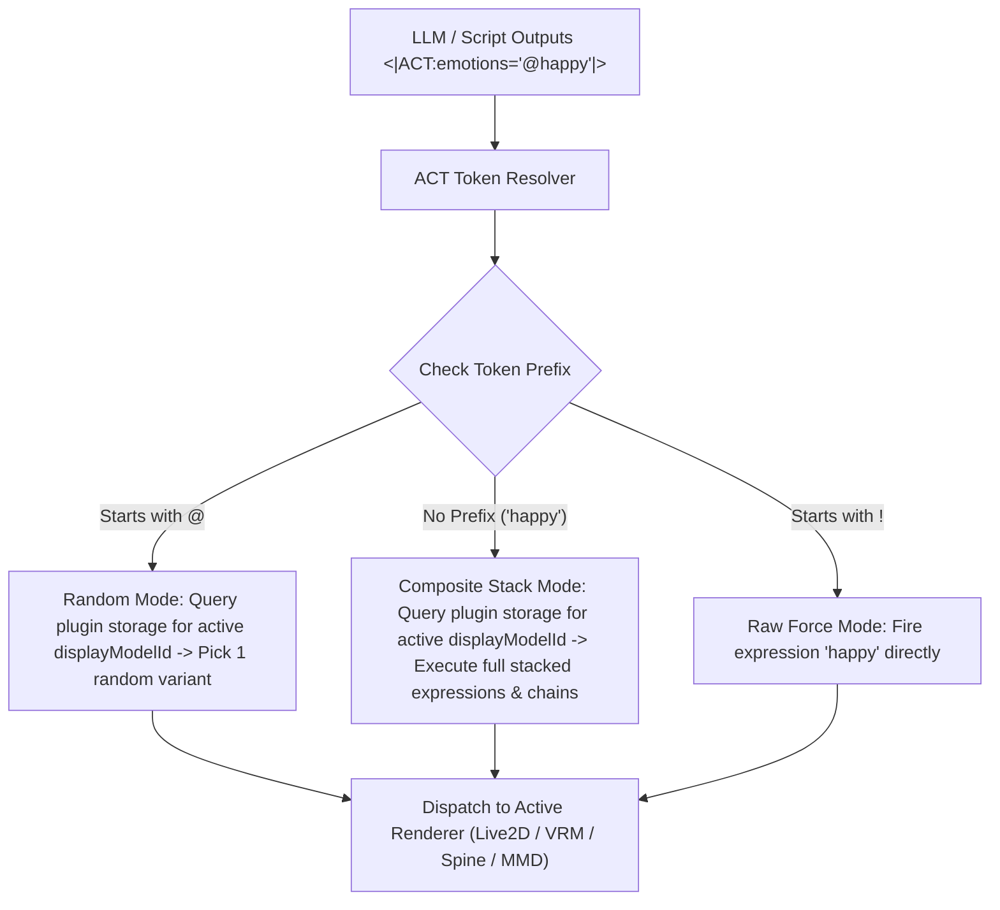

# Emotion / Motion Expression Library — Design Proposal (Rev 5)

> **Rev 1 (2026-08-03):** Initial draft.
>
> **Rev 2 (2026-08-03):** Code audit. Corrected 4 assumptions: hooks exist, Live2D resolver handles fileName directly, connector lifecycle moved to ControlStripHost, `updateCard` is shallow-spread only → 4-layer manual spread required.
>
> **Rev 3 (2026-08-03):** Architecture change to **plugin model** (`plugins/motion-exp-manager/`), storing data in flat `localStorage` and intercepting events via `BroadcastChannel` inside settings page view.
>
> **Rev 4 (2026-08-06):** Proposed embedding Action Group Manager directly into `ModelCustomizer.vue`. (Rejected: Developer wants total folder isolation in `plugins/` to avoid touching complex core UI files).
>
> **Rev 5 (2026-08-06) [CURRENT COMPROMISE ARCHITECTURE]:** Plugin Extension Hook Pattern.
> 1. **Core Responsibility (AIRI Main)**: Exposes a single lightweight plugin hook button (`<PluginActionGroupHook :model-id="modelId" />`) in `ModelCustomizer.vue` and executes model-bound action groups in the background ACT pipeline.
> 2. **Plugin Responsibility (`plugins/motion-exp-manager/`)**: Developer writes the entire custom modal UI (`ActionGroupModal.vue`), preset editor, weight sliders, sequence/chain timing, and SCHALE Lounge prefix rules (`!`, `@`, `*`) inside their isolated plugin directory.
> 3. **Storage**: Presets remain **keyed by `displayModelId`** so expression/motion groups stay strictly bound to physical model assets.

---

## Retrospective: Evolution & Architectural Trade-offs

| Rev | Architecture | Storage | Strengths | Roadblocks / Why Revised |
|---|---|---|---|---|
| **Rev 1–2** | Integrated into `airi-card.ts` & card schema | `extensions.airi.acting` (Card object) | Native card integration | Modifies core card schema; requires 4-layer manual spreads. |
| **Rev 3** | Pure sidecar plugin + settings page | Flat `localStorage: plugin/motion-exp-manager/library` | 100% plugin-owned files | Listener unmounts on page leave; flat storage causes preset leakage across models. |
| **Rev 4** | Embedded directly into `ModelCustomizer.vue` | Keyed by `displayModelId` in `displayModelsStore` | Clean model scoping & background execution | Developer rejected modifying complex core UI code; loses plugin isolation. |
| **Rev 5** | **Plugin Extension Hook** (`ModelCustomizer.vue` → plugin Modal) | Keyed by `displayModelId` (`plugin/motion-exp-manager/${modelId}`) | **Best of both worlds**: Full plugin folder isolation for developer UI + model-bound execution in core | None. Standard extension hook pattern. |

---

## Motivation

Current expression and motion editing in AIRI has three pain points:

1. **1:1 Mapping Restriction** — Core mappings currently resolve 1 emotion token to 1 single expression file. There is no native way to say: *"When `happy` fires, trigger `smile_01` + `star_eyes` + `blush` simultaneously and play `dance_joy` motion."*
2. **Lack of Dynamic Entropy** — AI actors firing the exact same single animation every time an emotion triggers feels robotic.
3. **Desire for Isolated Developer Workflow** — Developers want to build custom UI editors, weight sliders, and animation chains inside `plugins/motion-exp-manager/` without risking breaking core codebase files.

---

## Proposal: Plugin Extension Hook Pattern

### 1. Core Integration Point (`ModelCustomizer.vue`)

Main AIRI core provides a single, zero-friction extension mount point inside [`ModelCustomizer.vue`](file:///Users/richardpinedo/Projects.nosync/airi/airi_dasilva333/packages/stage-ui/src/components/scenarios/settings/model-settings/ModelCustomizer.vue):

```vue
<!-- ModelCustomizer.vue -->
<template>
  <div class="flex items-center justify-between">
    <h3>Model Customization — {{ modelName }}</h3>
    <!-- Core Plugin Hook Button -->
    <PluginActionGroupHook :model-id="props.modelId" />
  </div>
</template>
```

When clicked, this hook triggers the plugin's modal component without requiring `ModelCustomizer.vue` to house any group editing UI or logic.

---

### 2. Plugin Structure (`plugins/motion-exp-manager/`)

The plugin developer has **total freedom** to design their UI, modal layouts, animation chain builders, and controls inside their untracked plugin directory:

```
plugins/
  motion-exp-manager/
    package.json
    tsconfig.json
    src/
      types.ts                  ← ActionGroup, LibraryItem, ChainSequence
      store.ts                  ← Pinia store (reads/writes plugin/motion-exp-manager/${modelId})
      components/
        ActionGroupModal.vue    ← Full custom popup UI (Groups, Chains, Weights)
        ChainSequenceEditor.vue ← Visual timing/delay chain builder
        WeightSlider.vue        ← 0.0 - 1.0 weight adjustment controls
      connector.ts              ← Global background event listener
```

---

## Data Schema (Keyed by `displayModelId`)

Presets are stored in plugin-owned `localStorage` space, strictly isolated per model file:

```
localStorage key:  plugin/motion-exp-manager/models/${displayModelId}
value:             JSON-serialized ModelActionGroupMap
```

```typescript
// plugins/motion-exp-manager/src/types.ts

export type PrefixMode = 'force' | 'random' | 'pick-one'

export interface CompositeLibraryItem {
  id: string
  name: string
  targetId: string // VRM blendshape / Live2D fileName / motion key
  type: 'expression' | 'motion'
  prefix: PrefixMode
  weight?: number // 0.0 – 1.0 (expressions only)
  delayMs?: number // Sequential timing delay for chains
}

export interface ActionGroupChain {
  sequence: CompositeLibraryItem[]
  loopCount?: number
}

export interface DisplayModelActionGroup {
  id: string // Token trigger name (e.g. "happy", "angry")
  label: string // Friendly UI label (e.g. "Happy Jump & Sparkle")
  items: CompositeLibraryItem[]
  chains?: ActionGroupChain[]
  exclusive?: boolean
}

export type ModelActionGroupMap = Record<string, DisplayModelActionGroup>
```

---

## SCHALE Lounge Prefix Semantics in `<|ACT|>` Tokens

The plugin parses standard SCHALE Lounge prefix rules embedded directly inside `<|ACT|>` emotion tokens:

| Prefix | Token Example | Meaning | Behavior |
|---|---|---|---|
| `!` | `<|ACT:emotions="!happy"|>` | **Forced Raw Single** | Bypasses group lookup; fires raw expression target `"happy"` directly. |
| `@` | `<|ACT:emotions="@happy"|>` | **Random Variant Pick** | Queries `plugin/motion-exp-manager/models/${modelId}` for group `"happy"` and randomly selects 1 variant item. |
| *(none)* | `<|ACT:emotions="happy"|>` | **Full Composite Group** | Queries `plugin/motion-exp-manager/models/${modelId}` for group `"happy"` and executes all stacked expressions + motion chains. |

---

## ACT Execution Pipeline



---

## Benefits of Rev 5 Architecture

1. **Complete Developer UI Isolation**: Plugin developer builds their popup modal (`ActionGroupModal.vue`), chains, and controls inside `plugins/motion-exp-manager/` without editing complex core UI files.
2. **Model-Bound Integrity**: Groups remain tied to `displayModelId`, preventing expression preset leakage across different models.
3. **Background Persistence**: The background listener remains active across all app pages and desktop tamagotchi widgets.
4. **Coordinated Developer Workflow**: Main AIRI core only needs to expose `<PluginActionGroupHook :model-id="modelId" />` inside `ModelCustomizer.vue`.

## Relevant Skills

- [[airi-generative-motion-vrma]]
