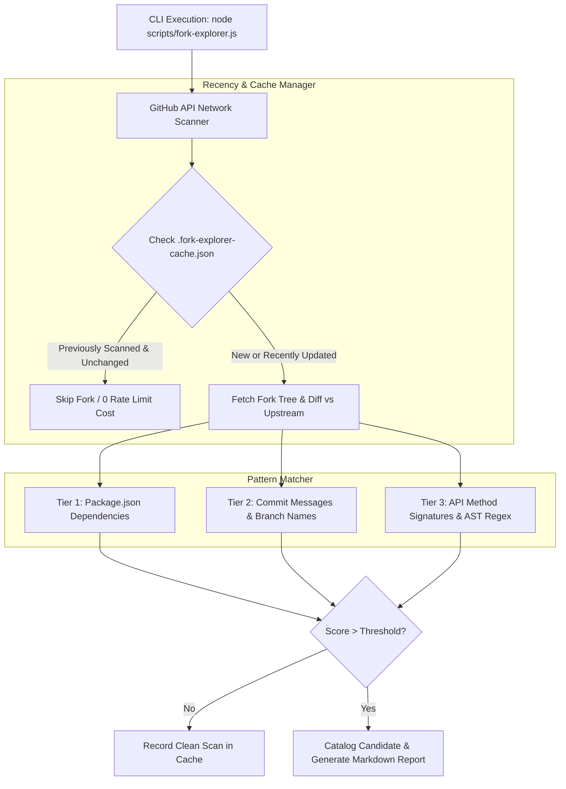

# Proposal: Project Fork Explorer — Automated Upstream R&D Reconnaissance & API Fingerprinting

**Status:** Initial Draft · **Scope:** Ecosystem Reconnaissance & Automated Feature Harvesting (`scripts/fork-explorer.js`)

---

## 1. Executive Summary & Problem Statement

The `moeru-ai/airi` ecosystem has over **4,000+ public forks** on GitHub. Across this vast open-source network, community developers are independently building novel features, experiment spikes, and platform integrations. However, manually locating high-value code across 4,000 repositories is impossible.

Standard search tools (GitHub search, star counts) fail because:
1. **Low-Yield False Positives**: Forking a repo copies legacy files (e.g. `services/telegram`), cluttering simple filename searches with stale boilerplate.
2. **Obscured Innovations**: Brilliant feature work (e.g. 3D VRM touch dragging, Live2D state machines, or in-browser ML) often exists in un-starred forks under non-descript commit names.

**Project Fork Explorer** solves this by turning the fork network into an **automated R&D pipeline**. Using GitHub's GraphQL/REST APIs, incremental recency windowing, local cache persistence, and **API Fingerprinting**, it scans commit diffs, tree blobs, and code signatures to identify and catalog true structural innovations ready for cherry-picking.

---

## 2. API Fingerprinting vs. Generic Tagging

Instead of searching for broad keywords (`voice`, `game`, `discord`) that yield hundreds of superficial UI tweaks, Fork Explorer uses **API Fingerprinting** — searching for exact method calls, imported npm packages, and architectural signatures that *only* exist when a developer builds advanced functionality.

### Curated High-Yield Fingerprint Profiles

```
┌─────────────────────────────────────────────────────────────────────────────┐
│ 🎯 FINGERPRINT REGISTRY                                                      │
├─────────────────────────────────────────────────────────────────────────────┤
│ 1. TELEGRAM INGESTION (Modern Eventa/SDK vs. Legacy Sidecar)                 │
│    • Exclude: Legacy `services/telegram` static files                       │
│    • Signatures: `grammy`, `telegraf`, `@proj-airi/plugin-telegram`,         │
│                 `telegram-bot-api`, `TelegramBot`, `TelegramClient`          │
│                                                                             │
│ 2. IN-BROWSER MACHINE LEARNING & WEBGPU                                      │
│    • Note: Upstream Moeru main does NOT use `@huggingface/transformers`    │
│    • Signatures: `@huggingface/transformers`, `@xenova/transformers`,       │
│                 `tesseract.js`, `onnxruntime-web`, `@mlc-ai/web-llm`         │
│                                                                             │
│ 3. LIVE2D DSL & STATE MACHINE RUNTIME                                        │
│    • Signatures: `varfloats`, `VarFloats`, `intimacy`, `dslActive`,          │
│                 `motion3.json`, `cubism-sdk`, `expression_map`               │
│                                                                             │
│ 4. VRM 3D TOUCH, RAYCASTING & KINEMATICS                                     │
│    • Signatures: `Raycaster.intersectObject`, `getNormalizedBoneNode`,       │
│                 `setFromNormalAndCoplanarPoint`, `ikTarget`, `draggedPart`   │
│                                                                             │
│ 5. WEBGPU RWKV & VECTOR RAG ENGINE                                           │
│    • Signatures: `web-rwkv`, `safetensors`, `perLayerCosine`, `voy-search`,   │
│                 `duckdb-wasm`, `hnswlib`                                    │
└─────────────────────────────────────────────────────────────────────────────┘
```

---

## 3. The Telegram Protocol Challenge & Upstream Baseline Validation

A key discovery in our architecture: searching for terms blindly can create mass false positives.

### 3.1 The Upstream Baseline Validation Pass (`--validate`)
If a signature in a search profile **already exists in upstream `moeru-ai/airi:main`** (e.g. searching for a standard Three.js component name like `ThreeScene`), **every single fork will trigger a match**, polluting the scan results across thousands of repos.

To prevent this, Fork Explorer executes a **Pre-Flight Baseline Pass** before scanning the fork graph:

```
┌─────────────────────────────────────────────────────────────────────────────┐
│ ⚡ PRE-FLIGHT BASELINE VALIDATION                                            │
├─────────────────────────────────────────────────────────────────────────────┤
│ 1. Fetch / Scan upstream `moeru-ai/airi:main` AST tree for active profiles. │
│ 2. Test each signature against Upstream Baseline.                          │
│ 3. IF SIGNATURE MATCHES UPSTREAM:                                           │
│    • 🚨 Emit Warning: "Signature '[signature]' exists in upstream main!"     │
│    • Automatically SUPPRESS / EXCLUDE signature to prevent 100% false-pos.  │
│ 4. Proceed to Fork Graph Iterator with clean, verified signature set.       │
└─────────────────────────────────────────────────────────────────────────────┘
```

### 3.2 Filtering Stale Sidecars
To isolate **usable modern Telegram integrations**:
- **Exclusion Rule**: Ignore matches limited strictly to `services/telegram/*`.
- **Target Pattern**: Search for new package declarations (`packages/plugin-telegram`, `packages/stage-ui/src/stores/mods/telegram.ts`), modern TS SDK imports (`grammy`, `telegraf`), or Eventa channel listeners (`modsServerChannelStore.sendContextUpdate`).

---

## 4. System Architecture & Execution Flow



### 4.1 State Machine & Cache Persistence (`.fork-explorer-cache.json`)
The script maintains a local state file to allow incremental expansion without hitting rate limits:

```json
{
  "last_run": "2026-08-10T00:15:00Z",
  "active_profiles": ["telegram-modern", "browser-ml", "live2d-dsl", "vrm-touch-ik"],
  "scanned_repositories": {
    "Martinudevel/airi": {
      "pushed_at": "2026-08-09T23:48:00Z",
      "status": "matched",
      "matched_profiles": ["vrm-touch-ik"],
      "matched_signatures": ["Raycaster.intersectObject", "getNormalizedBoneNode"],
      "diff_url": "https://github.com/dasilva333/airi/compare/main...Martinudevel:main"
    },
    "someuser/airi": {
      "pushed_at": "2026-08-01T12:00:00Z",
      "status": "clean",
      "matched_profiles": []
    }
  }
}
```

---

## 5. CLI Interface & Operational Workflow

### Command-Line Arguments (`scripts/fork-explorer.js`)

```bash
# 1. Short-Run / Validation Mode: Test signatures against upstream baseline & sample 5 forks
node scripts/fork-explorer.js --profile vrm-touch-ik --limit 5 --dry-run

# 2. Scan for modern Telegram implementations in forks active in the last 14 days
node scripts/fork-explorer.js --profile telegram-modern --days 14

# 3. Run a full multi-profile scan for in-browser ML, Live2D DSL, and VRM Touch across the last 30 days
node scripts/fork-explorer.js --profile browser-ml,live2d-dsl,vrm-touch-ik --days 30

# 4. Generate a comprehensive Markdown harvest catalog report
node scripts/fork-explorer.js --all --output docs/fork-harvest-report.md
```

### 5.1 Short-Run & Dry-Run Protection (`--limit`, `--dry-run`)
- **`--limit <N>`**: Caps the scan to the top $N$ most recently updated forks (e.g. `--limit 5`). Perfect for sanity-checking rules before starting a 500-repo sweep.
- **`--dry-run`**: Runs signature matching and prints terminal diagnostics without updating `.fork-explorer-cache.json` or writing report files.

### Generated Harvest Report Format (`docs/fork-harvest-report.md`)

```markdown
# AIRI Ecosystem R&D Harvest Report (Generated 2026-08-10)

## Profile: VRM 3D Touch & Kinematics (`vrm-touch-ik`)

### 1. `Martinudevel/airi` (Last Pushed: 2026-08-09)
* **Match Score**: High (2 Signatures)
* **Matched Signatures**: `Raycaster.intersectObject`, `humanoid.getNormalizedBoneNode`
* **Target Files**: [`packages/stage-ui-three/src/components/ThreeScene.vue`](file:///...)
* **Compare Diff**: [View Diff vs Upstream](https://github.com/moeru-ai/airi/compare/main...Martinudevel:main)
* **Summary**: Implements 3D raycasting touch reactions (face click -> happy, body click -> jump) and height-based body part grab detection.
```

---

## 6. Implementation Plan & Next Steps

1. **Phase 1**: Script substrate (`scripts/fork-explorer.js`) with GitHub API auth (`gh auth token` / `GITHUB_TOKEN`), fork iterator, and rate-limit backoff.
2. **Phase 2**: Fingerprint registry loader (`profiles/` or JSON regex rules) with the curated initial list (`telegram-modern`, `browser-ml`, `live2d-dsl`, `vrm-touch-ik`, `rwkv-vector-rag`).
3. **Phase 3**: Cache persistence (`.fork-explorer-cache.json`) and Markdown harvest report output.

## Relevant Skills

- [[airi-roadmap-upstream-research]]
