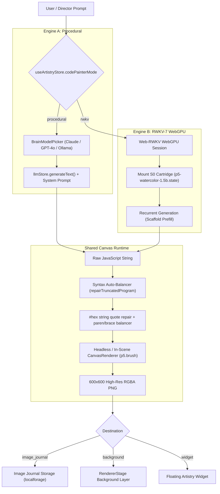

# Architectural Specification: Generative Code-Painting Dual-Engine (Procedural LLM & RWKV-7 State Tuning)

**Status:** Approved Architectural Specification & Cleanroom Verification Complete
**Target Subsystems:**
- `packages/stage-pages/src/pages/settings/modules/artistry.vue` (Artistry Module Switchboard)
- `packages/stage-pages/src/pages/settings/providers/artistry/code-painter.vue` (Dual-Engine Configuration & Studio)
- `packages/stage-ui/src/stores/modules/artistry.ts` & `artistry-autonomous.ts` (Artistry & Director Routing)
- `packages/stage-ui/src/components/scenarios/chat/BrainModelPicker.vue` (LLM Consciousness Model Binding)
- `packages/stage-ui/src/workers/web-rwkv/` (WebGPU RWKV-7 Worker & S0 State Ingestion)
- `scripts/tests/rwkv-harness/` (Cleanroom Execution & Dataset Lineage)

**Authoritative References & Prior Work:**
- **Inspiration & Methodology:** Surya Narreddi & Cameron Franz, [*"Training AI to Paint with Code"*](https://surya.website/rling-qwen-to-paint-with-code) (August 2026) — Reinforcement learning (GRPO) on Qwen models to generate painterly watercolor artwork via `p5.brush` JavaScript scripts.
- [`docs/project-rwkv-cleanroom-harness-plan.md`](./project-rwkv-cleanroom-harness-plan.md) — Cleanroom Test Harness, Scaffold-Prefill Breakthrough, and Phase 7–10 Verification.
- [`docs/design-text-to-motion.md`](./design-text-to-motion.md) — Parallel Dual-Engine Pattern (Procedural LLM vs. Dedicated Neural Engine).
- [`.agents/skills/airi-artistry-comfyui-widgets/`](../.agents/skills/airi-artistry-comfyui-widgets/SKILL.md) — Artistry store, widget routing, and headless generation contracts.
- [`.agents/skills/airi-generative-motion-vrma/`](../.agents/skills/airi-generative-motion-vrma/SKILL.md) — Dual-engine module reference implementation.

---

## 1. Executive Summary & Problem Context

AIRI historically relied exclusively on heavy raster Diffusion models (ComfyUI via WSL/CUDA, Replicate, NanoBanana) for background generation and Autonomous Artistry (AA). While diffusion generates detailed static pixels, it creates severe barriers for desktop and mobile companions:

1. **Massive VRAM Overhead**: Local diffusion requires 8GB–16GB of dedicated VRAM, competing directly with Live2D/VRM 3D avatar rendering.
2. **Static & Lifeless Assets**: Raster PNGs cannot react in real time to day/night lighting, music tempo, or the character's dynamic `MoodState`.
3. **Cloud/API Dependency**: Cloud diffusion incurs recurring API token costs and requires active internet access.

### The Solution: Dual-Engine Generative Code-Painting

Generative Code-Painting turns prompts into lightweight, executable **`p5.brush` JavaScript sketches** that render directly in WebGL as organic, multi-layered watercolor paintings.

To ensure **zero-friction universality across all devices**, AIRI adopts the **Symmetric Dual-Engine Architecture** pioneered by the Text-to-Motion subsystem:

```
┌────────────────────────────────────────────────────────────────────────────────────────┐
│                        Generative Code-Painting Dual Engines                           │
├──────────────────────────────────────┬─────────────────────────────────────────────────┤
│ 🧠 Engine A: Procedural LLM          │ ⚡ Engine B: RWKV-7 WebGPU (S0 Cartridge)        │
│    (General Consciousness)           │    (Dedicated On-Device Neural Model)           │
├──────────────────────────────────────┼─────────────────────────────────────────────────┤
│ • Zero local GPU memory overhead     │ • 100% free, runs completely offline on WebGPU  │
│ • Runs on any device (phone/web/mac) │ • Zero cloud dependency or API keys required    │
│ • Bound via <BrainModelPicker />     │ • O(1) constant-speed recurrent inference       │
│ • Uses Claude, GPT-4o, DeepSeek,     │ • Pre-conditioned S0 stylistic state cartridge  │
│   or local Ollama                    │   (p5-watercolor-1.5b.state, 12.19 MB)          │
└──────────────────────────────────────┴─────────────────────────────────────────────────┘
```

Both engines compile to the **exact same downstream WebGL canvas pipeline**, meaning character cards, the `image_journal` tool, and the Autonomous Artistry Director treat both engines interchangeably.

---

## 2. Settings & UI Surface Design

### 2.1 Settings > Modules > Artistry (Subsystem Switchboard)

Located in `packages/stage-pages/src/pages/settings/modules/artistry.vue`. The user selects the active image-generation backend:
- `None` (Disabled)
- `ComfyUI (Local Diffusion)`
- `Replicate.ai (Cloud Diffusion)`
- `NanoBanana (Cloud Diffusion)`
- **`Code Painter (Generative Canvas Art)`** `[NEW]` $\rightarrow$ Links to `/settings/providers/artistry/code-painter`

---

### 2.2 Settings > Providers > Artistry > Code Painter (Dual-Engine Studio)

Located in `packages/stage-pages/src/pages/settings/providers/artistry/code-painter.vue`.

```
┌────────────────────────────────────────────────────────────────────────────────────────┐
│  🎨 Generative Code Painter Settings                                                   │
│  Configure how AIRI paints on-device watercolor and canvas artwork from text prompts.  │
├────────────────────────────────────────────────────────────────────────────────────────┤
│                                                                                        │
│  Active Engine Mode:                                                                   │
│  ┌────────────────────────────────────────┐ ┌────────────────────────────────────────┐ │
│  │ 🧠 Procedural LLM Acting (Default)    │ │ ⚡ RWKV-7 WebGPU (On-Device Neural)   │ │
│  │ [Lightweight]                         │ │ [WebGPU 0-Cost]                        │ │
│  │                                        │ │                                        │ │
│  │ Uses your configured chat LLM to      │ │ Dedicated local RNN with pre-baked S0  │ │
│  │ synthesize p5.brush watercolor code.  │ │ watercolor stylistic state cartridges. │ │
│  │ Zero GPU memory overhead.             │ │ 100% offline & free on local GPU.      │ │
│  └────────────────────────────────────────┘ └────────────────────────────────────────┘ │
│                                                                                        │
│  ── [ IF PROCEDURAL SELECTED ] ──────────────────────────────────────────────────────  │
│  ┌──────────────────────────────────────────────────────────────────────────────────┐  │
│  │ 🧠 Consciousness Model Binding                                                   │  │
│  │ Select which LLM provider and model will generate creative canvas code.          │  │
│  │                                                                                  │  │
│  │ [ <BrainModelPicker v-model:provider="..." v-model:model="..." /> ]              │  │
│  │ [✓] Inherit from active character consciousness by default                       │  │
│  └──────────────────────────────────────────────────────────────────────────────────┘  │
│                                                                                        │
│  ── [ IF RWKV-7 WEBGPU SELECTED ] ───────────────────────────────────────────────────  │
│  ┌──────────────────────────────────────────────────────────────────────────────────┐  │
│  │ ⚡ RWKV-7 WebGPU Runtime & Cartridge Configuration                               │  │
│  │                                                                                  │  │
│  │ • Base Model: [ RWKV-7 1.5B (ctx 8192, 2.8 GB) ▼ ]                               │  │
│  │ • Style Cartridge Pack: [ p5-watercolor-1.5b.state (12.2 MB) ▼ ]                │  │
│  │ • WebGPU Status: [ ✓ Apple M-Series Metal GPU Accelerated (18.9 tok/s) ]         │  │
│  │ • Token Budget: [ ───────●────── 800 tokens ]                                    │  │
│  └──────────────────────────────────────────────────────────────────────────────────┘  │
│                                                                                        │
│  ── Interactive Art Studio Playground ───────────────────────────────────────────────  │
│  ┌──────────────────────────────────────────────────────────────────────────────────┐  │
│  │ Prompt: [ "blooming peach rose with translucent blush petals"                 ]  │  │
│  │ [ 🎨 Paint on Canvas ]                                                           │  │
│  │                                                                                  │  │
│  │ ┌───────────────────────────────────┐  Generation Telemetry:                     │  │
│  │ │                                   │  • Latency: 25.9s (477 tokens @ 18.4 t/s)  │  │
│  │ │       [ Live WebGL Canvas ]       │  • Ink Coverage: 51.3%                     │  │
│  │ │     (p5.brush Watercolor Render)  │  • Unique Colors: 77                       │  │
│  │ │                                   │  • Structure Score: 0.604                  │  │
│  │ └───────────────────────────────────┘                                            │  │
│  │ [ 💾 Save as Background ] [ 🖼️ Add to Journal ] [ ⬇️ Export PNG ]                 │  │
│  └──────────────────────────────────────────────────────────────────────────────────┘  │
└────────────────────────────────────────────────────────────────────────────────────────┘
```

---

## 3. End-to-End Execution Pipeline



---

## 4. Shared Canvas Runtime Contracts

### 4.1 Scaffold-Prefill Protocol
To prevent models from hallucinating `createCanvas` dimensions or getting trapped in configuration boilerplate loops, both engines use the canonical **Scaffold Prefill**:

```javascript
function setup() {
  createCanvas(600, 600, WEBGL);
  brush.load();
  noLoop();
  brush.seed(42);
  background(250, 246, 238);
  // Model begins emitting painting operations immediately at (0,0) center
```

### 4.2 Syntax Auto-Balancer (`repairTruncatedProgram`)
Token-budget truncation and raw token slips are automatically healed before canvas execution:
1. **Unquoted Hex Color Repair**: Converts unquoted `#hex` identifiers (e.g. `brush.set("HB", #f4e8a1)`) into valid JavaScript string literals `brush.set("HB", "#f4e8a1")`.
2. **Method Alias Normalization**: Maps hallucinated method aliases (e.g. `brush.blend(...)` $\rightarrow$ `brush.bleed(...)`).
3. **Paren & Brace Auto-Balancing**: Strips incomplete trailing function calls at the last clean statement boundary and balances closing parens `)` and braces `}` before closing `setup()`.

---

## 5. Verified Cleanroom Milestones (Empirical Results)

All core mechanisms have been verified in the cleanroom harness (`scripts/tests/rwkv-harness/`):

| Phase | Milestone | Outcome & Metric |
| :--- | :--- | :--- |
| **Phase 7** | Headless Brave WebGL Canvas Bridge | 600×600 WebGL canvas execution with modal-histogram background detection. |
| **Phase 7b** | Scaffold Prefill Discovery | Prefilling setup boilerplate eliminated 100% of base model configuration loops. |
| **Phase 8** | Verified Synthetic Watercolor Corpus | Built 100% non-blank multi-theme training dataset (`p5-watercolor-corpus.jsonl`). |
| **Phase 9** | PyTorch MPS State-Tuner | Exported **12.19 MB `p5-watercolor-1.5b.state`** cartridge optimized on Apple Silicon Metal GPU. |
| **Phase 10** | 20-Scene Nature, Florals & Skies Sweep | **45% non-blank hit rate**; **19–30s generation latency**; up to **83.1% ink coverage** (*Turquoise Ocean Waves*) and **60.2% ink with 210 colors** (*Winter Ramen Shop*). |

---

## 6. Implementation Checklist

- [x] **Cleanroom Harness & Engine Validation** (`scripts/tests/rwkv-harness/`)
- [x] **PyTorch State-Tuner ($S_0$) Pipeline & Export** (`trainer/train_state_s0.py`)
- [x] **Syntax Auto-Balancer & Truncation Healer** (`engine/sketch-extract.ts`)
- [ ] **Store Integration**: Extend `useArtistryStore` in `packages/stage-ui/src/stores/modules/artistry.ts` with `codePainterMode: 'procedural' | 'rwkv'` and provider options.
- [ ] **Settings UI**: Build `packages/stage-pages/src/pages/settings/providers/artistry/code-painter.vue` with `BrainModelPicker` and RWKV cartridge selector.
- [ ] **Tool & Autonomous Artistry Bridge**: Wire `image-journal.ts` and `artistry-autonomous.ts` to dispatch via the selected Code Painter engine when active.
