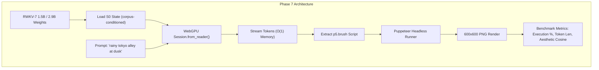

# Architectural Proposal: Generative Code-Painting Background Engine (WebLLM & RWKV-7 State Tuning)

**Status:** Proposed R&D Specification & Phase 7 Cleanroom Roadmap
**Target Subsystems:**
- `scripts/tests/rwkv-harness/` (Cleanroom CLI Test Harness)
- `packages/stage-ui/src/workers/web-rwkv/` (WebGPU RWKV-7 Worker)
- `packages/stage-ui/src/workers/webllm/` (WebLLM WebGPU Worker)
- `packages/stage-ui/src/stores/background.ts` & `packages/stage-ui/src/components/scenes/RendererStage.vue` (Stage Canvas Layer)
- `packages/stage-ui/src/stores/modules/artistry-autonomous.ts` (Autonomous Artistry Director Pipeline)

**Authoritative References & Prior Work:**
- **Inspiration & Methodology:** Surya Narreddi & Cameron Franz, [*"Training AI to Paint with Code"*](https://surya.website/rling-qwen-to-paint-with-code) (August 2026) — Reinforcement learning (GRPO) on Qwen models to generate painterly watercolor artwork via `p5.brush` JavaScript scripts.
- [`docs/project-rwkv-cleanroom-harness-plan.md`](./project-rwkv-cleanroom-harness-plan.md) — The Standalone RWKV Cleanroom Test Harness & Experiment Matrix.
- [`docs/proposal-built-in-llm-webgpu.md`](./proposal-built-in-llm-webgpu.md) — WebGPU RWKV architecture & OPFS model caching.
- [`docs/proposal-echo-chips-rwkv-synthesis.md`](./proposal-echo-chips-rwkv-synthesis.md) — RWKV offline synthesis & empirical schema adherence limits.
- [`docs/arch-comfyui-native-api-engine.md`](./arch-comfyui-native-api-engine.md) — Legacy diffusion backend architecture.

---

## 1. Executive Summary & Problem Context

AIRI currently relies on heavy local or cloud Diffusion models (Stable Diffusion XL, Flux.1, ComfyUI via MCP/API) for scene backgrounds and Autonomous Artistry (AA). While diffusion models generate high-fidelity raster pixels, they present severe constraints for a lightweight desktop companion:

1. **Massive VRAM Overhead**: Running local diffusion requires 8GB–16GB of dedicated VRAM, making it impossible to run concurrently with Live2D/VRM 3D rendering on mid-range laptops or integrated GPUs (Apple Silicon unified memory, Intel Arc).
2. **Static & Lifeless Assets**: Diffusion models emit static PNG/WebP grids. They cannot animate, react to day/night cycles, pulse with ambient music, or shift in response to the avatar's `MoodState`.
3. **Heavy Storage & Latency**: Each generated scene background consumes 5MB–25MB of disk storage in IndexedDB/`localforage` and takes 10–40 seconds to generate.

### The Breakthrough: Generative Code-Painting via Policy-Optimized Models

Surya Narreddi and Cameron Franz demonstrated that by using **Group Relative Policy Optimization (GRPO)** with a vision reward model (pairwise VLM judge + HPSv3 aesthetic score), an LLM can be trained to write expressive, organic `p5.brush` JavaScript sketches. The resulting outputs are not rigid, geometric "programmer clipart," but rich, multi-layered watercolor paintings with genuine artistic composition.

```
┌────────────────────────────────────────────────────────────────────────────────────────┐
│                               Pipeline Comparison                                      │
├──────────────────────────────────────┬─────────────────────────────────────────────────┤
│ 🖼️ Traditional Diffusion (ComfyUI)   │ 🎨 Generative Code-Painting (WebLLM / RWKV)      │
├──────────────────────────────────────┼─────────────────────────────────────────────────┤
│ • 8GB–16GB VRAM required             │ • 0 extra VRAM beyond lightweight local model   │
│ • Static, non-interactive raster PNG │ • Live HTML5 / WebGL interactive 60 FPS canvas  │
│ • 10MB–20MB storage per image        │ • 2KB JavaScript snippet stored as text         │
│ • Heavy PyTorch / Python environment │ • 100% in-browser WebGPU & WebAssembly execution│
│ • Opaque pixels, un-editable         │ • Human-readable, parameter-editable code      │
└──────────────────────────────────────┴─────────────────────────────────────────────────┘
```

This proposal defines the integration of Generative Code-Painting into AIRI using two local inference backends: **WebLLM (Qwen-2.5-Coder / Distilled Coder)** and **RWKV-7 with State-Tuning ($S_0$)**, extending the **RWKV Cleanroom Test Harness** (`scripts/tests/rwkv-harness/`) with **Phase 7**.

---

## 2. Theoretical Foundations: Why Reinforcement Learning Is Required

When a stock LLM is asked to *"draw a flower in p5.js"*, it fails to produce art because next-token prediction over internet text only teaches syntactic correctness, not visual aesthetics.

```mermaid
graph TD
    subgraph Pretrained Baseline
        PromptA["Prompt: 'peach hibiscus'"] --> BaseLLM["Stock LLM (Frozen Weights)"]
        BaseLLM --> CodeA["p5.js Script"]
        CodeA --> RenderA["Browser Render"]
        RenderA --> ResultA["Rigid Polygons & Hatch Lines (Step 11 Clipart)"]
    end

    subgraph GRPO Policy Optimization Loop
        PromptB["Prompt: 'peach hibiscus'"] --> Model["Policy Model (Qwen / RWKV-7)"]
        Model --> CodeB["p5.brush JavaScript"]
        CodeB --> SandboxedRender["Headless Puppeteer Execution"]
        SandboxedRender --> RasterPNG["Rendered Canvas PNG"]
        RasterPNG --> VLMJudge["Pairwise VLM Judge + HPSv3 Reward"]
        VLMJudge --> Reward["Reward Scalar (Aesthetics, Bleed, Composition)"]
        Reward --> GRPO["GRPO Gradient Step (Updates Model Weights / S0 State)"]
        GRPO -.-> Model
        SandboxedRender -.-> ResultB["Organic Multi-layered Watercolor (Step 625)"]
    end
```



### The 4-Step GRPO Training Harness (Surya & Cameron Lineage)

1. **Generation**: The model generates a complete `p5.brush` JavaScript script within a constrained token budget (<2,000 tokens).
2. **Headless Execution**: A sandboxed headless browser (Puppeteer) evaluates the script and captures a 600×600 PNG render.
3. **Multimodal Reward Evaluation**:
   - **Syntax & Execution Filter**: Strict binary reward (0 if syntax error or runtime crash).
   - **HPSv3 Score**: Human Preference Score baseline for visual structure.
   - **Pairwise Reference Comparison**: The generated image is compared against reference paintings from a curated dataset by a vision model (e.g. Gemini 1.5 Flash / Qwen-VL) to rank artistic nuance, watercolor bleed, and color depth.
4. **Policy Step**: GRPO computes the advantage across a group of sampled rollouts and updates the model parameters.

---

## 3. Backend Architecture: WebLLM vs. RWKV-7 State Tuning

AIRI can support two distinct deployment candidates for generating canvas art:

### Candidate A: WebLLM (Qwen-2.5-Coder-3B / 7B)
- **Engine**: Apache TVM / WebLLM running on WebGPU.
- **Mechanism**: Standard autoregressive Transformer execution of a fine-tuned GGUF/MLC model shard.
- **Strengths**: Extremely strong baseline code comprehension; easily fine-tuned using standard LoRA/GRPO pipelines.
- **Trade-off**: Requires $O(N)$ KV-cache allocation during generation.

### Candidate B: RWKV-7 with Hot-Swappable State Cartridges ($S_0$)
- **Engine**: `@cryscan/web-rwkv-wasm` WebGPU execution.
- **Mechanism**: Recurrent Linear Attention with State Tuning. The model weights remain frozen, and an initial hidden state tensor $S_0$ ($10\text{MB}–30\text{MB}$) is pre-conditioned for specific artistic styles.
- **Strengths**:
  1. **$O(1)$ Constant Memory**: Zero KV cache growth during generation.
  2. **Instant Style Swapping**: Swapping from `watercolor.state` to `cyberpunk_glsl.state` requires loading a 15MB tensor into the recurrent state at $t=0$, taking **0ms model reload time**.
  3. **Zero-Token Prefix Overhead**: No need to inject 1,500 tokens of `p5.brush` API reference in the system prompt; the API priors are baked into the initial hidden activations.

---

## 4. Cleanroom Experiment Plan: Introducing Phase 7 to RWKV Harness

In the RWKV Cleanroom Harness (`scripts/tests/rwkv-harness/`), previous research established the empirical boundaries of the tiny **0.1B (100M)** RWKV model:

> **Prior Cleanroom Findings (Phases 3 & 4b):**
> - **Phase 3 (Echo Chips Synthesis)**: The 0.1B model **failed** structured JSON extraction (0/14 ground truth matches) due to insufficient parameter capacity.
> - **Phase 4b (Salience Sensor)**: The 0.1B model **succeeded** as a zero-cost conversational intensity and topic-shift detector via recurrent hidden state vector deltas ($\Delta h$, $F_1 = 0.57$).
>
> **Conclusion**: Using the 100M parameter model for generative artistic code synthesis is a non-starter. Generative creative coding requires moving to **RWKV-7 1.5B / 2.9B** weights.
>
> **Checkpoint reality (2026-08-24)**: The "1.6B" referenced throughout this proposal does not exist. [`DanielClough/rwkv7-g1-safetensors`](https://huggingface.co/DanielClough/rwkv7-g1-safetensors) ships `g1d-{0.1b,0.4b,1.5b,2.9b,7.2b,13.3b}` (ctx8192). Phase 7 uses **`rwkv7-g1d-1.5b`** by default with `g1d-2.9b` opt-in. Additionally, no `.state`/StateFFT assets exist for `g1d` on HF and web-rwkv has no state-file mount path, so Phase 7's Baseline B implements $S_0$ as a **corpus-conditioned state built in-browser** (`session.load()`/`session.back()` snapshot of an ingested `p5.brush` style corpus) rather than a pre-trained `p5-watercolor.state` file. See the Phase 7 Decision Log in [`project-rwkv-cleanroom-harness-plan.md`](./project-rwkv-cleanroom-harness-plan.md).

### Phase 7 Specification: `07-creative-code-canvas.ts`

**Location**: `scripts/tests/rwkv-harness/experiments/07-creative-code-canvas.ts`



#### Experiment Objectives:
1. **Model Capacity Threshold**: Validate that the **1.5B RWKV-7 (`g1d-1.5b`)** model possesses sufficient syntax depth and spatial reasoning to emit executable `p5.brush` / HTML5 Canvas blocks.
2. **State Tuning Isolation**: Measure code generation quality with:
   - **Baseline A**: Raw 1.5B base weights + Few-shot text prompt.
   - **Baseline B**: 1.5B base weights + in-browser corpus-conditioned $S_0$ state (p5.brush style corpus ingested via `session.load()`/`session.back()`).
3. **Headless Cleanroom Validation**:
   - **Smoke track (implemented first, 2026-08-24)**: single scene prompt → extract script → headless render → one 600×600 PNG for human review. Stop as soon as a credible image exists.
   - Deferred 50-prompt automated compile-rate sweep (Puppeteer) until base output is reviewed.
   - Measure token efficiency: Ensure generated scripts stay under 2,500 tokens without infinite prose looping.
   - Verify non-blocking execution inside the Web Worker.

---

## 5. AIRI Runtime Integration Architecture

```
┌─────────────────────────────────────────────────────────────────────────────┐
│                          AIRI Renderer Process                              │
│                                                                             │
│  ┌──────────────────────┐      Scene Prompt       ┌──────────────────────┐  │
│  │ Autonomous Artistry  │ ──────────────────────► │ Local Inference      │  │
│  │ Director LLM         │                         │ Worker (RWKV/WebLLM) │  │
│  └──────────────────────┘                         └──────────┬───────────┘  │
│                                                              │              │
│                                                      p5.js Script (2KB)     │
│                                                              │              │
│                                                              ▼              │
│  ┌───────────────────────────────────────────────────────────────────────┐  │
│  │ RendererStage.vue (Stage Background Canvas Layer)                     │  │
│  │ ┌──────────────────────────────────────────────────────────────────┐  │  │
│  │ │ <canvas id="airi-generative-bg" />                               │  │  │
│  │ │ • Sandboxed execution of p5.brush / WebGL shader                 │  │  │
│  │ │ • Live uniform bindings: timeOfDay, audioVolume, characterMood   │  │  │
│  │ └──────────────────────────────────────────────────────────────────┘  │  │
│  │                                                                       │  │
│  │ ┌──────────────────────────────────────────────────────────────────┐  │  │
│  │ │ Live2D / VRM Avatar Layer (Foreground)                           │  │  │
│  │ └──────────────────────────────────────────────────────────────────┘  │  │
│  └───────────────────────────────────────────────────────────────────────┘  │
└─────────────────────────────────────────────────────────────────────────────┘
```

### 1. Storage Contract in `background.ts`
Instead of saving large binary image blobs in `localforage` under `bg-{nanoid}`, generative canvas backgrounds are stored as lightweight code records:

```typescript
export interface GenerativeCodeBackgroundEntry {
  id: string
  type: 'generative_code'
  name: string
  engine: 'p5.brush' | 'threejs_shader' | 'canvas2d'
  code: string // Complete executable script (~2KB)
  parameters?: Record<string, any>
  createdAt: number
}
```

### 2. Live Interactive Uniforms
Because the background is rendered in real-time JavaScript, it can receive continuous eventa/Pinia reactive bindings:
- `timeOfDay`: Shifts palette from dawn pastels to twilight watercolors.
- `characterMood`: Subtle dynamic shifts (e.g. slight rain splatters when character intimacy is melancholy).
- `audioVolume`: Responsive canvas brush pulses during speech.

---

## 6. Implementation Roadmap

| Milestone | Target Component | Deliverable |
| :--- | :--- | :--- |
| **M1: Cleanroom Phase 7** | `scripts/tests/rwkv-harness/experiments/07-creative-code-canvas.ts` | Test harness script for `g1d-1.5b` code generation + Puppeteer render validation (single-image smoke first; 50-prompt sweep deferred). |
| **M2: Synthetic Dataset & State Tuning** | External Training Script | 3,000 verified `p5.brush` sketches dataset; train $S_0$ state `p5-watercolor-1.5b` (Phase 7 approximates this with an in-browser corpus-conditioned state). |
| **M3: Stage Canvas Component** | `packages/stage-ui/src/components/scenes/CanvasCodeBackground.vue` | Hardware-accelerated canvas background component with sandboxed JS execution. |
| **M4: Autonomous Artistry Wiring** | `packages/stage-ui/src/stores/modules/artistry-autonomous.ts` | Wire Director LLM to trigger the local code painter when scene switches occur. |

---

## Relevant Skills

- [[airi-local-inference-engines]]
- [[airi-scenes-backgrounds]]
- [[airi-artistry-comfyui-widgets]]
- [[airi-memory-image-journal]]
