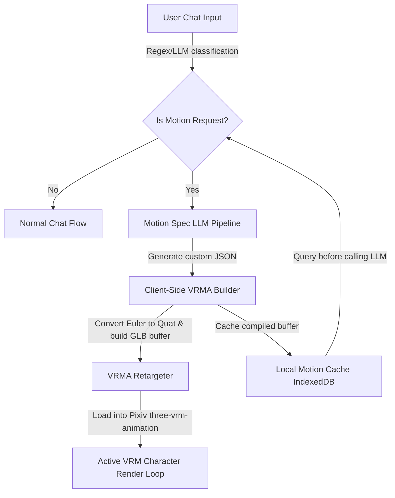

# Proposal: Text-To-VRMA (Natural Language Motion Generation) in AIRI

This document outlines the proposal to integrate dynamic text-to-motion capabilities into **AIRI**. By leveraging a specialized LLM generation prompt and client-side compilation, users can trigger custom character animations on the fly directly via chat.

---

## 1. Core Objectives
* **Dynamic Custom Animation**: Allow users to type actions (e.g., *"do jumping jacks"*, *"wave angrily"*, *"dance"*) and have the character animate instantly.
* **No File Overhead**: Generate the motions dynamically via LLM-designed keyframes rather than downloading/bundling heavy `.vrma` files.
* **Responsive Performance**: Compile, retarget, and load animations client-side in near real-time, caching repeat commands to eliminate generation latency.

---

## 2. System Architecture



### Flow Breakdown:
1. **Trigger Identification**: The client or backend agent detects a motion instruction (e.g., slash command `/animate jumping jacks` or an agent decision in the system prompt).
2. **Cache Check**: The system queries the local cache (IndexedDB) for existing compiled animation buffers matching the motion text.
3. **LLM Generation**: If uncached, a prompt is sent to the LLM (e.g., DeepSeek, GPT-4o) using anatomical rules to produce a JSON-based motion spec.
4. **Binary Compilation**: The frontend takes the JSON spec, converts Euler angles to quaternions, appends T-pose bone mappings, and outputs a standard `.vrma` (glTF binary with `VRMC_vrm_animation` extension) directly in the browser.
5. **Playback**: The buffer is loaded into the active scene using `@pixiv/three-vrm-animation` and played immediately.

---

## 3. Motion Spec Format Reference

The LLM outputs an intermediate JSON representation of keyframes:
```json
{
  "name": "motion_name",
  "duration": 2.0,
  "loop": true,
  "tracks": {
    "leftUpperArm": [
      { "t": 0.0, "r": [0, 0, -70] },
      { "t": 1.0, "r": [0, 0, 45] },
      { "t": 2.0, "r": [0, 0, -70] }
    ]
  },
  "hips": [
    { "t": 0.0, "p": [0, 0, 0] }
  ],
  "expressions": {
    "happy": [
      { "t": 0.0, "w": 1.0 }
    ]
  }
}
```

---

## 4. Key Considerations & Mitigations

### A. Generation Latency
* **Challenge**: LLM response times for generating complex JSON objects can range between 5 and 20 seconds.
* **Mitigation**:
  1. Maintain a **pre-generated library** of common actions (walk, wave, jump, bow) stored locally for instant retrieval.
  2. Implement an **asynchronous loader/waiting animation** on the character (e.g., looking thoughtful or tapping foot) while the motion is compiling in the background.

### B. Bone Collision and Deformities
* **Challenge**: The LLM might output angles that cause hands to clip through the face/torso or limbs to bend in unnatural, "broken" ways.
* **Mitigation**:
  1. Implement a **client-side safety validator** to clamp maximum bone rotations.
  2. Keep forearms locked to safe rotation ranges (clamping lower arm X/Y/Z) and auto-correct hands to rest positions.

### C. Resource Lifecycle
* **Challenge**: Loading new animations repeatedly can cause memory leaks in the WebGL scene.
* **Mitigation**: Properly release references to old tracks, mixers, and buffers when transitioning back to the idle animation loop.

---

## 5. Spitballed Integration Designs & Routing Options

To integrate this system cleanly into AIRI without disrupting existing chat and model setups, several UI and routing directions are proposed:

### Option A: The Tool-Calling Pattern (LLM-Activated Motion) — RECOMMENDED PATHWAY
* **Concept**: Equip the AIRI character's chat model with a custom tool/function: `generate_vrma(id: string, prompt: string)`. The model determines when to trigger a custom motion, creates a unique ID for it, compiles it, and triggers it via an outbound custom activation token.

#### The Tool Definition
```json
{
  "name": "generate_vrma",
  "description": "Generates a custom VRM animation (.vrma) dynamically from a natural language motion description.",
  "parameters": {
    "type": "object",
    "properties": {
      "id": {
        "type": "string",
        "description": "A unique snake_case identifier for this motion (e.g. 'jumping_jacks', 'happy_wave')."
      },
      "prompt": {
        "type": "string",
        "description": "A descriptive prompt detailing the exact motion sequence, bones to move, speed, and emotions (e.g. 'jumping jacks motion with happy expressions')."
      }
    },
    "required": ["id", "prompt"]
  }
}
```

#### The Execution Flow
1. **Tool Call**: The user says *"Do jumping jacks for me!"*.
2. **Tool Execution**: The LLM halts and yields a tool execution request:
   `generate_vrma({ id: "jumping_jacks", prompt: "jumping jacks motion" })`
3. **Background Build**:
   * The client captures this request and calls the background Text-to-VRMA spec generator.
   * The generator compiles the `.vrma` binary buffer on the fly.
   * The system caches the buffer in IndexedDB/localStorage mapped to the key `"jumping_jacks"`.
   * The tool returns success back to the model: `{"status": "success", "message": "Motion 'jumping_jacks' compiled and cached successfully."}`
4. **Final Response Generation**:
   The model continues generating its chat response, knowing the ID exists and is ready:
   > *"Sure thing! Let me stretch real quick... and go! <|ACT:motion="jumping_jacks"|> Look, did I do good?"*
5. **UI Rendering**: The client intercepts the `<|ACT:motion="..."|>` token inside the chat stream, grabs the compiled `.vrma` buffer from the local cache, and feeds it directly to the Three.js character mixer to execute the animation in sync with the text.

#### Why this is the Durable Solution:
* **No Classifiers / No Two-Hops**: Avoids a wrapper classification pass. The model naturally decides when it needs to move based on conversation context.
* **Synchronized Playback**: The use of the inline `<|ACT:motion="id"|>` token allows exact control over *when* the animation begins playing relative to the text generation stream, preventing the character from moving before they start talking.
* **Smart Caching**: If the model decides to call `generate_vrma` for `"jumping_jacks"` in a future turn, the tool execution returns immediately by serving the cached buffer, avoiding redundant API round-trips.

### Option B: The Grounding Popover & Dual-LLM Pipeline (Act Token Injection)
* **Concept**: Add a toggle for "Dynamic VRMA Generation" in the **Grounding Options Popover** (similar to the patterns in [proposal-dynamic-memory-rag-injection.md](file:///Users/richardpinedo/Projects.nosync/airi/airi_dasilva333/docs/proposal-dynamic-memory-rag-injection.md)).
* **Flow**:
  1. A fast classifier LLM or regex rule filters the user's incoming message to see if physical motion is requested.
  2. If detected, the system branches off:
     * A secondary model (like the text-to-vrma spec engine) designs and builds the `.vrma` binary immediately.
     * The compiled animation is played on the avatar.
     * The character's system context is injected with a transient prompt (following [proposal-introspective-context-injection.md](file:///Users/richardpinedo/Projects.nosync/airi/airi_dasilva333/docs/proposal-introspective-context-injection.md)): *"You have just started doing {jumping jacks} because the user asked you to. React to this action in your response."*
  3. The character LLM generates its text response matching this state.
* **Pros**: Works with all models (no tool-calling capability needed), and routes the animation before text generation finishes.
* **Cons**: Higher API cost (dual call) and increased latency on detection turns.

### Option C: The ModelCustomizer Tooling (Static Asset Generation)
* **Concept**: Add a creation studio utility directly inside the `ModelCustomizer`.
* **Flow**:
  1. User goes to settings or character customization, selects their VRM model, and opens a "Custom Motion Generator" subpanel.
  2. They type prompts, preview the results in real-time, tweak the parameters, and save the generated `.vrma` files locally to the character's standard animation inventory.
* **Pros**: Low risk, zero impact on the live chat routing pipeline, and operates as a clean user tool to build out their asset library.
* **Cons**: Lacks the magic of real-time, conversational triggers during live chat.

---

## 6. Rehearsal Room Integration (Sandbox Synergy)

The **Rehearsal Room** (as outlined in [proposal-acting-sidebar.md](file:///Users/richardpinedo/Projects.nosync/airi/airi_dasilva333/docs/proposal-acting-sidebar.md)) represents the perfect deterministic testing ground for Text-to-VRMA before rolling it out to fully autonomous agent tool-calls.

By placing a **Deterministic Motion Generator** directly inside the Rehearsal Room UI, we resolve the early-stage friction of coaxing and testing characters.

### The Sandbox Workflow & UI Layout

Instead of hijacking the existing purple **{clapperboard}** button (which parses and plays back act tokens in dialogue), we introduce a secondary action button next to it:
* **UI Elements**:
  * The primary button is labeled **"Simulate"** (or **"Act"**) with the **{clapperboard}** icon.
  * The secondary button is labeled **"Generate Motion"** with an action icon (e.g. `{iconForMotion}`).
* **Conditional Rendering**:
  * Since Text-to-VRMA motion generation is specifically designed for 3D humanoids, the secondary "Generate Motion" button is conditionally rendered:
    ```html
    <button v-if="activeCharacter.modelType === 'vrm'">Generate Motion</button>
    ```
    *(For Live2D or Spine characters, this button is hidden to prevent invalid generation calls).*

### Execution Flow:
1. **Direct Generation**: The user enters a motion description (e.g., *"jumping jacks"*) into the sandbox textarea and clicks **"Generate Motion"**.
2. **Deterministic Build**: The system builds and plays the `.vrma` immediately on the Stage avatar without needing any chat agent orchestration.
3. **Semantic Mapping & Cataloging**:
   * The user reviews the motion performance.
   * If satisfied, they name the action (e.g., `jumping_jacks`) and click **"Bind Act Token"** in the cataloging interface.
   * The compiled `.vrma` is saved locally under the character's custom asset library.
   * The new semantic action is added to the valid token schema map.
4. **Propagating to Prompting**:
   * The updated token list is injected into the character's `modelExpressionPrompt` suggestion engine.
   * When the character's prompt instructions are regenerated, the LLM is taught:
     > *"You have access to the following custom motions. Write `<|ACT:motion="jumping_jacks"|>` when the user asks you to jump or exercise."*

This creates a seamless progression:
* **Stage 1 (Manual/Sandbox)**: Generate, test, prune, and save animations manually in the Rehearsal Room.
* **Stage 2 (Autonomous)**: The character naturally adopts the new physical behavior in live chat using the newly mapped Act Tokens (Option A).

---

## 7. Open Questions & Implementation Nuances

### A. Preview Lifecycle: Ephemeral vs. Database Persistence
* **Problem**: In the Rehearsal Room, we want the user to preview a generated motion *before* committing it to the character's database and saving the `.vrma` file.
* **Options**:
  1. **Cheat / Act Hack**: Save the generated animation directly into the catalog database immediately with a temporary flag, play it by simulating an ACT token, and if the user discards it, run a background deletion step.
  2. **Memory Only**: Play the generated motion binary out-of-band by passing the buffer directly to the local Stage preview canvas without updating the database. This requires managing an ephemeral preview state in the store.

### B. Mounting Raw VRMAs to Three.js Canvas
* **Nuance**: Intercepting and playing raw binary `.vrma` buffers dynamically on the Stage active WebGL/Three.js context without disrupting the existing runtime animation mixers, crossfades, and default idle behaviors (breathing, eye blinking, etc.).

---

## 8. Future-Proofing: Engine-Agnostic Outputs (VMD & Live2D Compatibility)

A major benefit of separating the **LLM Motion Specification (JSON)** from the **Binary Compiler** is that the intermediate motion representation is completely engine-agnostic. The LLM describes motion intent, and the client-side compile layer targets the specific format required by the model type.

---

### A. VMD / MMD Compatibility (3D Alternate)
In theory, the same LLM prompt mapping and coordinate systems can be adapted to compile **VMD (Vocaloid Motion Data)** binary files to support MikuMikuDance (MMD) style models inside the Stage renderer.

#### Adaptability Requirements
To adapt the generator pipeline for MMD/VMD outputs, we would only need to swap `vrmaBuilder.js` with a new `vmdBuilder.js` handling:
1. **Bone Name Translation**: MMD targets legacy Japanese bone identifiers. The translation mapping layer would map English humanoid bones (e.g., `leftUpperArm`) to MMD standard labels (e.g., `"左腕"`).
2. **Binary Struct Packaging**: Serialize the keyframe tracks directly into the packed binary structs required by the VMD file format specifications.
3. **Orientation Adjustments**: Perform coordinate transformation adjustments to align standard VRM T-pose offsets with MMD rest-pose offsets.

---

### B. Live2D `.motion3.json` Compatibility (2D Target)
Live2D models drive animations through scalar **Parameters** (e.g., head angle yaw, body lean, eye open weight) typically mapped between `-1.0` and `1.0`. Generating these is mathematically simpler for the LLM than 3D bone rotations.

#### Adaptability Requirements
To compile the intermediate motion intent into a Live2D-compatible motion file:
1. **Unified Intent Mapping**: Translate skeletal intents (e.g., `look_left: 0.8`) into specific Live2D parameter offsets (`ParamAngleX: 24.0`, `ParamBodyAngleX: 4.0`).
2. **Parameter Metadata Ingestion**: Read the model's supported parameter keys and limits from the active `.model3.json` file.
3. **Curve Compilation**: Feed these curves into a `live2dMotionBuilder.js` module that generates standard Cubism-compatible `.motion3.json` keyframes with Bezier/linear segment interpolation.
4. **Rehearsal Room Conditioning**: Show/hide the respective compiler outputs conditionally based on the active character's model type:
   ```html
   <button v-if="activeCharacter.modelType === 'live2d'">Generate Live2D Motion</button>
   ```


