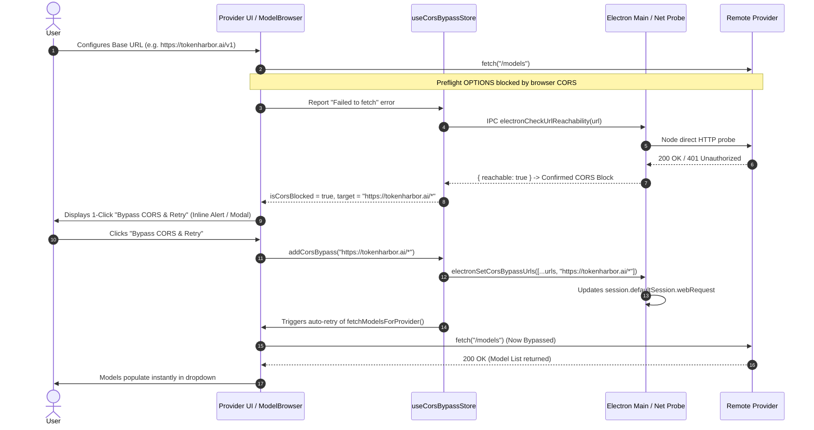

# Architecture & Design: Cross-Platform CORS Bypass & Intelligent Error Resolution

## 1. Background & Problem

Many LLM, speech, and transcription providers (such as TokenHarbor, Deepgram, Pioneer, Opencode, local servers, etc.) do not emit permissive `Access-Control-Allow-Origin` headers by default.

When the AIRI client tries to validate connectivity or fetch `/models` from these endpoints:
1. The browser engine (Chromium in Electron, or standard web browsers in Web stage) sends an `OPTIONS` preflight request.
2. The remote server responds without permissive CORS headers.
3. The browser engine cancels the request and throws a generic `TypeError: Failed to fetch` in client-side JavaScript.
4. The user is left with empty model dropdowns or cryptic "Failed to fetch" errors, without knowing that CORS is blocking their requests.

---

## 2. Platform Architecture

AIRI provides a unified CORS bypass approach tailored to each runtime:

```
                               ┌──────────────────────────────────────────────┐
                               │             AIRI Renderer Client             │
                               │  (useCorsBypassStore & Provider Validation)  │
                               └──────────────────────┬───────────────────────┘
                                                      │
                       ┌──────────────────────────────┴──────────────────────────────┐
                       │                                                             │
             [Desktop / Electron]                                              [Web Stage]
                       ▼                                                             ▼
       ┌───────────────────────────────┐                             ┌───────────────────────────────┐
       │   Native Session Interceptor  │                             │ User-Hosted Cloudflare Worker │
       │ (onHeadersReceived & Headers) │                             │   (Private Reverse Proxy)     │
       └───────────────┬───────────────┘                             └───────────────┬───────────────┘
                       │                                                             │
                       └──────────────────────────────┬──────────────────────────────┘
                                                      ▼
                                       ┌─────────────────────────────┐
                                       │ Target Provider Endpoint    │
                                       │ (e.g. tokenharbor.ai/v1)    │
                                       └─────────────────────────────┘
```

### A. Desktop App (`stage-tamagotchi`)
- **Native Session Interception**: Intercepts matching wildcard patterns in `corsBypassUrls` using Electron's `session.defaultSession.webRequest.onHeadersReceived` and `onBeforeSendHeaders`.
- **Zero External Infrastructure**: Bypasses CORS locally at 0ms latency with no proxy servers needed.

### B. Web App (`stage-web`)
- **User-Hosted Cloudflare Worker**: When a user configures their private Cloudflare Worker proxy URL (`https://my-cors-proxy.my-subdomain.workers.dev/`), requests matching `corsBypassUrls` are transparently routed as `https://my-cors-proxy.my-subdomain.workers.dev/https://target-domain.com/...`.
- **Zero Privacy Compromise**: API keys and payload data remain completely within the user's private Cloudflare account namespace.

---

## 3. Intelligent CORS Detection & Reachability Probing

### The Browser Limitation
Per W3C Fetch security specifications, browsers intentionally suppress CORS error details from JavaScript `catch(err)` blocks to prevent cross-origin side-channel probing. JavaScript only receives `TypeError: Failed to fetch` for both CORS failures and true offline/DNS errors.

### The Reachability Probe Solution
To determine with 100% confidence that a failure is a CORS block:

1. **Candidate Heuristic**: When `fetch(url)` fails with `TypeError: Failed to fetch`, check if the URL's origin (e.g. `https://tokenharbor.ai/*`) is already present in `corsBypassUrls`.
2. **Main-Process Reachability Probe (Electron)**:
   - Renderer invokes IPC `electronCheckUrlReachability({ url })`.
   - Electron Main executes a direct Node.js `fetch(url, { method: 'HEAD' / 'GET' })` (Node is not constrained by browser CORS rules).
   - If Node.js receives any HTTP status code (`200 OK`, `401 Unauthorized`, `403 Forbidden`, etc.), the endpoint is proven to be online and reachable.
   - Since the server is reachable via Node but failed in Chromium renderer, it is **definitively confirmed to be a browser CORS restriction**.
   - If Node.js also fails (e.g. `ENOTFOUND`, `ECONNREFUSED`), it is accurately classified as a real network/DNS outage.
3. **Web Heuristic (Web Stage)**:
   - If the endpoint fails on an external origin not in the bypass list, the client flags it as a likely CORS candidate and offers to add it to the proxy list.

---

## 4. User Experience & Resolution Flow



### Interaction Surfaces
1. **Inline 1-Click Alert in `ProviderValidationAlerts`**:
   - Amber alert banner: *"Requests to `tokenharbor.ai` are blocked by browser CORS."*
   - Button: `[Bypass CORS for this domain & Retry]`
2. **Inline Action in `ProviderModelBrowser`**:
   - If models cannot load due to CORS, shows `[CORS Blocked - Bypass & Reload Models]`.
3. **Global / Modal Dialog (`CorsBypassModal`)**:
   - Modal triggered for wizard flows or explicit dialog prompts.
4. **Settings -> System -> Connection (`ConnectionSettings`)**:
   - Retains full manual control to view, add, or delete wildcard patterns from `CORS Bypass URLs`.
   - On Web stage: Provides the **Deploy to Cloudflare Workers** button and **CORS Proxy Worker URL** configuration.
