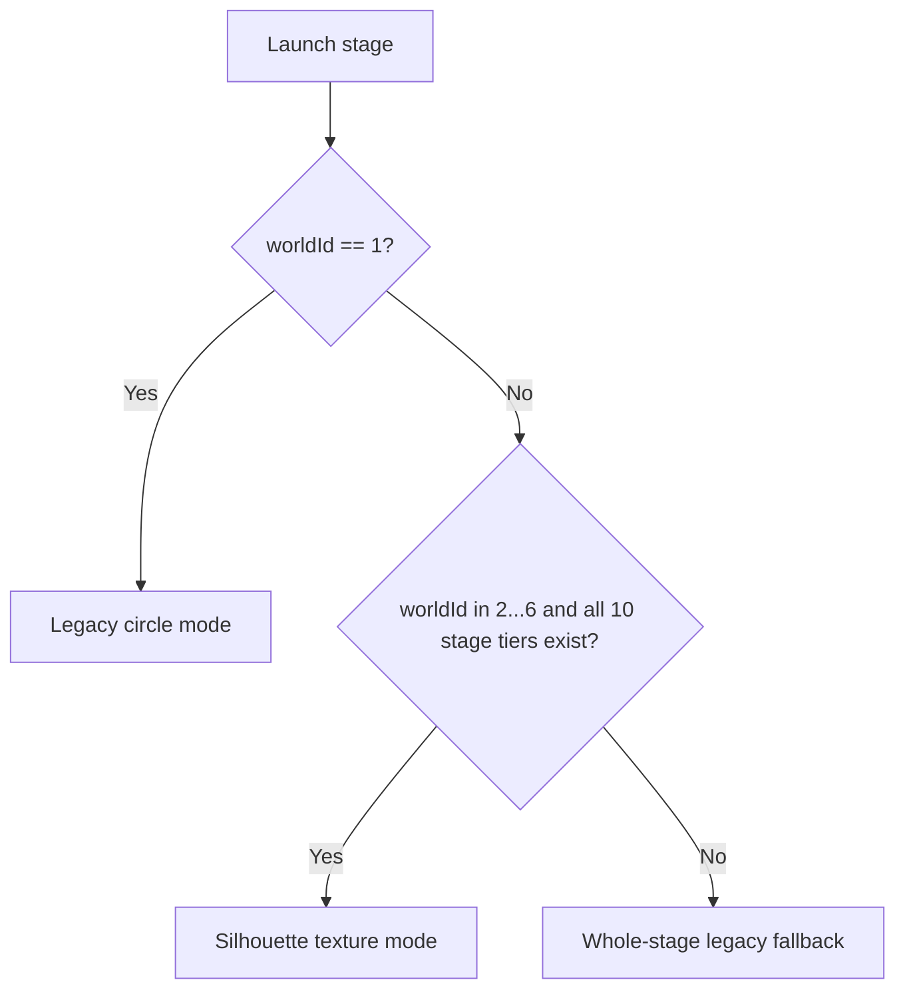

# Technical Specification: Campaign Silhouette Texture Physics Integration

> **Document:** `docs/texture-physics-campaign-integration-design.md`
> **Status:** Implementation-Ready Specification (Revision 4 — Peer-Reviewed)
> **Target Branch:** `feature/phase4-worldmap-campaign`
> **Reviewed Baseline:** `675c507`
> **Source POC:** `test/texture-physics-poc` at `0d9bf99`
> **Scope:** Dual physics for World 1 and validated campaign stages in Worlds 2–6

---

## 1. Objective

World 1 (Flower Meadow) is an established circular merge game whose physics, controls, merge presentation, and booster behavior are part of the player's learned muscle memory. It must remain behaviorally identical.

Worlds 2–6 introduce asymmetric illustrated objects such as flour bags, croissants, shells, anchors, potions, snowflakes, crystals, and crescent moons. Stages with a complete ten-tier silhouette asset set use SpriteKit texture-derived bodies so those objects can rotate, stack, and settle according to their artwork.

This integration ports the mechanism demonstrated by the texture-physics POC without cherry-picking its World-1 sandbox behavior or treating its inspection-scale tuning as production balance data.

### Non-goals

- Do not change World 1's sizes, body properties, damping, overlap correction, spawn queue, merge timing, game-over timing, face rigs, booster targeting, or balance.
- Do not mix circular and silhouette pieces inside one stage.
- Do not refactor monetization, entitlements, ads, navigation, or unrelated gameplay systems.
- Do not claim that the initial Worlds 2–6 size curve is balance-validated by the POC.

---

## 2. Authoritative Physics-Mode Policy

Physics mode is selected once per `TierTextureCache` instance, before any `Circle` is created.



### Required rules

1. World 1 is always `.legacyCircle`, regardless of custom or remotely supplied artwork.
2. Only explicit campaign worlds `2...6` are eligible for `.textureSilhouette`.
3. A campaign stage enables silhouette mode only when all ten stage-specific textures exist:
   `world{W}_stage{S}_tier1` through `world{W}_stage{S}_tier10`.
4. If any tier is absent, the entire stage uses its world-level animal slug fallback with legacy circular physics.
5. Missing assets produce a precise DEBUG assertion/log naming every missing tier. Release behavior remains deterministic and never creates a mixed-physics stage.
6. A stage intended for production silhouette gameplay must not be considered content-complete until the validation gate passes. Legacy fallback is a safety mechanism, not approval to ship incomplete stage art.

At the reviewed baseline, known incomplete sets include World 2 Stage 1 (9/10), World 3 Stage 1 (0/10 stage-specific tiers), and World 3 Stage 3 (9/10). These stages must therefore remain whole-stage legacy fallbacks until their sets are complete.

---

## 3. Runtime Model

```swift
struct TexturePhysicsProfile {
    let maxDimension: CGFloat
    let alphaThreshold: Float
    let friction: CGFloat
    let restitution: CGFloat
    let angularDamping: CGFloat
    let linearDamping: CGFloat
}

enum StagePhysicsMode {
    case legacyCircle
    case textureSilhouette
}
```

Each cache owns its world/stage context and all per-tier construction metadata. No static mutable cache state may participate in entity construction.

```swift
struct TierEntityDescriptor {
    let texture: SKTexture
    let hasCustomArt: Bool
    let eyeConfig: AnimalEyeConfig?
    let texturePhysicsProfile: TexturePhysicsProfile?
}
```

`TierTextureCache.makeCircle(tier:)` is the only production construction path for previews, drops, merges, direct/debug spawns, and restores.

---

## 4. World 1 Zero-Regression Invariants

### R1. Exact legacy body construction

When `texturePhysicsProfile == nil`, retain the current `Circle.attachBody(dynamic:)` branch without retuning or reorganizing its body properties:

- `SKPhysicsBody(circleOfRadius: tier.radius)`
- existing `tier.density`
- existing `tier.friction`
- existing `tier.restitution`
- existing `tier.angularDamping`
- existing collision and contact masks
- existing precise-collision setting
- existing dynamic/static rotation behavior

`attachPhysicsBody()` and `promoteToDynamic()` continue to start the current `0.95 -> 0.15` damping decay only for legacy circles. `updateSettleTracking()` continues to apply the random lateral settle nudge and restores `restLinearDamping = 0.5` only for legacy circles.

Silhouette bodies use the profile's fixed damping and never run the legacy decay or lateral settle nudge.

### R2. Geometry helpers must preserve the old expressions

```swift
var localPhysicsBounds: CGRect {
    guard usesTexturePhysics else {
        let r = tier.radius
        return CGRect(x: -r, y: -r, width: r * 2, height: r * 2)
    }
    let size = renderNode.size
    return CGRect(
        x: -size.width * renderNode.anchorPoint.x,
        y: -size.height * renderNode.anchorPoint.y,
        width: size.width,
        height: size.height
    )
}

var physicsFrameInParent: CGRect {
    guard usesTexturePhysics else {
        let r = tier.radius
        return CGRect(
            x: position.x - r,
            y: position.y - r,
            width: r * 2,
            height: r * 2
        )
    }

    let bounds = localPhysicsBounds
    guard let parent else {
        return bounds.offsetBy(dx: position.x, dy: position.y)
    }
    let corners = [
        CGPoint(x: bounds.minX, y: bounds.minY),
        CGPoint(x: bounds.maxX, y: bounds.minY),
        CGPoint(x: bounds.maxX, y: bounds.maxY),
        CGPoint(x: bounds.minX, y: bounds.maxY),
    ].map { parent.convert($0, from: self) }

    let xs = corners.map(\.x)
    let ys = corners.map(\.y)
    guard let minX = xs.min(), let maxX = xs.max(),
          let minY = ys.min(), let maxY = ys.max() else {
        return .zero
    }
    return CGRect(
        x: minX,
        y: minY,
        width: maxX - minX,
        height: maxY - minY
    )
}
```

All danger, height, and vertical target-ordering callers use a semantic helper that executes the exact existing World-1 expression rather than relying on equivalent `CGRect` arithmetic:

```swift
var physicsTopEdgeYInParent: CGFloat {
    usesTexturePhysics
        ? physicsFrameInParent.maxY
        : position.y + tier.radius
}
```

### R3. Radial booster hit-testing remains radial

```swift
func containsPhysicsPoint(_ point: CGPoint) -> Bool {
    if usesTexturePhysics {
        return physicsFrameInParent.contains(point)
    }
    return hypot(position.x - point.x, position.y - point.y) <= tier.radius
}
```

World 1 must not acquire a square tappable region around circular pieces.

### R4. Merge scale and presentation remain unchanged

```swift
var maxVisualDimension: CGFloat {
    usesTexturePhysics
        ? max(renderNode.size.width, renderNode.size.height)
        : tier.radius * 2
}
```

For World 1, `merged.maxVisualDimension / source.maxVisualDimension` is exactly the existing `nextTier.radius / source.tier.radius` ratio.

The legacy `animateMergeOut` and `animateMergeReveal` branches retain their current move, growth, color-blend, reveal, face reaction, squash, spring, and completion timing. Tint suppression and crossfading are gated only by `usesTexturePhysics`; `hasCustomArt` must not suppress World-1 tinting.

### R5. Dropper and merge clamping preserve legacy formulas

For legacy circles, retain the current formulas explicitly:

```swift
// Dropper
let hoverY = min(
    container.dangerLineY + tier.radius + desiredGap,
    containerHalfHeight - tier.radius - 2
)
let inset = tier.radius + 4

// Merge midpoint
clampedSpawnPosition(rawMidpoint, radius: nextTier.radius, in: container)
```

Only silhouette pieces use `localPhysicsBounds` for hover, wall clamping, and merge-spawn clamping. This makes the zero-regression boundary obvious and avoids depending on merely equivalent rearranged arithmetic.

---

## 5. Silhouette-Mode Safeguards

### G1. Instance-bound art and face configuration

Remove static `TierTextureCache.customArtTiers`. The active cache resolves the actual asset slug, custom-art state, eye configuration, and physics profile for each tier and passes them through the factory.

`Circle` preserves the existing World-1 face-selection order while isolating silhouette artwork:

```swift
if texturePhysicsProfile != nil {
    face = nil
} else if let eyeConfig {
    face = CircleFace(radius: tier.radius, eyeConfig: eyeConfig)
} else if !hasCustomArt {
    face = CircleFace(radius: tier.radius)
} else {
    face = nil
}
```

The cache must resolve `eyeConfig` from the actual loaded slug. It must not blindly use `tier.defaultSlugName` for a non-World-1 whole-stage fallback.

### G2. Texture body attachment

For a validated silhouette descriptor:

```swift
guard let texture = renderNode.texture,
      let profile = texturePhysicsProfile else {
    assertionFailure("Silhouette entity missing texture/profile")
    return
}

let body = SKPhysicsBody(
    texture: texture,
    alphaThreshold: profile.alphaThreshold,
    size: renderNode.size
)
```

Apply the existing density, masks, precise-collision setting, and dynamic/static state, while sourcing friction, restitution, angular damping, and linear damping from the profile. Avoid force-unwrapping `renderNode.texture`.

### G3. No artificial radius heuristics

Silhouette entities are excluded completely—not approximated with `maxVisualDimension / 2`—from the following radius-based systems:

- `GameScene.applyContinuousSeparation`
- `GameScene.updateDeadlockTracking`
- `ContainerNode.runSeparationPass`
- `ContainerNode.nudgeUnsupportedBallsDown`
- `ContainerNode.separateOverlaps(focal:tolerance:maxPasses:)`
- `MergeLogger` radius-based missed-contact diagnostics

`resolveOverlaps()` is not a current method and must not appear in the implementation plan.

Pairs involving any silhouette entity are left to SpriteKit's native contact solver. Whole-stage validation prevents normal gameplay from creating mixed-mode pairs.

### G4. Silhouette merge presentation

For silhouette sources:

1. Spawn the promoted entity through `textureCache.makeCircle(tier:)`.
2. Clamp its unrotated local bounds inside the container before attaching the static body.
3. Attach its full-size body as static during the reveal, preserving the established pinned-merge architecture.
4. Grow and move the sources using `merged.maxVisualDimension / source.maxVisualDimension`.
5. Do not apply procedural palette tint.
6. Fade source silhouettes over the final portion of convergence and fade in the promoted silhouette over the same interval.
7. Preserve the existing squash/spring and completion timing after the crossfade.
8. Promote to dynamic only after the reveal finishes. Do not run radial pre-promotion separation for a silhouette focal body.

Merge highlight sizing is visual, not collision logic: use `nextTier.radius` for legacy circles and `merged.maxVisualDimension / 2` for silhouette pieces.

### G5. Conservative silhouette bounds

`physicsFrameInParent` is a rotated AABB of the tightly trimmed sprite bounds. It is a conservative gameplay proxy, not the exact traced polygon or exact alpha-contour apex. It may include transparent corner space for highly concave artwork.

Use this proxy consistently for silhouette danger checks, HUD height, booster ordering, and hit-testing in the initial integration. Manual validation must confirm that it does not create materially early danger-line triggers. Exact contour-derived apex and alpha hit-testing are follow-up work if the conservative proxy proves unfair.

---

## 6. Snapshot Compatibility and Stage Identity

Rotation is entity state; world and stage are snapshot-level state.

```swift
struct GameSnapshot: Codable {
    // Existing fields remain unchanged.
    var worldId: Int?
    var stageIndex: Int?
}

struct CircleSnapshot: Codable {
    var tier: Int
    var x: Double
    var y: Double
    var zRotation: Double?
}
```

### Compatibility rules

1. Keep `GameSnapshot.currentVersion` unchanged for these additive optional fields; do not discard existing saves solely because the fields were added.
2. Capture the active `gameState.world.id` and `gameState.stageIndex` once on `GameSnapshot`.
3. Capture each in-play circle's `zRotation`.
4. In the existing `GameScene.restore(from:)` method, validate snapshot context before rebuilding:
   - interpret missing legacy context as World 1, Stage 1;
   - restore only when the resolved snapshot world/stage matches the active `GameState`;
   - reject or clear mismatched snapshots instead of rebuilding positions with another stage's silhouettes.
5. Set `circle.zRotation` before `attachPhysicsBody()`.
6. Velocities remain intentionally unsaved, preserving the existing paused-then-settle resume behavior.

---

## 7. Initial Silhouette Profiles and Balance Boundary

### Current World-1 data-pinned radii

The current `CircleTier.radius` values are:

| Tier | Radius | Diameter |
| ---: | ---: | ---: |
| 0 | 11 pt | 22 pt |
| 1 | 21 pt | 42 pt |
| 2 | 31 pt | 62 pt |
| 3 | 41 pt | 82 pt |
| 4 | 51 pt | 102 pt |
| 5 | 61 pt | 122 pt |
| 6 | 71 pt | 142 pt |
| 7 | 84 pt | 168 pt |
| 8 | 94 pt | 188 pt |
| 9 | 106 pt | 212 pt |

These values are tied to World-1 game-length and win-rate tuning. In particular, the largest tiers deliberately crowd the board.

### Worlds 2–6 initial tuning seed

The following values are a deliberate new-world starting hypothesis. They are neither derived mechanically from World-1 radii nor validated by the five-piece POC. Texture alpha area, aspect ratio, and mass distribution vary by asset, so every stage requires device testing and later win-rate calibration.

| Tier | Max dimension | Friction | Angular damping | Restitution | Linear damping |
| ---: | ---: | ---: | ---: | ---: | ---: |
| 0 | 48 pt | 0.25 | 0.70 | 0.0 | 0.15 |
| 1 | 58 pt | 0.22 | 0.65 | 0.0 | 0.15 |
| 2 | 68 pt | 0.20 | 0.60 | 0.0 | 0.15 |
| 3 | 80 pt | 0.24 | 0.65 | 0.0 | 0.15 |
| 4 | 94 pt | 0.28 | 0.70 | 0.0 | 0.15 |
| 5 | 108 pt | 0.25 | 0.65 | 0.0 | 0.15 |
| 6 | 122 pt | 0.25 | 0.65 | 0.0 | 0.15 |
| 7 | 136 pt | 0.26 | 0.65 | 0.0 | 0.15 |
| 8 | 148 pt | 0.24 | 0.65 | 0.0 | 0.15 |
| 9 | 164 pt | 0.22 | 0.65 | 0.0 | 0.15 |

All profiles initially use `alphaThreshold = 0.5`. `TexturePhysicsProfile.standard(for:)` implements this table explicitly. The cache architecture must permit later per-stage/per-tier overrides without changing the World-1 path.

Aspect ratio is preserved:

$$
\text{scale} = \frac{\text{maxDimension}}{\max(\text{texture.width},\ \text{texture.height})}
$$

The 48–164 pt progression materially changes packing, mass ratios, and likely win rates relative to World 1. Production balance approval therefore requires stage telemetry or seeded simulation comparable to the process that pinned World-1 radii.

---

## 8. Component-by-Component Implementation

### `Meld/Engine/Entities/TexturePhysicsProfile.swift` — new

- Define `TexturePhysicsProfile` and the explicit standard table.
- Keep room for future stage/tier overrides.

### `Meld/Engine/Entities/Circle.swift`

- Add instance construction metadata: `hasCustomArt`, resolved `eyeConfig`, and optional `texturePhysicsProfile`.
- Add `usesTexturePhysics`, aspect-ratio-preserving render sizing, `localPhysicsBounds`, `physicsFrameInParent`, `physicsTopEdgeYInParent`, `maxVisualDimension`, and `containsPhysicsPoint`.
- Implement the dual body branch without altering legacy properties.
- Gate damping decay, settle nudge, rest damping, face creation, tinting, and merge crossfade by physics mode.
- Preserve the complete existing World-1 animation branches.

### `Meld/Engine/Game/TierTextureCache.swift`

- Store all textures, art metadata, actual asset slugs, eye configurations, profiles, and stage physics mode on the cache instance.
- Remove static `customArtTiers` and static construction decisions.
- Validate all ten stage-specific textures before enabling silhouette mode.
- Provide `makeCircle(tier:)` as the unified factory.

### `Meld/Engine/Systems/PersistenceManager.swift`

- Add optional `worldId` and `stageIndex` to `GameSnapshot`.
- Add optional `zRotation` to `CircleSnapshot`.
- Preserve current snapshot version compatibility.

### `Meld/Engine/Systems/Dropper.swift`

- Build previews through `textureCache.makeCircle(tier:)`.
- Retain the exact radius-based legacy hover and X-clamp branches.
- Use `localPhysicsBounds` only for silhouette hover and X clamping.

### `Meld/Engine/Systems/MergeManager.swift`

- Build the promoted entity through `textureCache.makeCircle(tier:)` before selecting the clamp path.
- Retain the current radius overload for legacy midpoint clamping.
- Use a local-bounds overload only for silhouettes.
- Preserve legacy scale/tint/reveal behavior and add the silhouette crossfade branch.
- Size merge highlights using mode-appropriate visual geometry.
- Keep the static-body pin and promotion lifecycle unchanged except for mode-specific geometry.

### `Meld/Engine/Game/ContainerNode.swift`

- Filter silhouettes from `nudgeUnsupportedBallsDown`.
- Skip any silhouette-involving pair in `runSeparationPass`.
- Return immediately from `separateOverlaps` when the focal entity is a silhouette.

### `Meld/Engine/Game/GameScene.swift`

- Use the factory for direct/debug spawn and `restore(from:)` reconstruction.
- Capture and restore snapshot context and rotation.
- Exclude silhouettes before continuous separation and deadlock tracking.
- Replace every gameplay/HUD danger-top expression with `physicsTopEdgeYInParent`, including:
  - face scare/near-danger state;
  - fill-ratio/highest-piece calculation;
  - `triggerSecondChancePause` breach spotlight;
  - `beginLossSequence` breach spotlight.
- Preserve all World-1 results through the helper's exact legacy branch.

### `Meld/Engine/Systems/GameOverDetector.swift`

- Use `physicsTopEdgeYInParent` for line and ceiling breach evaluation.

### `Meld/Engine/Game/GameScene+Boosters.swift`

- Use `physicsTopEdgeYInParent` for shake near-line protection and top-three ordering.
- Use `containsPhysicsPoint` for remove-piece hit testing.
- Use `maxVisualDimension` only as the size tie-breaker for silhouette targets; preserve `tier.radius` for the legacy tie-breaker.
- Ensure preview and committed removal choose the same ordered targets.

### `Meld/Engine/Systems/MergeLogger.swift`

- Skip silhouette pairs in radius-based missed-merge diagnostics.

### DEBUG harnesses and tests

- Keep World-1 radius-based scenarios intact.
- Add separate silhouette scenarios rather than rewriting legacy fixtures with pseudo-radii.

---

## 9. Verification and Acceptance Gates

### A. Build and static validation

- Run `./build-app.sh` and require a clean build.
- Search all production `Circle(...)` construction sites; previews, drops, merges, direct spawns, and restores must use `TierTextureCache.makeCircle(tier:)`.
- Confirm no `resolveOverlaps` implementation work was introduced.
- Validate every enabled silhouette stage has exactly ten tier assets.

### B. World-1 behavioral equivalence

Run before/after builds with the same viewport, device/simulator, and seeded scenarios.

- Circle body area/mass and all tuned properties match the baseline for every tier.
- `physicsTopEdgeYInParent == position.y + tier.radius` at rotations 0, 45, and 90 degrees.
- Dropper hover and clamps match baseline values for every tier and representative container sizes.
- Merge midpoint, scale, tint, reveal timing, cap-clear behavior, and overlap correction match baseline.
- Faces, eye gaze, damping decay, settle impulses, danger timing, HUD fill, and both loss spotlight paths match baseline.
- Booster radial hit-testing, shake protection, and top-three ordering match baseline.
- Existing World-1 snapshots decode and restore without loss.

### C. Silhouette correctness

- Flour bags, croissants, bottles, shells, snowflakes, and other representative aspect ratios rotate and settle without phantom circular hulls.
- Dropper preview and released body remain inside both walls and below the ceiling.
- Same-tier contacts merge exactly once.
- Source and promoted artwork crossfade without palette tint or a hard silhouette pop.
- Danger/HUD/booster ordering uses one consistent top-edge source.
- Conservative AABB danger detection does not trigger materially early on rotated concave assets.

### D. Dense static-merge test

Create a dense pile around two mergeable silhouettes and exercise the complete lifecycle:

1. same-tier contact;
2. full-size static promoted body insertion;
3. source convergence and crossfade;
4. neighbor displacement during the static phase;
5. promotion to dynamic.

The promoted body must not rocket upward, tunnel through neighbors, leave the container, or trigger an unearned danger breach. Run this for wide, tall, and highly concave promoted assets.

### E. Snapshot round trip

- A pre-change snapshot without new optional fields decodes as World 1 Stage 1.
- A silhouette snapshot restores the exact stage, positions, and rotations.
- A world/stage mismatch is rejected instead of loading another stage's bodies.
- Resume does not create deep overlaps or ejection impulses.

### F. Performance

Measure on the oldest supported device where practical.

- Stress 40–80 active silhouette bodies with repeated drops and merges.
- Record frame time, sustained FPS, memory, and creation-time hitching from texture-body tracing.
- Repeat the same 40–80-body stress pass on World 1 after integration.
- Confirm new per-frame mode checks in `updateSettleTracking`, `didSimulatePhysics`, danger evaluation, and booster ordering do not measurably regress the legacy hot path.

### G. Balance validation

Physics correctness does not approve the new size curve. For each campaign stage:

- run seeded simulations or comparable repeatable sessions;
- measure session length, peak tier, loss height, cap frequency, and win rate;
- tune size/profile overrides without changing World-1 data;
- document the accepted stage curve before release.

---

## 10. Rollout Sequence

1. Add profile/mode/descriptors and stage completeness validation.
2. Update `Circle` with exact legacy branches and isolated silhouette behavior.
3. Route every construction site through the cache factory.
4. Integrate dropper and merge geometry, including complete silhouette crossfade behavior.
5. Exclude silhouettes from all radius heuristics and diagnostics.
6. Unify danger, HUD, and booster geometry through semantic helpers.
7. Add snapshot context and rotation compatibility.
8. Run the full World-1 equivalence gate.
9. Run silhouette correctness, dense-merge, snapshot, and performance gates.
10. Balance and approve campaign stages individually.

Implementation should not begin by cherry-picking `0d9bf99`. Port the proven mechanism deliberately into the campaign branch while treating this document's regression invariants and acceptance gates as authoritative.
